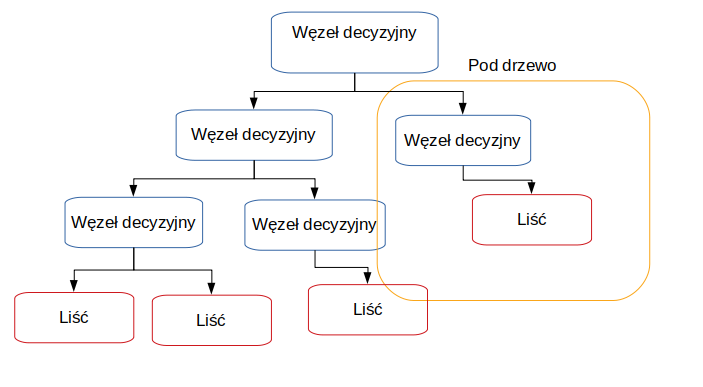

**Wykrywanie występowanie chorób serca, wykorzystanie uczenia maszynowego nadzorowanego** {.unnumbered}
========

**Wstęp** {.unnumbered}
========

Sztuczna inteligencja wśród szerokiego zakresu swoich zastosowań może zostać wykorzytana do analizy bardziej lub mniej złożonych danych medycznych, w celu przewidzenia wystąpienia choroby u konkretnej osoby, bez udziału procesu myślowego od stony specjalisty.  
 

Do tego przeznaczenia idealnie nadaje się uczenie nadzorowane (ang. _supervised learning_) tj. rodzaj uczenia maszynowego zakładający  przykład, dane wejściowe będące wzorcem  na podstawie którego wyszukiwane są zależności.  

Zależności typujące osoby chore, zakwalifikowane na podstawie konkretnych objawów lub wyników badań.  

W dzisiejszych czasach choroby sercowo-naczyniowe stanowią najczęstszą  przyczynę zgonów,a liczba osób cierpiących na te dolegliwości stale rośnie. Głównymi przyczynami zachorowalności diagnozowanymi przez specjalistów są niski poziom świadomości i profilaktyki chorób serca. Objawy są tym silniejsze im gorszy jest stan chorobowy pacjenta.   

Dlatego prowadzone  są  intensywne  prace  nad zwiększeniem  dostępności badań,  które  wspomogą  diagnostykę  kardiologiczną na jak najwcześniejszym etapie.  

Powodem szukania dokładniejszych sposobów diagnozowania są również wysokie koszty leczenia generowane przez choroby układu krwionośnego. Według analityków firmy konsultingowej KPMG [^KPMG] w 2011 r. koszty diagnostyki i terapii chorób serca wyniosły ponad 15 miliardów polskich złotych.   

Nadzieją jaka pokładana jest w machine learningu jest szybsza diagnostyka chorób ułatwiająca oraz przyśpieszająca proces ich leczenia. Zastosowanie uczenia maszynowego w medycynie, pozwala również na przetwarzanie historycznych danych, w celu poszerzenia zasobów informacji które mogą zostać wykorzystane przez lekarza.  

Słowa kluczowe: uczenie maszynowe, uczenie nadzorowane  

[^KPMG]:  międzynarodowa sieć firm audytorsko-doradczych ze szczególnym uwzględnieniem branży dóbr konsumpcyjnych, usług finansowych, nieruchomości i budownictwa, technologii informacyjnych, mediów i komunikacji (TMT), transportowej (TSL), produkcji przemysłowej, a także sektora publicznego

**Cel i zakres pracy** {.unnumbered}
========

Celem pracy jest porównanie wybranych algorytmów uczenia maszynowego nadzorowanego, przy założeniu że dane wejściowe są wybrakowane, a w rezultacie zbudowanie modelu który na podstawie danych medycznych wystawia diagnozę o występowaniu zaburzeń sercowo-naczyniowych lub ich braku.   

Dane medyczne wyróżniają się tym, że trudno uzyskać do nich dostęp, najczęściej nie są to informacje, które się udostępnia do użytku publicznego. Z tego powodu, kluczowym krokiem jest  wybór cech branych pod uwagę przy tworzeniu modelu.  

Zatem odpowiedź na pytanie jak wybrakowanie danych mocno wpływa na rezultat i czy istnieją róznicę między zastosowaniem wybranych algorytmów nauczania nadzorowanego wymaga przedstawienia porówniania łatwości tworzenia modelu, dokładności, złożoności oraz czasu uzyskania odpowiedzi.  

W pracy opisano następujące algorytmu uczenia nadzorowanego: 

- lasy decyzyjne (ang. _decisions-forests_)
- metoda wektorów nośnych (ang. _support vector machines_, SVM)
- k-najbliższych sąsiadów (ang. _k-neares neighbours_, KNN)  

Praktyczna część pracy napisana została w języku Python z wykorzystaniem scikit-learn, obsługującym wiele algorytmów maszynowego uczenia się w tym uczenia nadzorowanego i docelowo wybranych algorytmów przedstawionych w teoretycznej części pracy.  

Biblioteka opiera się o Numerical Python, zestaw narzędzi do obliczeń na macierzach, wektorach oraz o pakiet Science python umożliwiający metody numeryczne takie jak całkowanie, różniczkowanie itp. .  

Do przygotowania danych wykorzystano zestaw narzędzi Pandas, ułatwiający tworzenie struktur danych i ich analizę.
W celu wizualizacji wyników w postaci wykresów zastosowano Matplotlib.  

 

# Wprowadzenie teoretyczne 

**Uczenie maszynowe** (ang._machine learning_, ML)  to dziedzina zajmująca się zestawem algorytmów,  które analizując duże zbiory dancyh wsyatwiają predyckję na temat zadanego problemu. Uczenie maszynowe zależnie od sposobu _trenowania_ algorytmu wyróżnia min. uczenie nadzorowane oraz uczenie bez nadzoru. Dane oraz wynik który przewidywanie ma osiągnąć uzależniają wybór kategorii.   

  

**Uczenie maszynowe nadzorowane** (ang. _supervised learning_) to klasa algorytmów uczenia maszynowego, która bazuje na poetykietowanych już danych wejściowych. Ten typ uczenia świetnie nadaje się do rozwiązywania problemów z zakresu klasyfikacji. Nadzór polega na porównaniu rezultatów działania modelu z wynikami które są zawarte w danych wejściowych(_dane oznaczone_). Algorytm po osiągnięciu żądanej efektywnosci jest w stanie dokonać klasyfikacji przykładu dla którego nie posiada odpowiedzi. Sprawdza się to obecnie w rekomendacji produktów oraz diagnozie chorób.  

**Uczenie maszynowe bez nadzoru** (ang. _unsupervised learning_) to klasa algroytmów uczenia maszynowego która głownie rozwiązuje problemy grupowania. Dane dostarczane do modelu nie zawierają _oznaczeń_, zatem nauczanie polega na wyciąganiu konkluzji z poprzednio wykonanych iteracji. Na skuteczność modeli budownych w oparciu o uczenie bez nadzoru wpływ ma rozmiar dostarczonego do nauki zbioru danch, im jest on większy tym bardziej wzrasta effektywność. Takie zbiory można uzyskać rejestrując dane na bierząco dlatego do najczęstrzych zastosowań tej klasy algorytmów, można zaliczyć rozpoznawanie mowy czy obrazu.  
  

Podział osób na kategorie cierpiące na choroby sercowo-naczyniwe oraz zdrowe, to dylemat klasyfikayjny nadający się do rozwiązania za pomoca algorytmów uczenia maszynowego nadzorowanego i na nich skupia się dalsza część pracy.  

  

## Wybrane algorytmy uczenia maszynowego nadzorowanego

**Drzewa decyzyjne** (ang. _decisions trees_) są uznawane za najprostyszy i najbliższy ludzkiemu  zrozumieniu algorytm uczenia, który swoją nazwę zawdzięcza graficznej reprezentacji w postaci drzewa. Każdy węzeł oznacza atrybut, na podstawie którego następuję rozróżnienie. W modelu kluczowa jest kolejnośc cech, które wystęują po sobie ponieważ determinuje to otrzymany rezultat.   

  
 
 Prawie każdy algorytm uczenia maszynowego nadzorowanego można podzielić na dwa etapy. W pierwszym opracowywany jest wzorzec, na którym bazuję późniejsza predykcja. Etap nauki dla drzewa decyzyjnego polega na typowaniu atrybutów,którestaja się węzłami decyzyjnymi, dzielącymi rekordy na dwa mniejsze zestawy i tak aż nie ma możliwości dalszego podziału.
  
O metodologie drzew decyzyjnych oparta jest dokładniejsza forma nauczania nadzorowanego:  _losowe lasy decyzyjne._  

**Losowe lasy decyzyjne** (ang. _random decision forests_) to technika polegająca na połączeniu wielu drzew decyzyjnych w celu uniknięcia problemu z _nadmiernym dopasowaniem _ do treningowego zestawu danych na którym został przeszkolony.  Utworzony szablon aby poprawnie działać na danych testowych i służacych weryfikacji, nie może stać się charakterystycznym przypadkiem rozwiązującym przypadek testowy.   
 
W tym celu dla loswoych lasów decyzyjnych najpierw stosuję się **agregację bootstrap'ową**.   

Z treningowego zestawu danch losuję się, co ważne z możliwymi powtorzeniami, wiersze danych dla których trenowany będzie model. Jako rezutat brana jest większość lub średnia wartości uzyskanych wyników dla poszczególnych drzew dezycyjnch. Dodatkowo dla drzew decyzyjnych w lasach losowych, atrybuty odpowiadające za kategoryzację są wybierane z wylosowanego podzbioru.  

Wśrod zalet lasów losowych nalezy wyróżnić iż potrafią one trafnie wykalkulować brakujace wartości cech. Idealnie znajdują zastosowanie dla realnych danych, których zasadniczym problemem jest ich niekompletność.  
 Dane medyczne posiadają szeroką wariację zmiennych z dużym prawdopodobieństwem wybrakownia, zastosowanie do nich lasów decyzyjnych ma potencjał na pozytywne rezulataty.  

**Metoda wektorów nośnych** (ang._support vector machines_, skr. **_SVM_**) to algorytm uczenia maszynowego nadzorowanego, który każdy parametr z dostępnych cech dla danych wejściowych, traktuje jako punkt w przestrzeni. Na podstawie ułożenia punktów  dzieli się je na 2 klasy. Graficznie jest to reprezentowane przez prostą dla której odległość między najbliższymi dwoma punktami dla wektorów jest możliwie największa.Taka prosta nazywana jest  _prostą marginalną_ i powstaje ona poprzez generowanie i selekcję tych prostych które rzetelnie szufladkują klasy danych.   

![Schemat 2 [^schemat_wzorowany]](img/svm_schemat.png "Schmat SVM")  

Techinka ta gwarantuje precyzyjniejsze rezulatay niż drzewa deczyjne, niestety dla dużych zbiorów danych czas trwania szkolenia znacznie się wydłuża oraz istnieją przypadki dla których podział jedną prostą jest niewykonalny, taki przypadek reprezentuje rozkład na schemacie nr. 2. 

![Schemat 2 [^schemat_wzorowany]](img/svm_niemozliwy_podzial_schemat.png "Schmat SVM niemożliwy podział")  

Zbór dancyh wykorzytany w pracy nie jest aż tak kolosalny by zaszkodzić wydajności, a małym kosztem można uzyskać celnośc rozwiązania zadanego problemu: wykrwania występowania chorób sercowo-naczyniowych. Istnieje jednak  ryzyko uzyskania rozkładu wartości który wyklucza graficzną frgmentacje zestawu danych na dwie części za pomocą prostej.  

**K najbliższych sąsiadów** (ang. _k nearest neighbours_, skr. **_KNN_**) to algorytm uczenia maszynowego nadzorowanego operający swoje estymacje dla konkretnego przypadku danch na  wartościach jego K najbliższych sąsiadów(punktów) liczonych min. dla przestrzeni Euklidesowej, miasto(in. Manhattan) oraz Mińkowskiego.   

Atrybut który nastraja proces uczenia się modelu i ma na niego największy wpływ określany jest jako hiperparametr. Dla KNN jest to liczba sąsiadów, im większa ilość jednostek mających wpływ, tym wierniejsze będą wyniki. Potęguje się wtedy niestety złożoność czasowa algorytmu, znacząco już większa od przedstawionych powyżej innych algoryrtmów. 

W celu przewidzenia wartości dla nowych danych, należy odnaleść K najbliższych punktów wyliczając odległości, a następnie przpisać odpowiedź implikowaną przez większość sąsiadów. Dla wartości K równej jeden, metoda ta nazywana jest algorytmem najbliższego sąsiada. 

![Schemat 3[^schemat_wzorowany]](img/knn_schemat.png "Schmat KNN")  

Dla lekarza wartością dodatnią jest wykrycie zależności które decyzują o uznaniu lub zaprzeczeniu występowania choroby. Zastosowanie algorytmu KNN może nie tylko  zakwalifikować osoby chorujące na serce, ale również ułatwić swoją graficzną reprezentacją wpływ cech na ostateczny osąd próbki.  

## Zestawienie efektywności działania algorytmów

Konfrontacja technik ucznia maszynowego zaleznie od zestawu danch będzie dawała odmienne wyniki ze względu na ich predyspozycje do zajmowania się odpowiednimi zbiorami danych.  

Potencjał algorytmów dla niewielkiego kompletu danych zawierającego wartości wybrakowane zostanie omówony w późniejszych rozdziałach pracy.  

Zczynając od drzew decyzyjnych, można od razu stwierdzić ich niski potencjał. Istnieje zbyt duże prawdopodobieństwo dopasowania się do modelu treningowego, gdyż wspomniany zbiór dancyh wejściowych  nie jest wystarczająco liczny. Dlatego w dalszej części pracy omówione zostaną lasy decyzyjne.  

Większej dokładności można się spodziewać po metodzie wektorów nośnych, ale jego złożoność czasowa oraz pamięciowa mogą zaniżyc jego ogólną klasyfikację.  

**Wskaźniki wydajności**  

Określenie stopnia, w jakim skonstruowany model z powodzeniem realizuje wyznaczone zadanie należy do wskaźnika wydajności. Przykładem nieprawidłowego wyboru może być próba przewidzenia wystąpienia rzadkiej choroby u pacjenta i określenie głownym miernikiem _dokładność_. W takim scenariuszu klasyfikacja wszystkich pacjentów jako zdrowych , daje niewiele odbiegającą od perfekcji dokładność, a jednocześnie  błędnie osądzać każde wystąpienie choroby.

**K-krotna walidacja krzyżowa** (ang. _Fold Cross-Validation_) to metodyka weryfikacji poprawności modeli nauczania masznowego. Opiera się ona na wyporze wartości swojego hiperparamtru jakim jest K, które może przyjąć dowolną wartość mniejszą lub równą od rozmiaru danych. 

Po wyborze hiperparametru następuje segmentacjia danych na K jendakowej wielkości zestawów. Wykonywanych jest k iteracji, w każdej z nich na k-1 kolekcjach model jest trenowany, a na pozostałej jednej weryfikowany. Procedura efektywnie pomaga ocenić poprawność działania modelu i zastosowanego algorytmu.

[^schemat_wzorowany]:Na podstwie materiałów opublikowanych na [https://www.datacamp.com](http://res.cloudinary.com/dyd911kmh/image/upload/f_auto,q_auto:best/v1526288453/index3_souoaz.png)

## Model Danych 
### Omówienie danych
 <!--
The “Cleveland heart disease dataset 2016” is used by various researchers [13] and can be accessed from online data mining repository of the University of California, Irvine. This dataset was used in this research study for designing machine-learning-based system for heart disease diagnosis. The Cleveland heart disease dataset has a sample size of 303 patients, 76 features, and some missing values. During the analysis, 6 samples were removed due to missing values in feature columns and leftover samples size is 297 with 13 more appropriate independent input features, and target output label was extracted and used for diagnosing the heart disease. The target output label has two classes in order to represent a heart patient or a normal subject. Thus, the extracted dataset is of 29713 features matrix. The complete information and description of 297 instances of 13 features of the dataset is given in Table 1.-->
### Budowa modelu zależna od danych
### Obróbka danych 
<!--
2.2.1. Data Preprocessing
The preprocessing of data is necessary for efficient representation of data and machine learning classifier which should be trained and tested in an effective manner. Preprocessing techniques such as removing of missing values, standard scalar, and MinMax Scalar have been applied to the dataset for effective use in the classifiers. The standard scalar ensures that every feature has the mean 0 and variance 1, bringing all features to the same coefficient. Similarly, in MinMax Scalar shifts the data such that all features are between 0 and 1. The missing values feature row is just deleted from the dataset. All these data preprocessing techniques were used in this research.-->
### Budowa modelu 
#### Metody optymalizacji
#### Implementacja algorytmu 1: Losowe lasy decyzyjne
#### Implementacja algorytmu 2: Metoda wektorów nośnych
#### Implementacj algorytmu 3: K najbliższych sąsiadów

## Wnioski i walidacja rozwiązania
### Algorytm 1:Resultaty wnioski: Losowe lasy decyzyjne
### Algorytm 2: Rezultaty wnioski: Metoda wektorów nośnych
### Algorytm 3 : Rezultaty wnioski: K najbliższych sąsiadów

### Porównianie algorytmów : złożoność czasowa , dokładność , złożoność implementacyjna , wpływ danych wykorzytywanych w modelu

### Podsumowanie i opisanie wpływu danych na model

O:

Repozytorium uczenia maszynowego UCI to zbiór baz danych, teorii domen i generatorów danych, które są używane przez społeczność uczących się maszyn do analizy empirycznej algorytmów uczenia maszynowego. Archiwum zostało utworzone jako archiwum ftp w 1987 roku przez Davida Aha i innych doktorantów UC Irvine. Od tego czasu jest szeroko stosowany przez studentów, nauczycieli i naukowców na całym świecie jako główne źródło zestawów danych uczenia maszynowego. Wskazując na wpływ archiwum, cytowano go ponad 1000 razy, co czyni go jednym ze 100 najczęściej cytowanych „artykułów” we wszystkich dziedzinach informatyki. Obecna wersja strony została zaprojektowana w 2007 roku przez Arthura Asuncion i Davida Newmana, a ten projekt jest realizowany we współpracy z Rexa.infona University of Massachusetts Amherst. Z wdzięcznością doceniamy wsparcie finansowe od National Science Foundation.

Wiele osób zasługuje na podziękowania za sukces repozytorium. Najważniejsi z nich to dawcy i twórcy baz danych i generatorów danych. Specjalne podziękowania należą się również byłym bibliotekarzom z repozytorium: Davidowi Aha, Patrickowi Murphy, Christopherowi Merzowi, Eamonn Keogh, Cathy Blake, Sethowi Hettichowi i Davidowi Newmanowi.

## Bibliografia
## Spis ilustracji
## Spis tabel
