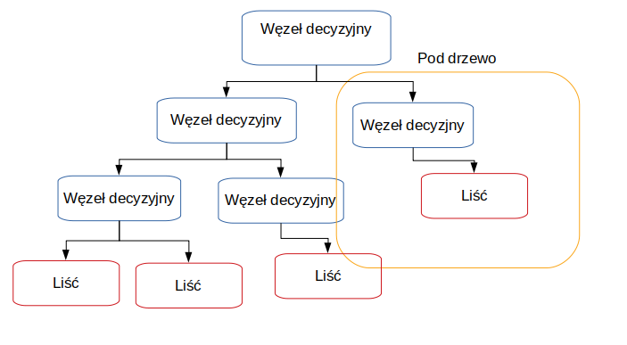

**Wykrywanie występowanie chorób serca, wykorzystanie uczenia maszynowego nadzorowanego na podstawie zbioru danych dotyczących chorób układu krążenia z repozytorium  UCI** {.unnumbered}
========

**Wstęp** {.unnumbered}
========

Sztuczna inteligencja wśród szerokiego zakresu swoich zastosowań może zostać wykorzytana do analizy bardziej lub mniej złożonych danych medycznych, w celu przewidzenia wystąpienia choroby u konkretnej osoby, bez udziału procesu myślowego od stony specjalisty.  
 

Do tego przeznaczenia idealnie nadaje się uczenie nadzorowane (ang. _supervised learning_) tj. rodzaj uczenia maszynowego zakładający  przykład, dane wejściowe będące wzorcem  na podstawie którego wyszukiwane są zależności.  

Zależności typujące osoby chore, zakwalifikowane na podstawie konkretnych objawów lub wyników badań.  

W dzisiejszych czasach choroby sercowo-naczyniowe stanowią najczęstszą  przyczynę zgonów,a liczba osób cierpiących na te dolegliwości stale rośnie. Głównymi przyczynami zachorowalności diagnozowanymi przez specjalistów są niski poziom świadomości i profilaktyki chorób serca. Objawy są tym silniejsze im gorszy jest stan chorobowy pacjenta.   

Dlatego prowadzone  są  intensywne  prace  nad zwiększeniem  dostępności badań,  które  wspomogą  diagnostykę  kardiologiczną na jak najwcześniejszym etapie.  

Powodem szukania dokładniejszych sposobów diagnozowania są również wysokie koszty leczenia generowane przez choroby układu krwionośnego. Według analityków firmy konsultingowej KPMG [^KPMG] w 2011 r. koszty diagnostyki i terapii chorób serca wyniosły ponad 15 miliardów polskich złotych.   

Nadzieją jaka pokładana jest w machine learningu jest szybsza diagnostyka chorób ułatwiająca oraz przyśpieszająca proces ich leczenia. Zastosowanie uczenia maszynowego w medycynie, pozwala również na przetwarzanie historycznych danych, w celu poszerzenia zasobów informacji które mogą zostać wykorzystane przez lekarza.  

Słowa kluczowe: uczenie maszynowe, uczenie nadzorowane  

[^KPMG]:  międzynarodowa sieć firm audytorsko-doradczych ze szczególnym uwzględnieniem branży dóbr konsumpcyjnych, usług finansowych, nieruchomości i budownictwa, technologii informacyjnych, mediów i komunikacji (TMT), transportowej (TSL), produkcji przemysłowej, a także sektora publicznego

**Cel i zakres pracy** {.unnumbered}
========

Celem pracy jest porównanie wybranych algorytmów uczenia maszynowego nadzorowanego, przy założeniu że dane wejściowe są wybrakowane, a w rezultacie zbudowanie modelu który na podstawie danych medycznych wystawia diagnozę o występowaniu zaburzeń sercowo-naczyniowych lub ich braku.   

Dane medyczne wyróżniają się tym, że trudno uzyskać do nich dostęp, najczęściej nie są to informacje, które się udostępnia do użytku publicznego. Z tego powodu, kluczowym krokiem jest  wybór cech branych pod uwagę przy tworzeniu modelu.  

Zatem odpowiedź na pytanie jak wybrakowanie danych mocno wpływa na rezultat i czy istnieją róznicę między zastosowaniem wybranych algorytmów nauczania nadzorowanego wymaga przedstawienia porówniania łatwości tworzenia modelu, dokładności, złożoności oraz czasu uzyskania odpowiedzi.  

W pracy opisano następujące algorytmu uczenia nadzorowanego: 

- lasy decyzyjne (ang. _decisions-forests_)
- metoda wektorów nośnych (ang. _support vector machines_, SVM)
- k-najbliższych sąsiadów (ang. _k-neares neighbours_, KNN)  

Praktyczna część pracy napisana została w języku Python z wykorzystaniem scikit-learn, obsługującym wiele algorytmów maszynowego uczenia się w tym uczenia nadzorowanego i docelowo wybranych algorytmów przedstawionych w teoretycznej części pracy.  

Biblioteka opiera się o Numerical Python, zestaw narzędzi do obliczeń na macierzach, wektorach oraz o pakiet Science python umożliwiający metody numeryczne takie jak całkowanie, różniczkowanie itp. .  

Do przygotowania danych wykorzystano zestaw narzędzi Pandas, ułatwiający tworzenie struktur danych i ich analizę.
W celu wizualizacji wyników w postaci wykresów zastosowano Matplotlib.  

// joblib do storage 
Let's Reflect back on Joblib approach :

PROs of Joblib :

1) the Joblib library offers a bit simpler workflow compared to Pickle.

2) While Pickle requires a file object to be passed as an argument, Joblib works with both file objects and string filenames.

3) In case our model contains large arrays of data, each array will be stored in a separate file, but the save and restore procedure will remain the same.

4) Joblib also allows different compression methods, such as 'zlib', 'gzip', 'bz2', and different levels of compression

FLASK dla strony 
 - 
// rozdział dotyczący słownictwa wykorzystywanego podczas pisania pracy tłumaczenia i wykorzystywane powszechnie w pub;ikacjach naukowaych angielskie sposoby interpretowania i opisyeania

//todo wymienić obrazki wykresów na te które zostały utworzone na podstawie działania algorytmu
# Wprowadzenie teoretyczne 

++++++++++++++++++++++++++++++++
Modele uczenia maszynowego sÈ ukïadami matematycznymi zawierajÈcymi wiele cech
wspólnych. Nawet jeĂli sÈ czasami definiowane jedynie z perspektywy teoretycznej, postÚpy
badañ pozwalajÈ nam wykorzystywaÊ róĝne koncepcje sïuĝÈce do lepszego zrozumienia mechanizmów dziaïania zïoĝonych systemów, takich jak gïÚbokie sieci neuronowe. W tym rozdziale poznamy i omówimy pewne podstawowe elementy, które mogÈ byÊ juĝ doskonale
znane doĂwiadczonym Czytelnikom, ale które jednoczeĂnie moĝna róĝnie interpretowaÊ
i które majÈ róĝne zastosowania.
W szczególnoĂci omówimy nastÚpujÈce elementy:
Q procesy generowania danych;
Q skoñczone zestawy danych;
Q strategie uczenia i rozdzielania danych;
Q sprawdzian krzyĝowy;
Q pojemnoĂÊ, obciÈĝenie i wariancja modelu;
Q teoria Vapnika-Chervonenkisa;
Q granica Craméra-Rao;
Q niedotrenowanie i przetrenowanie;
Q funkcje straty i kosztu;
Q regularyzacja.
++++++++++++++++++++++++++++++++++

**Uczenie maszynowe** (ang._machine learning_, ML)  to dziedzina zajmująca się zestawem algorytmów,  które analizując duże zbiory dancyh wsyatwiają predyckję na temat zadanego problemu. Uczenie maszynowe zależnie od sposobu _trenowania_ algorytmu wyróżnia min. uczenie nadzorowane oraz uczenie bez nadzoru. Dane oraz wynik który przewidywanie ma osiągnąć uzależniają wybór kategorii.   

  

**Uczenie maszynowe nadzorowane** (ang. _supervised learning_) to klasa algorytmów uczenia maszynowego, która bazuje na poetykietowanych już danych wejściowych. Ten typ uczenia świetnie nadaje się do rozwiązywania problemów z zakresu klasyfikacji. Nadzór polega na porównaniu rezultatów działania modelu z wynikami które są zawarte w danych wejściowych(_dane oznaczone_). Algorytm po osiągnięciu żądanej efektywnosci jest w stanie dokonać klasyfikacji przykładu dla którego nie posiada odpowiedzi. Sprawdza się to obecnie w rekomendacji produktów oraz diagnozie chorób.  

**Uczenie maszynowe bez nadzoru** (ang. _unsupervised learning_) to klasa algroytmów uczenia maszynowego która głownie rozwiązuje problemy grupowania. Dane dostarczane do modelu nie zawierają _oznaczeń_, zatem nauczanie polega na wyciąganiu konkluzji z poprzednio wykonanych iteracji. Na skuteczność modeli budownych w oparciu o uczenie bez nadzoru wpływ ma rozmiar dostarczonego do nauki zbioru danch, im jest on większy tym bardziej wzrasta effektywność. Takie zbiory można uzyskać rejestrując dane na bierząco dlatego do najczęstrzych zastosowań tej klasy algorytmów, można zaliczyć rozpoznawanie mowy czy obrazu.  
  

Podział osób na kategorie cierpiące na choroby sercowo-naczyniwe oraz zdrowe, to dylemat klasyfikayjny nadający się do rozwiązania za pomoca algorytmów uczenia maszynowego nadzorowanego i na nich skupia się dalsza część pracy.  

  

//todo Machine leraning flow

// opis repozytorium 

Repozytorium uczenia maszynowego UCI to zbiór baz danych, teorii domen i generatorów danych, które są używane przez społeczność uczenia maszynowego do empirycznej analizy algorytmów uczenia maszynowego. Archiwum zostało utworzone jako archiwum ftp w 1987 roku przez Davida Aha i kolegów z UC Irvine. Od tego czasu jest szeroko stosowany przez studentów, nauczycieli i badaczy na całym świecie jako główne źródło zestawów danych uczenia maszynowego. Jako wskazanie wpływu archiwum, było ono cytowane ponad 1000 razy, co czyni je jednym ze 100 najczęściej cytowanych „artykułów” w całej informatyce. Obecna wersja strony została zaprojektowana w 2007 roku przez Arthura Asunciona i Davida Newmana, a projekt ten jest realizowany we współpracy z Rexa.infona Uniwersytecie Massachusetts w Amherst. Z wdzięcznością doceniamy wsparcie finansowe Narodowej Fundacji Nauki.

## Wybrane algorytmy uczenia maszynowego nadzorowanego

**Drzewa decyzyjne** (ang. _decisions trees_) są uznawane za najprostyszy i najbliższy ludzkiemu  zrozumieniu algorytm uczenia, który swoją nazwę zawdzięcza graficznej reprezentacji w postaci drzewa. Każdy węzeł oznacza atrybut, na podstawie którego następuję rozróżnienie. W modelu kluczowa jest kolejnośc cech, które wystęują po sobie ponieważ determinuje to otrzymany rezultat.   

  
 
 Prawie każdy algorytm uczenia maszynowego nadzorowanego można podzielić na dwa etapy. W pierwszym opracowywany jest wzorzec, na którym bazuję późniejsza predykcja. Etap nauki dla drzewa decyzyjnego polega na typowaniu atrybutów,którestaja się węzłami decyzyjnymi, dzielącymi rekordy na dwa mniejsze zestawy i tak aż nie ma możliwości dalszego podziału.
  
O metodologie drzew decyzyjnych oparta jest dokładniejsza forma nauczania nadzorowanego:  _losowe lasy decyzyjne._  

**Losowe lasy decyzyjne** (ang. _random decision forests_) to technika polegająca na połączeniu wielu drzew decyzyjnych w celu uniknięcia problemu z _nadmiernym dopasowaniem _ do treningowego zestawu danych na którym został przeszkolony.  Utworzony szablon aby poprawnie działać na danych testowych i służacych weryfikacji, nie może stać się charakterystycznym przypadkiem rozwiązującym przypadek testowy.   
 
W tym celu dla loswoych lasów decyzyjnych najpierw stosuję się **agregację bootstrap'ową**.   

Z treningowego zestawu danch losuję się, co ważne z możliwymi powtorzeniami, wiersze danych dla których trenowany będzie model. Jako rezutat brana jest większość lub średnia wartości uzyskanych wyników dla poszczególnych drzew dezycyjnch. Dodatkowo dla drzew decyzyjnych w lasach losowych, atrybuty odpowiadające za kategoryzację są wybierane z wylosowanego podzbioru.  

Wśrod zalet lasów losowych nalezy wyróżnić iż potrafią one trafnie wykalkulować brakujace wartości cech. Idealnie znajdują zastosowanie dla realnych danych, których zasadniczym problemem jest ich niekompletność.  
 Dane medyczne posiadają szeroką wariację zmiennych z dużym prawdopodobieństwem wybrakownia, zastosowanie do nich lasów decyzyjnych ma potencjał na pozytywne rezulataty.  

**Metoda wektorów nośnych** (ang._support vector machines_, skr. **_SVM_**) to algorytm uczenia maszynowego nadzorowanego, który każdy parametr z dostępnych cech dla danych wejściowych, traktuje jako punkt w przestrzeni. Na podstawie ułożenia punktów  dzieli się je na 2 klasy. Graficznie jest to reprezentowane przez prostą dla której odległość między najbliższymi dwoma punktami dla wektorów jest możliwie największa.Taka prosta nazywana jest  _prostą marginalną_ i powstaje ona poprzez generowanie i selekcję tych prostych które rzetelnie szufladkują klasy danych.   

![Schemat 2 [^schemat_wzorowany]](img/svm_schemat.png "Schmat SVM")  

Techinka ta gwarantuje precyzyjniejsze rezulatay niż drzewa deczyjne, niestety dla dużych zbiorów danych czas trwania szkolenia znacznie się wydłuża oraz istnieją przypadki dla których podział jedną prostą jest niewykonalny, taki przypadek reprezentuje rozkład na schemacie nr. 2. 

![Schemat 2 [^schemat_wzorowany]](img/svm_niemozliwy_podzial_schemat.png "Schmat SVM niemożliwy podział")  

Zbór dancyh wykorzytany w pracy nie jest aż tak kolosalny by zaszkodzić wydajności, a małym kosztem można uzyskać celnośc rozwiązania zadanego problemu: wykrwania występowania chorób sercowo-naczyniowych. Istnieje jednak  ryzyko uzyskania rozkładu wartości który wyklucza graficzną frgmentacje zestawu danych na dwie części za pomocą prostej.  

**K najbliższych sąsiadów** (ang. _k nearest neighbours_, skr. **_KNN_**) to algorytm uczenia maszynowego nadzorowanego operający swoje estymacje dla konkretnego przypadku danch na  wartościach jego K najbliższych sąsiadów(punktów) liczonych min. dla przestrzeni Euklidesowej, miasto(in. Manhattan) oraz Mińkowskiego.   

Atrybut który nastraja proces uczenia się modelu i ma na niego największy wpływ określany jest jako hiperparametr. Dla KNN jest to liczba sąsiadów, im większa ilość jednostek mających wpływ, tym wierniejsze będą wyniki. Potęguje się wtedy niestety złożoność czasowa algorytmu, znacząco już większa od przedstawionych powyżej innych algoryrtmów. 

W celu przewidzenia wartości dla nowych danych, należy odnaleść K najbliższych punktów wyliczając odległości, a następnie przpisać odpowiedź implikowaną przez większość sąsiadów. Dla wartości K równej jeden, metoda ta nazywana jest algorytmem najbliższego sąsiada. 

![Schemat 3[^schemat_wzorowany]](img/knn_schemat.png "Schmat KNN")  

Dla lekarza wartością dodatnią jest wykrycie zależności które decyzują o uznaniu lub zaprzeczeniu występowania choroby. Zastosowanie algorytmu KNN może nie tylko  zakwalifikować osoby chorujące na serce, ale również ułatwić swoją graficzną reprezentacją wpływ cech na ostateczny osąd próbki.  

## Zestawienie efektywności działania algorytmów

Konfrontacja technik ucznia maszynowego zaleznie od zestawu danch będzie dawała odmienne wyniki ze względu na ich predyspozycje do zajmowania się odpowiednimi zbiorami danych.  

Potencjał algorytmów dla niewielkiego kompletu danych zawierającego wartości wybrakowane zostanie omówony w późniejszych rozdziałach pracy.  

Zczynając od drzew decyzyjnych, można od razu stwierdzić ich niski potencjał. Istnieje zbyt duże prawdopodobieństwo dopasowania się do modelu treningowego, gdyż wspomniany zbiór dancyh wejściowych  nie jest wystarczająco liczny. Dlatego w dalszej części pracy omówione zostaną lasy decyzyjne.  

Większej dokładności można się spodziewać po metodzie wektorów nośnych, ale jego złożoność czasowa oraz pamięciowa mogą zaniżyc jego ogólną klasyfikację.  

**Wskaźniki wydajności**  

Określenie stopnia, w jakim skonstruowany model z powodzeniem realizuje wyznaczone zadanie należy do wskaźnika wydajności. Przykładem nieprawidłowego wyboru może być próba przewidzenia wystąpienia rzadkiej choroby u pacjenta i określenie głownym miernikiem _dokładność_. W takim scenariuszu klasyfikacja wszystkich pacjentów jako zdrowych , daje niewiele odbiegającą od perfekcji dokładność, a jednocześnie  błędnie osądzać każde wystąpienie choroby.

**K-krotna walidacja krzyżowa** (ang. _Fold Cross-Validation_) to metodyka weryfikacji poprawności modeli nauczania masznowego. Opiera się ona na wyporze wartości swojego hiperparamtru jakim jest K, które może przyjąć dowolną wartość mniejszą lub równą od rozmiaru danych. 

Po wyborze hiperparametru następuje segmentacjia danych na K jendakowej wielkości zestawów. Wykonywanych jest k iteracji, w każdej z nich na k-1 kolekcjach model jest trenowany, a na pozostałej jednej weryfikowany. Procedura efektywnie pomaga ocenić poprawność działania modelu i zastosowanego algorytmu.

[^schemat_wzorowany]:Na podstwie materiałów opublikowanych na [https://www.datacamp.com](http://res.cloudinary.com/dyd911kmh/image/upload/f_auto,q_auto:best/v1526288453/index3_souoaz.png)

## Opis praktycznej częsci projektu
Moduły projektu:
 - algorithms:
   - decisionForest - implepmentacja algorytmu
   - KNN  - implepmentacja algorytmu
   - SVM  - implepmentacja algorytmu
 - data - moduł odpowiada za wczytywanie i obróbkę danych testowych, oraz danych dostarczonych finalnie do weryfikacji modelu
 - doc - praca oraz wszytkie dokumenty
 - result - moduł odpowiedzialny za prezentację wyników w postaci wy
kresów porównujących algorytmy oraz odpowiedzi na zadany problem

// todo 
dodać porównanie i wyższość w zastosowaniu dla modeli uczonych bez nadzoru 
//todo dodć opis maszyny plus ewentualne zastosowanie google cloiud
//todo dodać wykresy 
//opis praktycznej części podrasować

to możliwe że zbyt abstrakcyjne i do wywalenie - pytanie do promotora czy dodawać taki zapychacz z dziedziny filozofii
// rozwój działu listeratury w zakresie wykorzystania technologi uczenia maszynowego od fantastyki do realiów jakie są obecnie granice nie do przekroczenia , 
dlaczego mylnie orientowanie jest założenie sztucznej inteligencji z potencjałem inteligencji ludzkiej
// rodził dotyczący hisorii sposobów opisywania algorytmów którtki briref na temat zmian oraz celów realizaowanych przez programy 
// podejście naturalistyczne czerpani inspiracji do tworzenia nowych założeń i wykorzytstywanie czynników popychających postęp
technlologiczny do powszechnego wykorztsania algorytmów uczenia maszynowego i ich kommercjalny potencjał oraz zagrożenia.

## Model Danych 
### Wykorzystywane biblioteki w projekcie
#### Python
#### Flaks Templates

#### Numpy 
+++++++++++++++++++++++++++++++++++++++++++++++
Numpy to pakiet programistyczny o otwartym kodzie źródłowym przeznaczony do obliczeń naukowych. Udostępniony jest on na licencji BSD. Numpy charakteryzuje się
następującymi właściwościami:
• Posiada wydajne tablice służące do wykonywania dużej ilości złożonych operacji matematycznych i logicznych na zapisanych w nich obiektach.
• Jest kompatybilny i wspierany przez wiele popularnych narzędzi przeznaczonych do obliczeń numerycznych wymagających wysokiej wydajności.
4.4 Podsumowanie 49
• Wykorzystuje statyczne tablice ze zdefiniowanymi rozmiarami. Zmiana ich wielkości lub wymiaru wymusza stworzenie nowej struktury.
• Przechowuje w tablicy jedynie dane tego samego typu
+++++++++++++++++++++++++
#### SkitLearn

+++++++++++++++++++++++++++++++++++++++++++
Scikit-learn to biblioteka programistyczna o otwartym kodzie źródłowym stworzona
w języku programowania Python. Zawiera ona popularne algorytmy uczenia maszynowego. Projekt autorstwa Davida Cournapeau rozpoczął się w 2007 roku w ramach
programu Google Summer of Code. Aktualnie biblioteka wydana jest na licencji
BSD. Scikit-learn charakteryzuje się następującymi właściwościami:
• Wykorzystuje najpopularniejsze biblioteki związane z uczeniem maszynowym,
takie jak NumPy, SciPy, Matplotlib, IPython, Sampy oraz Pandas.
• Jest elastyczna ze względu na kompatybilność z różnymi abstrakcyjnymi obiektami wchodzącymi w skład wykorzystywanych bibliotek. Umożliwia to na przykład dostarczenie danych do modelu zarówno w tablicach z pakietu Numpy,
jak i w ramkach danych pochodzących z biblioteki Pandas
++++++++++++++++++++++++++++++++++++++++++

#### Matplotlib

#### JobLib 

Zapis modelu z joblib
Joblib jest częścią ekosystemu SciPy i zapewnia narzędzia do potokowania zadań Pythona.

Zapewnia narzędzia do zapisywania i ładowania obiektów Pythona, które efektywnie wykorzystują struktury danych NumPy.

Może to być przydatne w przypadku niektórych algorytmów uczenia maszynowego, które wymagają wielu parametrów lub przechowują cały zestaw danych (np. K-Nearest Neighbors).

Poniższy przykład pokazuje, w jaki sposób można wytrenować model regresji logistycznej na podstawie zbioru danych dotyczących początku cukrzycy u Indian Pima, zapisać model do pliku przy użyciu biblioteki zadań i załadować go w celu dokonania prognoz na niewidocznym zbiorze testowym.
#### Pandas

++++++++++++++++++++++++++++++++++++
Pandas to pakiet programistyczny zawierający dynamiczne, wydajne i elastyczne
struktury danych. Jest on udostępniony na licencji BSD. Pandas charakteryzuje się
następującymi właściwościami:
48 Wykorzystane narzędzia
• Posiada szybkie i wydajne ramki danych służące do wykonywania operacji
na zapisanych w nich obiektach.
• Oferuje dostęp do narzędzi umożliwiających odczyt, zapis i konwersję danych
w różnych formatach.
• Automatyzuje procesy związane z uzupełnianiem brakujących danych i jest w stanie porządkować je według określonych reguł.
• Wspiera operacje na szeregach czasowych.
• Pozwala na elastyczne przekształcanie i manipulowanie zawartościami struktur
danych.
• Umożliwia dynamiczną zmianę rozmiarów wierszy i kolumn oraz wykonywanie
na nich określonych operacji.
• Etykietuje dane i rozdziela je na określone podzbiory.
• Osiąga wysoką wydajność wykonywanych obliczeń poprzez implementację kluczowych składowych w języku programowania Cython oraz C.
• Udostępnia wydajny mechanizm rozdzielania i łączenia zestawów danych.
• Potrafi operować na danych wielowymiarowych i skalować je do określonych
potrzeb.

++++++++++++++++++++++++++++++++++++

#### pozostałe
### Omówienie danych

 <!--
The “Cleveland heart disease dataset 2016” is used by various researchers [13] and can be accessed from online Data mining repository of the University of California, Irvine. This dataset was used in this research study for designing machine-learning-based system for heart disease diagnosis. The Cleveland heart disease dataset has a sample size of 303 patients, 76 features, and some missing values. During the analysis, 6 samples were removed due to missing values in feature columns and leftover samples size is 297 with 13 more appropriate independent input features, and target output label was extracted and used for diagnosing the heart disease. The target output label has two classes in order to represent a heart patient or a normal subject. Thus, the extracted dataset is of 29713 features matrix. The complete information and description of 297 instances of 13 features of the dataset is given in Table 1.-->
### Budowa modelu zależna od danych
### Obróbka danych 
<!--
2.2.1. Data Preprocessing
The preprocessing of Data is necessary for efficient representation of Data and machine learning classifier which should be trained and tested in an effective manner. Preprocessing techniques such as removing of missing values, standard scalar, and MinMax Scalar have been applied to the dataset for effective use in the classifiers. The standard scalar ensures that every feature has the mean 0 and variance 1, bringing all features to the same coefficient. Similarly, in MinMax Scalar shifts the Data such that all features are between 0 and 1. The missing values feature row is just deleted from the dataset. All these Data preprocessing techniques were used in this research.-->

Dane już przeprocesowane

Handling Null Values : Imputacja 

W każdym zestawie danych ze świata rzeczywistego zawsze występuje kilka wartości null. Tak naprawdę nie ma znaczenia, czy jest to regresja, klasyfikacja, czy jakikolwiek inny problem, żaden model nie może samodzielnie poradzić sobie z tymi wartościami NULL lub NaN, więc musimy interweniować.
W Pythonie NULL jest reprezentowany przez NaN. Więc nie pomyl się między tymi dwoma, mogą być używane zamiennie.

Imputacja to po prostu proces zastępowania brakujących wartości naszego zbioru danych. Możemy to zrobić, definiując własną dostosowaną funkcję lub po prostu wykonać imputację za pomocą klasy SimpleImputer dostarczonej przez sklearn.
from sklearn.impute import SimpleImputer 
imputer = SimpleImputer(brakujące_wartości=np.nan, strategy='średnia') 
imputer = imputer.fit(df[['Waga']]) 
df['Waga'] = imputer.transform(df[ ['Waga']])
.values użyte tutaj zwracają numpy reprezentację ramki danych.
Zostaną zwrócone tylko wartości w ramce danych, etykiety osi zostaną usunięte.

strategystr, default=’mean’
The imputation strategy.

If “mean”, then replace missing values using the mean along each column. Can only be used with numeric data.

If “median”, then replace missing values using the median along each column. Can only be used with numeric data.

If “most_frequent”, then replace missing using the most frequent value along each column. Can be used with strings or numeric data. If there is more than one such value, only the smallest is returned.

If “constant”, then replace missing values with fill_value. Can be used with strings or numeric data.

Standardization -already made

Jest to kolejny integralny etap przetwarzania wstępnego. W Standaryzacji przekształcamy nasze wartości w taki sposób, że średnia wartości wynosi 0, a odchylenie standardowe wynosi 1.

Obraz autora
Rozważ powyższą ramkę danych, tutaj mamy 2 wartości liczbowe: Wiek i Waga . Nie są one na tej samej skali, co Wiek w latach, a Waga w kg, a ponieważ Waga jest bardziej prawdopodobna niż Wiek; w związku z tym nasz model będzie przywiązywał większą wagę do wagi, co nie jest idealnym scenariuszem, ponieważ wiek jest tutaj również integralnym czynnikiem. Aby uniknąć tego problemu, przeprowadzamy Standaryzację.

Obraz autora
Mówiąc prościej, po prostu obliczamy średnią i odchylenie standardowe wartości, a następnie dla każdego punktu danych po prostu odejmujemy średnią i dzielimy ją przez odchylenie standardowe.
Przykład -
Rozważ kolumnę Wiek z Dataframe 1. Aby ujednolicić tę kolumnę, musimy obliczyć średnią i odchylenie standardowe, a następnie przekształcimy każdą wartość wieku za pomocą powyższego wzoru.
Nie musimy wykonywać tego procesu ręcznie, ponieważ sklearn udostępnia funkcję o nazwie StandardScaler.
from sklearn.preprocessing import StandardScaler 
std = StandardScaler() 
X = std.fit_transform(df[['Wiek','Waga']])
Ważną rzeczą, na którą należy zwrócić uwagę, jest to, że musimy ujednolicić zarówno dane treningowe, jak i testowe.
fit_transform jest równoważne użyciu dopasowania, a następnie przekształcenia.
Funkcja fit oblicza średnią i odchylenie standardowe, a funkcja transformacji faktycznie standaryzuje zbiór danych i możemy to zrobić w jednym wierszu kodu za pomocą funkcji fit_transform.

Handling Categorical Variables -already made

Obsługa zmiennych kategorialnych to kolejny integralny aspekt uczenia maszynowego. Zmienne kategorialne to zasadniczo zmienne, które są dyskretne i nieciągłe. Ex — kolor przedmiotu jest zmienną dyskretną, a jego cena jest zmienną ciągłą.
Zmienne kategorialne są dalej podzielone na 2 typy —
Porządkowe zmienne kategorialne — te zmienne można uporządkować. Ex — Rozmiar koszulki. Można powiedzieć, że M<L<XL.
Nominalne zmienne kategorialne — tych zmiennych nie można uporządkować. Ex — Kolor koszulki. Nie możemy powiedzieć, że Blue<Green, ponieważ porównywanie kolorów nie ma sensu, ponieważ nie mają one żadnego związku.
Ważną rzeczą, na którą należy zwrócić uwagę, jest to, że musimy inaczej wstępnie przetwarzać porządkowe i nominalne zmienne kategorialne.

One-Hot Encoding

ak więc w One-Hot Encoding zasadniczo tworzymy kolumny „n”, gdzie n jest liczbą unikalnych wartości, które może przyjąć zmienna nominalna.
Np. — tutaj, jeśli kolor może przyjąć Blue,Green i White, to po prostu utworzymy trzy nowe kolumny, mianowicie — color_blue,color_green i color_white, a jeśli kolor jest zielony, to wartości kolumn color_blue i color_white wyniosą 0, a wartość kolumny color_green będą być 1 .
Tak więc z n kolumn tylko jedna kolumna może mieć wartość = 1, a wszystkie pozostałe będą miały wartość = 0.
One-Hot Encoding to całkiem fajny i zgrabny hack, ale jest z nim tylko jeden problem i jest nim wielokoliniowość. Ponieważ wszyscy musieliście założyć, że jest to dość ciężkie słowo, więc musi być trudne do zrozumienia, więc pozwólcie mi tylko potwierdzić wasze nowo uformowane przekonanie. Współliniowość jest rzeczywiście nieco trudną, ale niezwykle ważną koncepcją statystyki. Dobrą rzeczą jest to, że tak naprawdę nie musimy rozumieć wszystkich najdrobniejszych szczegółów wielowspółliniowości, a raczej musimy skupić się na tym, jak wpłynie to na nasz model. Zagłębmy się więc w tę koncepcję współliniowości i jej wpływ na nasz model.

Multicollinearity

Wielokoliniowość występuje w naszym zbiorze danych, gdy mamy cechy, które są od siebie silnie zależne. Ex- W tym przypadku mamy funkcje -
color_blue, color_green i color_white, które są od siebie zależne i mogą mieć wpływ na nasz model.
Jeśli w naszym zbiorze danych mamy wielokoliniowość, nie będziemy mogli użyć naszego wektora wag do obliczenia ważności cechy.
Wielokoliniowość wpływa na interpretację naszego modelu.
Myślę, że tyle informacji wystarczy w kontekście uczenia maszynowego, jednak jeśli nadal nie jesteś przekonany, możesz odwiedzić poniższy link, aby zrozumieć matematykę i logikę związaną z wielokoliniowością.
12.1 - Co to jest współliniowość? | STATYSTYKA 501
Jak stwierdzono w przeglądzie lekcji, współliniowość występuje, gdy dwa lub więcej predyktorów w modelu regresji…
newonlinekursy.nauka.psu.edu

Teraz, gdy zrozumieliśmy, czym jest wielokoliniowość, spróbujmy teraz zrozumieć, jak ją zidentyfikować.
Najłatwiejszą metodą identyfikacji współliniowości jest po prostu wykreślenie wykresu pary i można obserwować relacje między różnymi obiektami. Jeśli uzyskasz liniową zależność między dwiema cechami, to są one ze sobą silnie skorelowane i w zestawie danych występuje wielokoliniowość.

### Budowa modelu  

Zrozumienie przepływu pracy uczenia maszynowego
Przepływy pracy uczenia maszynowego definiują kroki zainicjowane podczas konkretnej implementacji uczenia maszynowego. Przepływy pracy uczenia maszynowego różnią się w zależności od projektu, ale zazwyczaj uwzględniane są cztery podstawowe fazy. 

Zbieranie danych uczenia maszynowego

Zbieranie danych to jeden z najważniejszych etapów przepływów pracy uczenia maszynowego. Podczas zbierania danych określasz potencjalną przydatność i dokładność swojego projektu za pomocą jakości gromadzonych danych. 

Aby zbierać dane, musisz zidentyfikować swoje źródła i agregować dane z tych źródeł w jeden zbiór danych. Może to oznaczać przesyłanie strumieniowe danych z czujników Internetu rzeczy, pobieranie zestawów danych o otwartym kodzie źródłowym lub tworzenie jeziora danych z różnych plików, dzienników lub multimediów. 

Wstępne przetwarzanie danych

Po zebraniu danych musisz je wstępnie przetworzyć. Wstępne przetwarzanie obejmuje czyszczenie, weryfikację i formatowanie danych w użyteczny zestaw danych. Jeśli zbierasz dane z jednego źródła, może to być stosunkowo prosty proces. Jeśli jednak agregujesz kilka źródeł, musisz upewnić się, że formaty danych są zgodne, że dane są równie niezawodne i usunąć wszelkie potencjalne duplikaty. 

Budowanie zbiorów danych

Ta faza obejmuje podział przetworzonych danych na trzy zestawy danych — szkolenie, walidację i testowanie:

Zestaw uczący — służy do wstępnego uczenia algorytmu i uczenia go, jak przetwarzać informacje. Ten zestaw definiuje klasyfikacje modeli za pomocą parametrów. 
Zestaw walidacyjny — używany do oszacowania dokładności modelu. Ten zestaw danych służy do dostrajania parametrów modelu.
Zestaw testowy — służy do oceny dokładności i wydajności modeli. Ten zestaw ma na celu ujawnienie wszelkich problemów lub błędów w modelu. 
Szkolenie i doskonalenie

Gdy masz już zestawy danych, możesz rozpocząć trenowanie modelu. Wiąże się to z wprowadzeniem zestawu treningowego do algorytmu, aby mógł nauczyć się odpowiednich parametrów i cech używanych w klasyfikacji. 

Po zakończeniu szkolenia możesz udoskonalić model, korzystając ze swojego zestawu danych do walidacji. Może to obejmować modyfikację lub odrzucenie zmiennych i obejmuje proces dostrajania ustawień specyficznych dla modelu (hiperparametrów) aż do osiągnięcia akceptowalnego poziomu dokładności. 

Ocena uczenia maszynowego

Wreszcie, po znalezieniu akceptowalnego zestawu hiperparametrów i zoptymalizowaniu dokładności modelu, możesz przetestować swój model. Testowanie wykorzystuje Twój testowy zestaw danych i ma na celu sprawdzenie, czy Twoje modele używają dokładnych funkcji. Na podstawie otrzymanej opinii możesz wrócić do trenowania modelu, aby poprawić dokładność, dostosować ustawienia wyjściowe lub wdrożyć model w razie potrzeby.

Jakie są najlepsze praktyki uczenia maszynowego dla wydajnych przepływów pracy?
Podczas definiowania przepływu pracy dla projektu uczenia maszynowego można zastosować kilka najlepszych praktyk. Poniżej kilka na początek.

Zdefiniuj projekt

Dokładnie zdefiniuj cele projektu przed rozpoczęciem, aby upewnić się, że modele dodają wartość do procesu, a nie redundancję. Definiując swój projekt, weź pod uwagę następujące aspekty:

Jaki jest Twój obecny proces — zazwyczaj modele są zaprojektowane w celu zastąpienia istniejącego procesu. Ważne jest zrozumienie, jak działa istniejący proces, jakie są jego cele, kto go wykonuje i co liczy się jako sukces. Zrozumienie tych aspektów pozwala wiedzieć, jakie role musi pełnić Twój model, jakie ograniczenia mogą istnieć w implementacji oraz jakie kryteria musi spełniać lub przekraczać model. 
Co chcesz przewidzieć — dokładne zdefiniowanie tego, co chcesz przewidzieć, jest kluczem do zrozumienia, jakie dane należy zbierać i jak należy trenować modele. Chcesz być jak najbardziej szczegółowy na tym etapie i upewnić się, że wyniki zostały określone ilościowo. Jeśli twoje cele nie są mierzalne, będziesz miał trudności z zapewnieniem, że każdy z nich zostanie osiągnięty. 
Jakie są Twoje źródła danych — oceń, na jakich danych opiera się Twój bieżący proces, w jaki sposób są gromadzone i w jakiej objętości. Z tych źródeł należy określić, jakie konkretne typy danych i punkty są potrzebne do tworzenia prognoz. 
Znajdź podejście, które działa

Celem wdrożenia przepływów pracy uczenia maszynowego jest poprawa wydajności i/lub dokładności bieżącego procesu. Aby znaleźć podejście, które pozwoli osiągnąć ten cel, musisz:

Badania — przed wdrożeniem podejścia należy poświęcić czas na badanie, w jaki sposób inne zespoły wdrożyły podobne projekty. Możesz być w stanie pożyczyć metody, których używali lub uczyć się na ich błędach, oszczędzając czas i pieniądze.
Eksperyment — niezależnie od tego, czy znalazłeś istniejące podejście, aby zacząć od lub stworzyłeś własne, musisz z nim poeksperymentować. Jest to zasadniczo faza uczenia i testowania Twojego modelu. 
Zbuduj rozwiązanie na pełną skalę

Opracowując swoje podejście, końcowy rezultat jest zazwyczaj dowodem koncepcji. Musisz jednak umieć przełożyć ten dowód na funkcjonalny produkt, aby osiągnąć swój cel końcowy. Aby przejść z rozwiązania testowego do rozwiązania wdrażalnego, potrzebne są: 

Testy A/B — umożliwiają porównanie bieżącego modelu z istniejącym procesem. Może to potwierdzić lub zaprzeczyć, czy Twój model jest skuteczny i może stanowić wartość dodaną dla Twoich zespołów i użytkowników. 
API uczenia maszynowego — tworzenie interfejsu API do implementacji modelu umożliwia komunikację ze źródłami danych i usługami. Ta dostępność jest szczególnie ważna, jeśli planujesz oferować swój model jako usługę uczenia maszynowego.
Dokumentacja przyjazna dla użytkownika — obejmuje dokumentację kodu, metod i sposobu korzystania z modelu. Jeśli chcesz stworzyć produkt rynkowy, musi być jasne dla użytkowników, w jaki sposób mogą wykorzystać model, jak uzyskać dostęp do jego wyników i jakich wyników mogą się spodziewać.
Automatyzacja przepływów pracy uczenia maszynowego
Automatyzacja przepływów pracy uczenia maszynowego umożliwia zespołom wydajniejsze wykonywanie niektórych powtarzalnych zadań związanych z tworzeniem modeli. Istnieje wiele modułów i coraz więcej platform do tego celu, czasami określanych jako autoML. 

Co to jest zautomatyzowane uczenie maszynowe?
AutoML zasadniczo stosuje istniejące algorytmy uczenia maszynowego do opracowywania nowych modeli. Jego celem nie jest automatyzacja całego procesu tworzenia modelu. Zamiast tego ma zmniejszyć liczbę interwencji, które ludzie muszą wykonać, aby zapewnić pomyślny rozwój. 

AutoML pomaga programistom znacznie szybciej rozpocząć i ukończyć projekty. Może również usprawnić procesy uczenia głębokiego i nienadzorowanego uczenia maszynowego, potencjalnie umożliwiając samokorektę w opracowanych modelach. 

Train Test Split
train/test splitting techniques, exploiting three different Python libraries:

Zwykle proces uczenia/podziału testów jest jednym z zadań uczenia maszynowego, które są uznawane za oczywiste . W rzeczywistości naukowcy zajmujący się danymi koncentrują się bardziej na wstępnym przetwarzaniu danych lub inżynierii funkcji, delegując proces dzielenia zestawu danych na wiersz kodu.
W tym krótkim artykule opiszę trzy techniki dzielenia uczenia/testowania, wykorzystujące trzy różne biblioteki Pythona:
nauka-scikit
pandy
NumPy
W tym samouczku zakładam, że cały zestaw danych jest dostępny jako plik CSV, który jest ładowany jako Pandas Dataframe. Rozważam heart.csvzbiór danych, który ma 303 wiersze i 14 kolumn:
importuj pandy jako PD
df = pd.read_csv('źródło/serce.csv')
Ramka danych Pandy
Obraz autora
Kolumna wyjściowa odpowiada kolumnie docelowej, a wszystkie pozostałe odpowiadają cechom wejściowym:
Y_col = „wyjście” 
X_cols = df. loc [:, df.columns != Y_col].columns
1 Nauka scikitu
Scikit-learn udostępnia funkcję o nazwie train_test_split(), która automatycznie dzieli zbiór danych na zbiór uczący i testowy. Jako parametry wejściowe funkcji można przekazać listy lub ramki danych Pandas.
ze sklearn.model_selection importuj train_test_split
X_train, X_test, y_train, y_test = train_test_split (df[X_cols], df[Y_col],test_size=0.2, random_state=42)
Inne parametry wejściowe obejmują:
test_size: część zbioru danych, która ma zostać uwzględniona w zbiorze danych testowych.
random_state: liczba nasion, która ma zostać przekazana do operacji tasowania, dzięki czemu eksperyment będzie powtarzalny.
Oryginalny zbiór danych zawiera 303 rekordy, train_test_split()funkcja test_size=0.20przypisuje 242 rekordy do zestawu uczącego i 61 do zestawu testowego.
2 pandy
Pandas udostępnia funkcję Dataframe o nazwie sample(), która może być używana do dzielenia Dataframe na zestawy pociągowe i testowe. Funkcja otrzymuje jako dane wejściowe fracparametr, który odpowiada proporcji zbioru danych, który ma zostać uwzględniony w wyniku. Podobnie jak scikit-learn train_test_split(), również sample()funkcja dostarcza random_stateparametr wejściowy.
Funkcji sample()można użyć do wyodrębnienia zestawu treningowego:
df_pociąg = df. próbka (frac=0.8, random_state=1)
natomiast zestaw testowy można wyodrębnić, upuszczając zestaw uczący z oryginalnego zestawu danych:
df_test=df.upuszczać(df_train.index)
Zmienne X i Y można wyodrębnić, wybierając odpowiednie kolumny ze zbiorów uczących i testowych:
X_train = df_train[X_cols] 
X_test = df_test[X_cols]
y_train = df_train[Y_col] 
y_test = df_test[Y_col]3 np.random.rand()
Podobnie do train_test_split()funkcji, funkcja sample() z frac=0.8przypisuje 242 rekordy do zbioru uczącego i 61 do zbioru testowego. Oczywiście rekordy zawarte w zbiorach danych tworzonych przez sample()różnią się od tych tworzonych przez train_test_split().
3 Nudny
W pakiecie Numpy możemy wykorzystać tę rand()funkcję do wygenerowania listy losowych elementów od 0 do 1. Dokładniej, możemy wygenerować listę o tej samej długości co Dataframe. Następnie możemy stworzyć maskę o wartościach <0,8, a następnie użyć tej maski do zbudowania zbiorów uczących i testowych:
importuj numer jako np
maska ​​= np.losowy.rand(len(df)) <0,8
df_train = df[maska] 
df_test = df[~maska]
W przeciwieństwie do train_test_split()i sample(), ta strategia nie generuje stałej liczby próbek dla zbiorów uczących i testowych. W tym konkretnym przykładzie liczba próbek w zbiorze uczącym wynosi 256 (w porównaniu z 242 innymi strategiami) i 47 dla zbioru testowego.
Streszczenie
W tym krótkim artykule zilustrowałem trzy strategie dzielenia zbioru danych, dostarczonego jako Ramka danych Pandas, na zbiory pociągowe i testowe.

Feature Scaling
Why Should we Use Feature Scaling?
The first question we need to address – why do we need to scale the variables in our dataset? Some machine learning algorithms are sensitive to feature scaling while others are virtually invariant to it. Let me explain that in more detail.
Training and Predictions
Evaluating the Algorithm
#### Implementacja algorytmu 1: Losowe lasy decyzyjne

+++++++++++++++++++++++++++++++++++++++++++++++++++
Drzewa decyzyjne to metody wykorzystujące szereg zasad decyzyjnych do wytrenowania modelu w oparciu o zbiór uczący w celu generowania przyszłych predykcji
na podstawie zmiennych objaśniających. Poniżej znajduje się schemat przedstawiający przykładową strukturę drzewa decyzyjnego (patrz rysunek 3.6) oraz opis jego
najważniejszych składowych.
Rys. 3.6. Poglądowy schemat przedstawiający przykładową strukturę modelu drzewa decyzyjnego.
32 Metody uczenia maszynowego
• Gałąź - krawędź łącząca pozostałe elementy drzewa
• Węzeł - wierzchołek łączący co najmniej jedną gałąź
• Korzeń - główny węzeł drzewa
• Liść - węzeł z którego nie wychodzi żadna gałąź
Głównym problemem w efektywnym korzystaniu z drzew decyzyjnych jest dobór odpowiedniej struktury dla rozważanego zagadnienia. W tym celu stosuje się algorytmy rekurencyjne umożliwiające maksymalizację zdobywania najistotniejszych
informacji z punktu widzenia rozwiązywanego problemu podczas dokonywania decyzji oraz podziału w każdym węźle. W przypadku przewidywania cen na giełdzie
papierów wartościowych wyznacznikiem dla reguły decyzyjnej mogłaby być wartość
błędu średniokwadratowego postaci:
MSE =
1
n
Xn
i=1
(yi − yˆi)
2
• yi - rzeczywista wartość wyniku
• yˆi - przewidziana wartość
Algorytm rekurencyjny po znalezieniu najskuteczniejszych reguł decyzyjnych
wykrytych na podstawie minimalizacji wartości błędu średniokwadratowego oraz
zmiennych objaśniających mógłby generować przewidywania notowań spółek zamknięcia kolejnego dnia działa giełdy dla nieoznaczonych danych wejściowych. W celu przewidywania jeszcze dokładniejszych wyników mógłby zostać wykorzystany
algorytm lasów losowych. Metoda ta polega na wykorzystaniu wielu drzew decyzyjnych w celu wygenerowania predykcji, a następnie wybrania z nich najczęściej
występującego rezultatu.
+++++++++++++++++++++++++++++++++++++++++++++++++++

#### Implementacja algorytmu 2: Metoda wektorów nośnych

++++++++++++++++++++++++++++++++++++++++++++++++++++++
Maszyna wektorów nośnych jest techniką wykorzystującą wielowymiarową przestrzeń w celu znalezienia maksymalnej hiperpłaszczyzny brzegowej umożliwiającej
najbardziej precyzyjny sposób podziału danych na klasy. Wykres przedstawiający
przykładową predykcję modelu znajduje się na rysunku 3.5.
Nowy obiekt
Y
X
Rys. 3.5. Poglądowy wykres przedstawiający przykładową predykcję modelu maszyny
wektorów nośnych.
Idea działania maszyny wektorów nośnych opiera się na wyszukiwaniu maksymalnych odległości pomiędzy najbliższymi punktami nazywanymi marginesami zgodnie
ze wzorem:
f(x) = β0 +
X
i∈S
αiK(xi
, xi
0)
• β0 - wyraz wolny
• S - zbiór wszystkich obserwacji wektora nośnego
• α - parametry modelu przeznaczone do nauki
• (xi
, xi
0) - pary obserwacji wektora nośnego
• K - funkcja nazywana kernelem porównująca podobieństwo pomiędzy xi
i xi
0
3.7 Drzewa decyzyjne i lasy losowe 31
W przypadku przewidywania notowań spółek na giełdzie papierów wartościowych maszyna wektorów nośnych mogłaby zostać wykorzystana podobnie jak w przypadku regresji logistycznej oraz algorytmu k najbliższych sąsiadów w celu predykcji przyszłych ruchów kursów akcji. Algorytm na podstawie danych wejściowych
oznaczających historyczne wartości spółek przewidywałby ruch wzrostowy, spadkowy lub horyzontalny na zakończenie kolejnego dnia działania giełdy względem
poprzedniego. Oczywiście predykcje odbywałyby się przy wykorzystaniu wytrenowanego wcześniej modelu sekwencyjnie minimalizującego wybraną funkcję błędu
w oparciu o próby uczące
+++++++++++++++++++++++++++++++++++++++++++++++++++++

#### Implementacj algorytmu 3: K najbliższych sąsiadów

Algorytm ten służy do rozwiązywania problemów modelu klasyfikacyjnego. K-najbliższy sąsiad lub algorytm K-NN w zasadzie tworzy wyimaginowaną granicę do klasyfikacji danych. Gdy pojawią się nowe punkty danych, algorytm spróbuje przewidzieć to z dokładnością do najbliższej linii granicznej.

Dlatego większa wartość k oznacza gładsze krzywe separacji, co skutkuje mniej złożonymi modelami. Natomiast mniejsza wartość k powoduje przepełnienie danych i prowadzi do złożonych modeli.

Uwaga:  Bardzo ważne jest, aby podczas analizowania zestawu danych mieć odpowiednią wartość k, aby uniknąć nadmiernego i niedopasowanego zestawu danych.

Używając algorytmu k-najbliższego sąsiada dopasowujemy dane historyczne (lub trenujemy model) i przewidujemy przyszłość. 

+++++++++++++++++++++++++++++++++++++
Algorytm k najbliższych sąsiadów
Algorytm k najbliższych sąsiadów, w odróżnieniu od omówionych powyżej metod,
nie opiera się na trenowaniu modelu w celu generowania predykcji zmiennych objaśnianych. Z tego powodu nazywany jest również często algorytmem leniwym. Idea
jego działania polega na przyporządkowaniu wszystkim danym wejściowym zestawu
cech oraz umieszczeniu ich w wielowymiarowej przestrzeni w oparciu o miarę podobieństwa. W przypadku przekazania do algorytmu próby nieoznaczonej następuje
wyszukanie k najbliższych obiektów przy pomocy określonej metody. Najczęściej
wykorzystywane są do tego celu następujące miary odległości:
• Euklidesowa:
d =
vuutXn
i=1
(xi − yi)
2
3.5 Algorytm k najbliższych sąsiadów 29
• Manhattan:
d =
Xn
i=1
|xi − yi
|
• Minkowskiego:
d =
 Xn
i=1
|xi − yi
|
p
!1
p
– xi
i yi - obserwacje służące do obliczania odległości,
– P - parametr przyjmujący wartość 1 dla odległości Manhattan oraz wartość 2 w przypadku odległości Euklidesowej.
W kolejnym kroku następuje zliczenie wystąpień wszystkich klas z wybranego
zbioru najbliższych sąsiadów i przyporządkowanie etykiety najczęściej występującej grupy do zmiennej objaśnianej. Wykres przedstawiający przykładową predykcję
modelu znajduje się na rysunku 3.4.
Nowy obiekt
Y
X
Rys. 3.4. Poglądowy wykres przedstawiający przykładową predykcję modelu algorytmu
k najbliższych sąsiadów.
W przypadku przewidywania notowań spółek na giełdzie papierów wartościowych algorytm k najbliższych sąsiadów mógłby znaleźć zastosowanie w predykcji
przyszłych ruchów kursów akcji. Na podstawie danych wejściowych oznaczających
historyczne wartości spółek przydzielałby on je do jednej z trzech grup oznaczających ruch cen instrumentów finansowych w kierunku wzrostowym, spadkowym
lub horyzontalnym w czasie kolejnego dnia działania giełdy.
++++++++++++++++++++++++++++++++++

## Wnioski i walidacja rozwiązania

+++++++++++++++++++++++++++++++++++++++++++++++++++++++++++++++
W dalszej części bieżącej sekcji znajdują się wyniki przeprowadzonych eksperymentów. W badaniach zostało wykonanych 25 pełnych iteracji przy wykorzystaniu całego
zbioru treningowego. Zgodnie z przyjętą metodyką ewaluacji opisaną we wcześniejszym fragmencie niniejszego rozdziału wszystkie iteracje zakończone były procesem
weryfikacji skuteczności każdej z architektur na podstawie zbioru testowego. Niższa
uzyskiwana wartość błędu oznaczała wyższą skuteczność generowanych predykcji.
W oparciu o uzyskane wyniki powstały poniższe wykresy odzwierciedlające cały
proces nauki każdej opracowanej na potrzeby przeprowadzenia eksperymentów
+++++++++++++++++++++++++++++++++++++++++++++++++++++++++++++++

### Algorytm 1:Resultaty wnioski: Losowe lasy decyzyjne
### Algorytm 2: Rezultaty wnioski: Metoda wektorów nośnych
### Algorytm 3 : Rezultaty wnioski: K najbliższych sąsiadów

Plusy
Faza uczenia klasyfikacji K-najbliższego sąsiada jest znacznie szybsza w porównaniu z innymi algorytmami klasyfikacji. Nie ma potrzeby uczenia modelu do uogólniania, dlatego KNN jest znany jako prosty algorytm uczenia oparty na instancjach. KNN może być przydatny w przypadku danych nieliniowych. Może być używany z problemem regresji. Wartość wyjściowa obiektu jest obliczana przez średnią k wartości najbliższych sąsiadów.

Cons
Faza testowania klasyfikacji najbliższych sąsiadów K jest wolniejsza i bardziej kosztowna pod względem czasu i pamięci. Wymaga dużej pamięci do przechowywania całego zestawu danych treningowych do przewidywania. KNN wymaga skalowania danych, ponieważ KNN wykorzystuje odległość euklidesową między dwoma punktami danych, aby znaleźć najbliższych sąsiadów. Odległość euklidesowa jest wrażliwa na wielkości. Obiekty o dużych jasnościach będą miały większą wagę niż obiekty o niskich jasnościach. KNN nie nadaje się również do dużych danych wymiarowych.

Jak ulepszyć KNN?
Aby uzyskać lepsze wyniki, zdecydowanie zaleca się normalizację danych w tej samej skali. Ogólnie rzecz biorąc, rozważany zakres normalizacji między 0 a 1. KNN nie jest odpowiedni dla danych wielkowymiarowych. W takich przypadkach wymiar musi się zmniejszyć, aby poprawić wydajność. Również obsługa brakujących wartości pomoże nam poprawić wyniki.

### Porównianie algorytmów : złożoność czasowa , dokładność , złożoność implementacyjna , wpływ danych wykorzytywanych w modelu

### Podsumowanie i opisanie wpływu danych na model

porównanie do dnych statystycznych

 # todo variants of user data preparatrio
            ## preparation all -> all test
            ## preparation best for best 
            ## best from other to best in another  -> result and reasons for data anlayse
            ## fast not best - why is it faster 
            ## 
    # todo prediction
    # todo percentage na true false

O:

Repozytorium uczenia maszynowego UCI to zbiór baz danych, teorii domen i generatorów danych, które są używane przez społeczność uczących się maszyn do analizy empirycznej algorytmów uczenia maszynowego. Archiwum zostało utworzone jako archiwum ftp w 1987 roku przez Davida Aha i innych doktorantów UC Irvine. Od tego czasu jest szeroko stosowany przez studentów, nauczycieli i naukowców na całym świecie jako główne źródło zestawów danych uczenia maszynowego. Wskazując na wpływ archiwum, cytowano go ponad 1000 razy, co czyni go jednym ze 100 najczęściej cytowanych „artykułów” we wszystkich dziedzinach informatyki. Obecna wersja strony została zaprojektowana w 2007 roku przez Arthura Asuncion i Davida Newmana, a ten projekt jest realizowany we współpracy z Rexa.infona University of Massachusetts Amherst. Z wdzięcznością doceniamy wsparcie finansowe od National Science Foundation.

Wiele osób zasługuje na podziękowania za sukces repozytorium. Najważniejsi z nich to dawcy i twórcy baz danych i generatorów danych. Specjalne podziękowania należą się również byłym bibliotekarzom z repozytorium: Davidowi Aha, Patrickowi Murphy, Christopherowi Merzowi, Eamonn Keogh, Cathy Blake, Sethowi Hettichowi i Davidowi Newmanowi.

## Bibliografia
## Spis ilustracji
## Spis tabel
