---
title: "Wykrywanie występowanie chorób serca z wykorzystaniem wybranych modeli uczenia maszynowego"
author: [Magdalena Szulc]
header: UNIWERSYSTET MIKOŁAJA KOPERNIKA WYDZIAŁ MATEMATYKI I INFORMATYKI
date: "Toruń, 2022-05-01"
footer: Praca inż. napisana pod kierunkiem dr Piotr Przymus
geometry: "left=2.5cm,right=2.5cm,top=2cm,bottom=2cm"
output: pdf_document
titlepage: true
titlepage-background: "`titlepage1.pdf`{=latex}"
book: true
titlepage-logo: "`img/umkLogo.png`{=latex}"
logo-width: 30mm
bibliography: true
disable-header-and-footer: true
toc-own-page: true
toc-title: Spis Treści
...

**Abstrakt**{.unnumbered}
========

The aim of the work is to compare selected algorithms of supervised machine learning and build a model based on medical
data, which diagnoses the presence or absence of cardiovascular disorders.

Medical data is distinguished by the fact that it is difficult to access, in most cases it is restricted information not
 available for public use. Therefore, a key step is to choose the features taken into account when creating the
model. The data obtained from the UCI repository has already undergone pre-processing. The dataset itself, due
to its small size, allows checking effects of algorithms without getting rid of redundant and insignificant
features.

The main motive is to answer the question of how data deficiency strongly influences the outcome and whether there is a
difference between the use of selected supervised learning algorithms requires a comparison of the difficulty level of creating a
model, accuracy, complexity and time to obtain an answer.


**Wstęp**{.unnumbered}
========

Uczenie maszynowe jako spopularyzowana dziedzna metod uczenia, zainteresowanie sobą w dużej mierze zawdzięcza rozwojowi procesorów graficznych pozwalających na wykorzystanie algorytmów w optymalnym czasie.
Ze względu na chodliwość tematu, powstało nowe oprogramowanie, jak i przystosowania ułatwiające wydajną pracę z obszernymi zasobami danych.
Pojęcie sztucznej inteligencji pochodzi od próby odtworzenia ludzkiego sposobu myślenia, jedną z bardziej znanych historycznie
postacią z tym związaną jest psycholog Frank Rosenblatt z Cornell University. Badacz przyczynił się do powstania projektu zbudowania maszyny o nazwie "perceptron" mającej za zadnie 
rozpoznawać litery i jest prawzorem nowoczesnych sztucznych sieci neuronowych. To dzięki jego badaniom nad perceptronem rozpropagowany został koncept algorytmu uczenia w skończonej liczbie wywołań.
Z czasem liczba przetwarzanych informacji stopniowo się zwiększała dzięki zastosowaniu procesów równoległych oraz wydajności pamięci.
Wartą wspomnienia datą jest rok 2006, w tym roku zaprezentowano opensource'owy odpowiednik MapReduce od _Google_, który dał sposobność do przenoszenia między procesorami obróbki Big Data. 
 Rok ten jest również znaczący ze względu na wydanie przez Nividia procesora graffitiing monopolizującego rynek uczenia maszynowego.
Zmniejszenie kosztów pamięci RAM zaowocowało powstaniem kolejnych algorytmów uczenia, a istniejące podejścia są sukcesywnie ulepszane.[@FRADKOV20201385,@introduction

Sztuczna inteligencja wśród szerokiego zakresu swoich zastosowań może zostać wykorzystana do analizy bardziej lub mniej
złożonych danych medycznych, w celu przewidzenia wystąpienia choroby u konkretnej osoby, bez udziału procesu myślowego
od strony specjalisty. Diagnoza medyczna to rozległa dziedzina, z której zasoby pod postacią danych tekstowych czy obrazów idealnie nadają się do analizy przez uczenie maszynowe. Zadanie postawienia diagnozy to typowe zagadnienie klasyfikacji, ale nie jedyny sposób wykorzystania.
Przykładem systemu uczącego może być wycena akcji na giełdzie na podstawie danych z poprzedniego kwartału lub optymalizacja strony na podstawie historii odwiedzeń .[@confiusion]


Do tego przeznaczenia istnieje możliwość zastosowania uczenia nadzorowanego (ang. _supervised learning_) tj. rodzaj
uczenia maszynowego zakładający istnienie zbioru danych testowych zawierających odpowiedzi, na których podstawie wyszukiwane
są zależności, cechy znaczące oraz budowany jest w ten sposób model służący przykładowo do przewidywania przyszłych wartości.

W przypadku danych dotyczących chorób zależności typujące występowanie choroby bazują na podstawie konkretnych wyników
badań zgromadzonych w repozytorium UCI.

W dzisiejszych czasach choroby sercowo-naczyniowe stanowią najczęstszą przyczynę zgonów, a liczba osób cierpiących na te
dolegliwości stale rośnie. Głównymi przyczynami zachorowalności diagnozowanymi przez specjalistów są niski poziom
świadomości i profilaktyki chorób serca. Dlatego prowadzone są intensywne prace nad zwiększeniem dostępności badań, które wspomogą diagnostykę kardiologiczną na
jak najwcześniejszym etapie[@1].

Powodem szukania dokładniejszych sposobów diagnozowania są również wysokie koszty leczenia generowane przez choroby
układu krwionośnego. Według analityków firmy konsultingowej KPMG [@KPMG] w 2011 r. koszty diagnostyki i terapii chorób
serca wyniosły ponad 15 miliardów polskich złotych.

Uczenie maszynowe poprzez przetwarzanie dużych zasobów klinicznych danych historycznych pod kątem zależności przyczynowo skutkowych, może zostać wykorzystane do wczesnej diagnostyki lub wspomagania leczenia pacjentów [@2].

Słowa kluczowe: uczenie maszynowe, uczenie nadzorowane, lasy losowe, maszyna wektorów nośnych, k-najbliższych sąsiadów

**Cel i zakres pracy**{.unnumbered}
========

Celem pracy jest porównanie wybranych algorytmów uczenia maszynowego nadzorowanego, przy założeniu że dane wejściowe są
wybrakowane, a w rezultacie zbudowanie modelu który na podstawie danych medycznych wystawia diagnozę o występowaniu
zaburzeń sercowo-naczyniowych lub ich braku.

Dane medyczne wyróżniają się tym, że trudno uzyskać do nich dostęp, najczęściej nie są to informacje, które się
udostępnia do użytku publicznego, z tego powodu, kluczowym krokiem jest wybór cech branych pod uwagę przy tworzeniu
modelu. Dane pozyskane z repozytorium UCI przeszły już wstępną obróbkę , sam dataset ze względu na swoje niewielkie
rozmiary pozwala na sprawdzenie działań algorytmów bez pozbywania się nadmiarowych i mało znaczących cech.

Zatem odpowiedź na pytanie jak wybrakowanie danych mocno wpływa na rezultat i czy istnieją róznicę między zastosowaniem
wybranych algorytmów nauczania nadzorowanego wymaga przedstawienia porówniania łatwości tworzenia modelu, dokładności,
złożoności oraz czasu uzyskania odpowiedzi.

W pracy opisano następujące algorytmy uczenia nadzorowanego:

- losowe lasy decyzyjne (ang. _random_ _decision_ _forests_)
- maszyna wektorów nośnych (ang. _support vector machines_, SVM)
- k-najbliższych sąsiadów (ang. _k-nearest neighbours_, KNN)

**Wprowadzenie teorertyczne**
========

Omówienie teoretyczne rozpoczynają defninicje podstawowych pojęć wykorzystywanych w dalszych częściach, zaczynając od Algorytmu.

*Algorytm* to pojęcie matematyczne odpowiadające za szereg działań prowadzących do uzyskania żądanego rozwiązania. Bazując 
na wynikach działań, krokami opisujemy np.: problem znajdowania najkrótszej drogi lub tłumaczenie języka na podstawie analizy mowy.

**Uczenie maszynowe** (ang. _machine learning_, ML) to dziedzina zajmująca się tworzeniem modeli do analizy obszernych zasobów danych. Modele utworzone za pomocą algorytmów uczenia maszynowego są w stanie z wysokim prawdopodobieństwem wystawić predyckję lub dokonać klasyfikacji na temat zadanego problemu. 

Model _klasyfikacjny_ służy do przewidzenia etykiety klasy poprzez mapowanie na już z góry ustalony jednowymiarowy podział, model _regresywny_ natomiast mapuje przestrzeń, ustalając liczbę klas podziału oraz grupując wartości. [@clsvsreg] Istnieje możliwość przekształcenia problemu regresywnego na klasyfikacje i odwrotnie poprzez zamianę wartości oczekiwanego wyniku. Taką modyfikację zastosowano w praktycznej częsci projektu. Wyniki dla danych występowały w wartościach od 0 do 4 , dla wartości <1,4> przypadek testowy uznawany był za sklasyfikowany pozytywny (chory), dlatego przekształcenie z modelu regresywnego do modelu klasyfikacyjnego polega na konwersji wyników do wartości liczbowych 0 - brak stwierdzenia stanu chorobowego oraz 1 - stwierdzenie o chorobie układu krążenia. 

Sposób wykorzystania segreguje algorytmy uczenia maszynowego na dwie kategorie, jednak powszechnie stosowanym podziałem jest podział zależnie od
sposobu _trenowania_ algorytmu. Algorytmy dzieli się na m.in.: uczenie nadzorowane, uczenie częściowo nadzorowane, uczenie bez nadzoru oraz uczenie przez
wzmacnianie[@3].

Dobór typu uczenia oraz algorytmu uzależniony jest od danych wejściowych, oraz oczekiwanego rezultatu. Dane wyjściowe
mogą przyjmować format odpowiedzi TAK/NIE, klasyfikacji do danego zbioru czy np. procentowej oceny ryzyka.

**Uczenie maszynowe nadzorowane** (ang. _supervised learning_) to klasa algorytmów uczenia maszynowego, która bazuje na
poetykietowanych danych. Nadzór polega na porównaniu rezultatów działania modelu z wynikami, które są zawarte w danych wejściowych ( _dane oznaczone_ ) [@learning].
Algorytm po osiągnięciu żądanej efektywności jest w stanie dokonać klasyfikacji przykładu, dla którego nie posiada
odpowiedzi. Sprawdza się to obecnie w rekomendacji produktów oraz diagnozie chorób. Z matematycznego puntu widzenia
dopasowanie danych oznaczonych nazywane jest aproksymacją funkcji[@3].


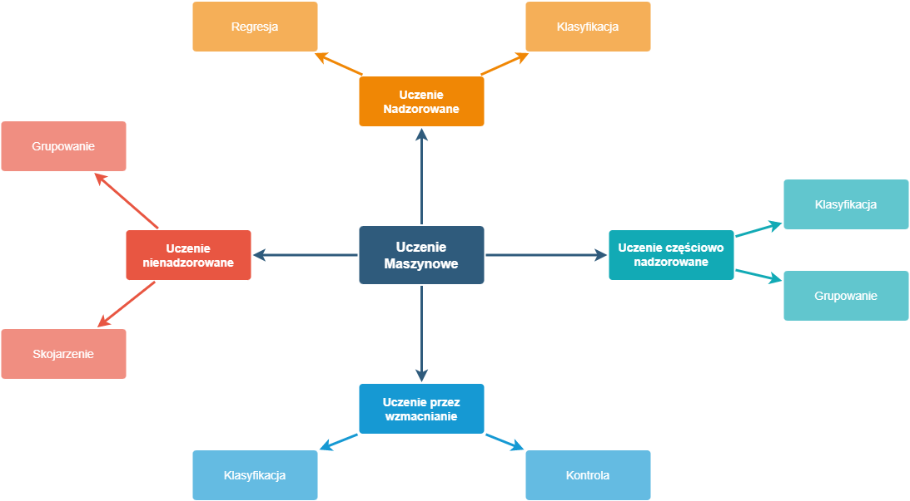{ height=100% }


**Uczenie maszynowe bez nadzoru** (ang. _unsupervised learning_) to klasa algorytmów uczenia maszynowego, która wiodąco rozwiązuje problemy grupowania. Dane dostarczane do modelu nie zawierają _oznaczeń_, zatem nauczanie polega na wyciąganiu konkluzji z poprzednio wykonanych iteracji. Na skuteczność modeli budowanych w oparciu o uczenie bez nadzoru
wpływ ma rozmiar dostarczonego do nauki zbioru danych, im jest on większy, tym bardziej wzrasta efektywność. Takie zbiory można uzyskać rejestrując dane na bierząco dlatego do najczęstszych zastosowań tej klasy algorytmów zaliczamy rozpoznawanie mowy czy obrazu[@3].

**Uczenie maszynowe przez wzmacnianie** (ang. _reinforcement learning_) to klasa algorytmów uczenia maszynowego, której nauczanie nie opiera się
na danych wejściowych czy wyjściowych a rezultatach otrzymanych podczas testu nazywanych tzw. sygnałami wzmocnienia, które mogą przyjmować wartość pozytywną lub negatywną.
Algorytm generując dane wejściowe dostosowuje reguły by uzyskać zwrotnie sygnał pozytywny w jak największej liczbie przypadków[@reinfor-learning].

**Uczenie częściowo nadzorowane** (ang. _semi-supervised_ _learning_) to klasa algorytmów uczenia maszynowego która wykorzystuje zbór danych w większości niepoetykietowany na podstawie których tworzony jest model[@semi-learning], wykorzystywany głównie w przypadkach niewydajności zastosowania osobno modeli nadzorowanych i nienadzorowanych. Zastosowanie tej klasy algorytmów pozwala również na maksymalizację wykorzystania zebranych informacji [@introduction] .

Uczenie nadzorowane przedstawiając oficjalną matematyczną definicję:
```
 DL = ((xi, yi))l      gdzie : i=1
 ```
(xi, yi) to punkt z zakresu xi ∈ X oznaczony etykietą yi dla danych wejściowych oznaczonych jako X. 

Zbiór (xi, yi) to tzw. dane uczące, na podstawie których metody uczenia próbują wywnioskować funkcję, która ustali y dla nieoznakowanego x.

Większy zasób punktów sprawdzający działanie, czyli dane testowe definiujemy następująco[@scikit-learn-two]:

```
DU = (xi)l+u          gdzie : i=l+1 
```

### Klasyfikacja a Regresja

Oba przedstawione poniżej typy sysytematyzją w oparciu o dostarczone dane wejściowe i mają one wspólną część polegającą na budowaniu modelu
separującego kategorie docelowe w użyteczny i dokładny sposób.[@introduction]

*Klasyfikacja* - decyduje o przynależności do zbioru, kategorii, grupy lub klasy.

*Regresja* - daję ciągłą prognozę korelacji między zmiennymi, standardowym przykładem zastosowania jest prognoza pogody. 
Realne pomiary temperatury, prędkości wiatru, ciśnienia wpływają na finalną odpowiedź. Sama regresja dzieli się również na kategorie ze względu na skomplikowanie, najprostszym przykładem jest regresja liniowa.

Analogiczne typy i stanieją dla uczenia bez nadzoru jak na przykład *grupowanie*, które klasyfikuje dane w zbiory. Rozbieżność z klasyfikacją polega na wykorzystaniu do wykonania oceny korelacji podobnych cech, a nie wsadu danych testowych. 

*Redukcja wymiarowa* to jak nazwa wskazuje pozbycie się nieistotnych atrybutów i odrzuceniu duplikatów, a co za tym idzie wymiaru 
data set'u. Dobrym przykładem byłoby tutaj analiza zawartości skrzynki pocztowej i szukanie spamu. 

Podział osób na kategorie cierpiące na choroby sercowo-naczyniwe oraz zdrowe to dylemat klasyfikacyjny nadający się do
rozwiązania za pomoc algorytmów uczenia maszynowego nadzorowanego i na nich skupia się dalsza część pracy.

## Ścieżka działania algorytmów uczenia maszynowego nadzorowanego

Bazowy schemat budowania i oceniania modeli uczenia nadzorowanego to kolejno:

1. Przygotowanie danych.
2. Implementacja modelu.
3. Trening oraz ocena.

Wykorzystanie utworzonego modelu wymaga:

1. Zbudowania modelu oraz jego wytrenowania
2. Wykonania predykcji na danych, które nie posiadają oznaczenia[@confiusion]

Ten schemat można zastosować do dowolnego modelu uczenia, wykonanie kolejnych bloków zadaniowych różnić się będzie specyfiką dla danego modelu: 

- przygotowanie danych dla algorytmów uczenia nadzorowanego musi zawierać również zebranie odpowiedzi/wyników dla danych testowych
- implementacja modelu za każdym razem jest specyficzna dla zastosowanego algorytmu, który równiez zależy od typu uczenia
- ewaluacja modeli regresywnych różni się od ewaluacji modeli klasyfikacyjnych ze względu na wykorzystanie innych miar oceny dokładności
- zastosowanie modeli może posiadać wielorakie formy realizacji.

## Dane 

### Terminologia

Analiza uczenia maszynowego wymusza stosowanie rozróżnienia przy pojęciach parametru i argumentu.
Cechy, dla których szukamy optymalnych wartości, które stanowią podstawe modelu i ich dostrajanie wykonywane jest podczas treningu nazywane są parametrami i hiperparametrami.
 Argumenty natomiast to liczby znajdujące się w wierszach zbioru danych, które podlgają zmianie tylko podczas preprocesingu.
Nazewnictwo hiperparametrów wykorzystywane jest w przypadku zastosoawnia dla nich walidacji krzyżowej.

*Nadmierne dopasowanie(ang. _overfitting_ )*

Istnieje możliwość wytrenowania algorytmu tylko pod zadany zbiór testowy, wyniki dotyczące dokładności modelu, pomimo iż
będą wysokie, nie będą świadczyły o rzeczywistej skuteczności, gdyż będą uwzględniały tylko pojedynczy przypadek zasymulowany daną próbką danych testowych.
Przed wyborem cech do hiperparametryzacji warto sprawdzić macież korelacji cech, aby nie wybrać tylko tych silnie ze sobą sprzężonych[@sensor].

### Repozytorium uczenia maszynowego UCI

Sensem wykorzystania uczenia maszynowego jest prognoza lub klasyfikacja rzeczywistych wartości z dużego zbioru danych, które mogą znaleść zastosowanie w praktycznych dziedzinach. Im bardziej dokładne i rzeczywiste dane do testowania i tworzenia modelu tym większe prawdopodobieństwo otrzymania realnych wyników na końcu ścieżki uczenia. 

{ width=50% } [@UCI]

W celu gromadzenia miarodajnej bazy dostępnych zbiorów danych testowych powstało repozytorium uczenia maszynowego UCI. Jak podaje strona informacyjna:

> ... było ono cytowane ponad 1000 razy, co czyni je
> jednym ze 100 najczęściej cytowanych „artykułów” w całej informatyce ... [@UCI]

Repozytorium gromadzi dane z wielu rozbieżnych dziedzin , dane medyczne umieszczone w repozytorium nie zawierają wrażliwych danych pacjentów, a niektóre zbiory są poddane już wstępnej obróbce tak jak zbiór danych _"Heart Disease Databases"_ wykorzystany w tym dokumencie, który powstał na podstawie realnych danych medycznych zebrany z lokalizacji:

1. Fundacja Cleveland Clinic [@5]
2. Węgierski Instytut Kardiologii, Budapeszt  [@hungary]
3. V.A. Centrum medyczne, Long Beach, Kalifornia  [@5]
4. Szpital Uniwersytecki, Zurych, Szwajcaria  [@switzerland].

#### Stratyfikacja

Wyróżniono 14 atrybutów spośród 76 zebrancyh do wykorzystania w algorytmach uczenia maszynowego, wszystkie z nich mają
wartośi liczbowe. Lista atrybutów wykorzystanych w algorytmie:

- wiek
- płeć
- rodzaj bólu w klatce piersiowej
- spoczynkowe ciśnienie krwi
- cholesterol w surowicy w mg/dl
- poziom cukru we krwi na czczo > 120 mg/dl
- spoczynkowe wyniki elektrokardiograficzne
- osiągnięto maksymalne tętno
- dławica piersiowa wywołana wysiłkiem fizycznym
- obniżenie odcinka ST wywołane wysiłkiem fizycznym w stosunku do odpoczynku
- nachylenie szczytowego odcinka ST ćwiczenia
- liczba głównych naczyń pokolorowanych fluorozopią
- skan serca z talem lub test wysiłkowy
- stan (brak choroby serca/choroba serca)

Rozkład chorób serca w danych testowych to 44.67% chorych, czyli 509 prób pozytywnych oraz 411 negatywnych.
W danych testowych znajduje się 726 przypadków osób płci męskiej oraz 194 żeńskiej. Dla zachorowań widać nierówność, ale jest ona spowodowana rzeczywistą statystyką.
Tylko u 25.77% badanych kobiet stwierdzono występowanie chorób wieńcowych, natomiast wśród badanych mężczyzn jest to aż 63.22%. [@UCI]


W przypadku danych testowych z repozytorium UCI fakt, iż dane pochodziły z róźnych lokalizacji ma duże znaczenie, gdyż
od placówki medycznej zależy jakim badaniom poddani zostali pacjęci a co za tym idzie, w jakich kolumnach tabelarycznego
przedstawienia będą mieć uzupełnione bądź puste wartości. Scalenie ze sobą wyników badań dostarcza większej różnorodności
również dzięki temu że dane pochodzą z wielu krajów. Jeżeli zestaw wejściowy zostałby ograniczony do jednej
lokalizacji to cecha, dla której nie uzupełniono wartości zostałaby pominięta podczas treningu ze względu na brak
danych, co skutowało by uboższym modelem i możliwe, że pominięciem kluczowej cechy wpływającej na działanie.

### Wstępna obróbka danych

Proces przetwarzania danych może składać się z wielu róźnych kroków zależenie od typu, w uczeniu nadzorowanym operującym
na danych tekstowo-liczbowych poprawne będzie zastosowanie schematu przedstawionego poniżej:

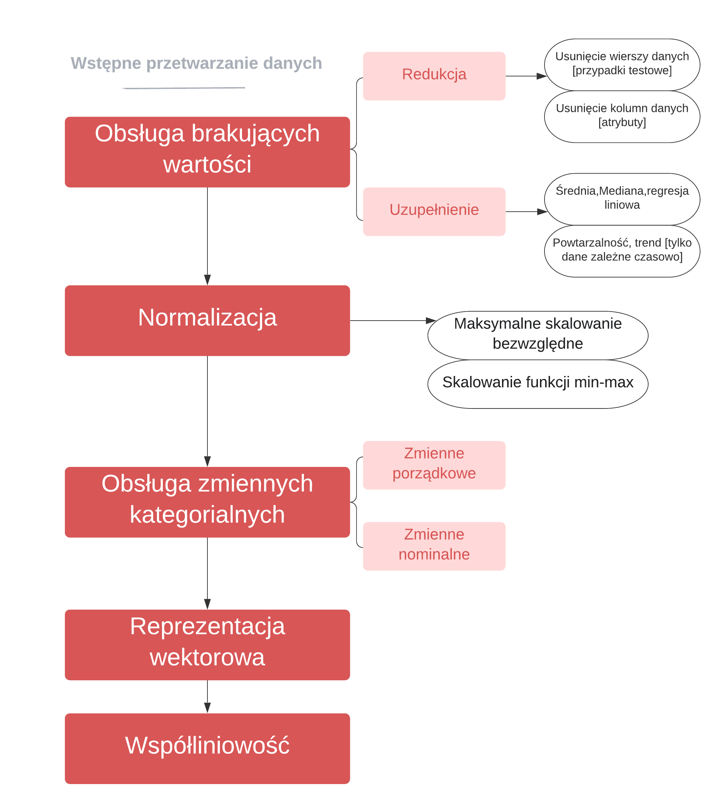{ width=50% }

 Po złączeniu można przeprowadzić szereg działań w celu sztucznego uzupełnienia pustych wartości bazując na wartościach, które już istnieją.

*Obsługa brakujących wartości*

Możliwościami obsługi brakujących wartości są: mniej polecana ze względu na utratę danych, redukcja zestawu danych lub uzupełnienie go zgodnie z wybrany przez siebie założeniem. Biblioteki do nauczania
maszynowego dostarczają już gotowe rozwiązania do upuszczenie wierszy lub kolumn zawierających wartości
_null_. Uzupełnienie danych inaczej _imputacja_ rozwiązuje problem w mniej stratny sposób i tak samo, jak do redukcji są już
gotowe rozwiązania w bibliotece sklearn. 

Istnieją 4 różne strategie uzupełniania wykorzystujące proste matematyczne obliczenia takie jak:

- średnia,
- mediana,
- stała,
- najczęściej występująca wartość.

Do wyznaczenia wartości uzupełniających można również użyć regresji liniowej.

*Standaryzacja*

Przekształcenie danych również bazujące na statystycznych założeniach i również ustandaryzowane w popularnych
bibliotekach. Dąrzymy, aby średnia wartoś wynosiła 0, a odchylenie standardowe 1 dla liczbowych reprezentacji danych. Z
matematyczne punktu widzenia wykonujemy działanie

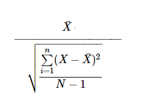{ width=30% } [@standar]

*Obsługa zmiennych kategorialnych*

Cechy kategorialne dzielą się na dwie zasadnicze grupy ze względu na możliwość uporządkowania, dane takie jak wykształcenie, rozmiar podlegają mapowaniu, dane typu kolor lub płeć podlegają kodowaniu. W ten sposób dane
kategoryczne staja się wartościami liczbowymi.

*Reprezentacja wektorowa*

Obsługa danych kategorialnych pozwoliła zmapować/zakodować je w postaci liczbowej, ale można pójść o krok dalej i te same dane mieć w postaci 0 lub 1 na odpowiedniej kolumnie. Rozwiązanie reprezentacji wektorowej polega na utworzeniu tylu kolumn ile jest unikalnych wartości dla kategorii i wpisanie 0 lub 1 dla każdego rekordu danych [@wektor] .

*Współliniowość cech*

Znalezienie korelacji współliniowości polega na szukaniu liniowej zależności pomiędzy danymi, najłatwiej zauważyć to tworząc wykresy z danych testowych dla każdej pary[@wektor].

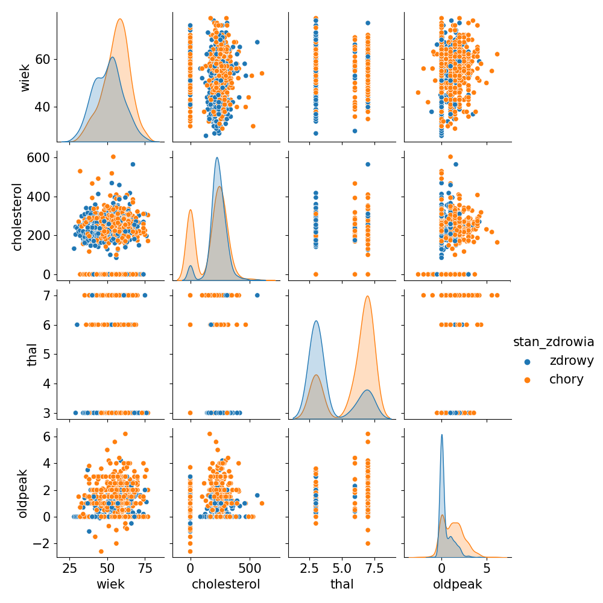{ width=50% } 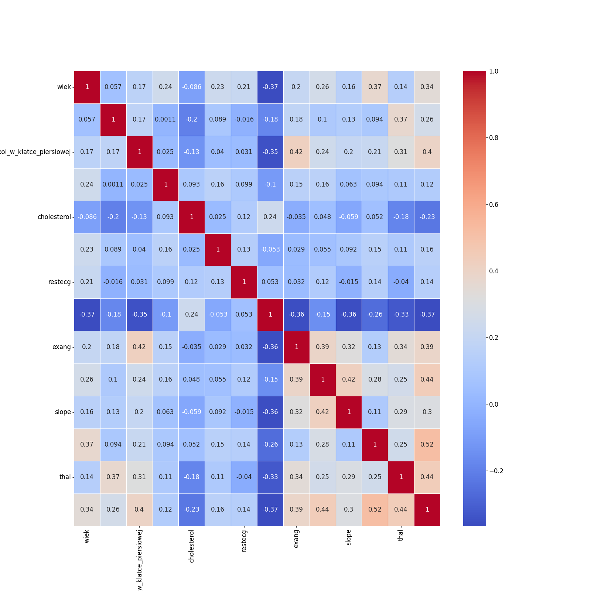{ width=50% } 


Zgodnie z schematem po przeprocesowaniu wejściowego zbioru danych, należy go podzielić na dane treningowe oraz ewaluacyjne. Powszechnie stosowana K krzyżowa walidacja umożliwia maksymalne wykorzystanie dostarczonego wejścia do dostrajania parametrów modelu, ponieważ optymalizacja hiperparametrów połączone z ciągłą weryfikacją poprawności to sedno treningu.


**K-krotna walidacja krzyżowa** (ang. _K-fold Cross Validation_) - metoda weryfikacji działająca poprzez podział
zbioru danych na k podzbiorów, z których każdy przynajmniej raz jest zbiorem oceniającym wydajność, zaznaczając, że K
musi być równe lub mniejsze niż liczba elementów w zbiorze[@kfold;@kfold2].

Kluczowym elementem jest ewaluacja, która odbywa się na końcu każdej z k-1 iteracji w celu dostosowania parametrów, po
osiągnięciu wymaganych lub ustalonych wartości dokładności modelu, lub weryfikacji wszystkich możliwych opcji i
znalezienie najlepszego modelu można go wykorzystać do weryfikacji na danych spoza zestawu testowego.


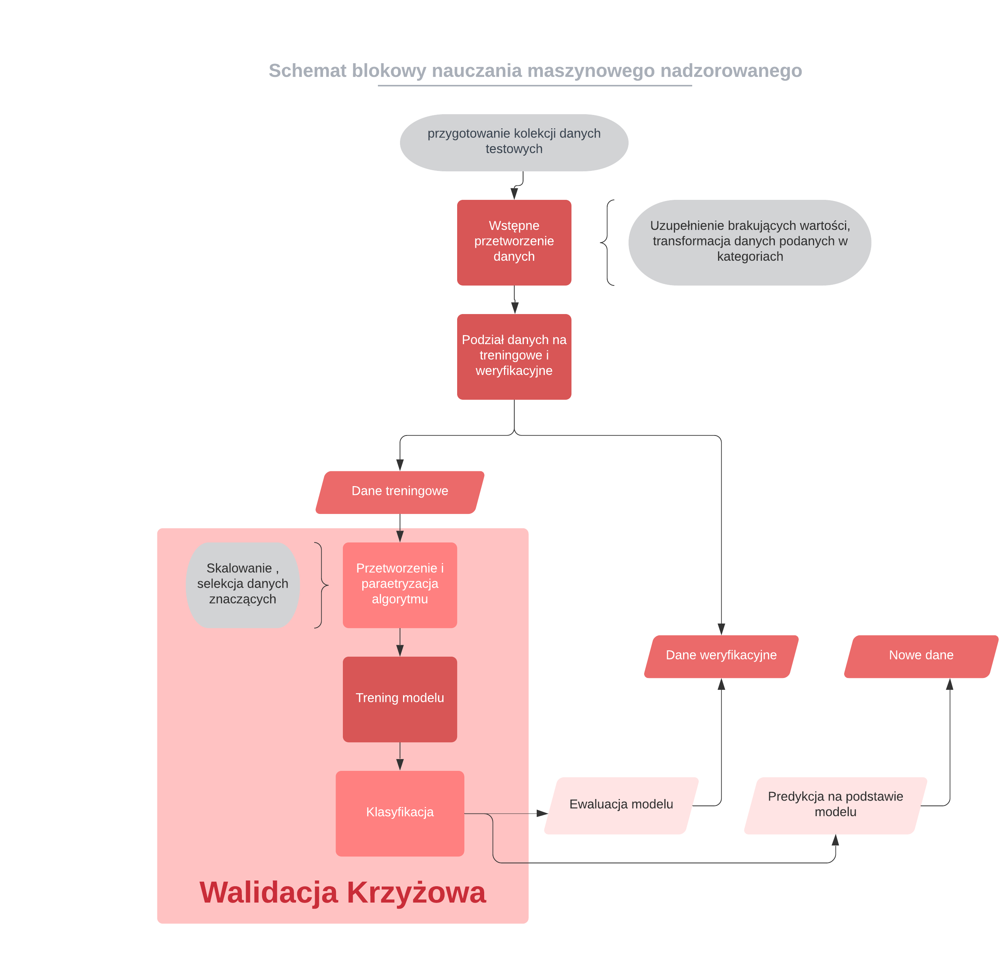{ height=45% }


## Wybrane algorytmy uczenia maszynowego nadzorowanego

### Losowe lasy decyzyjne

**Drzewa decyzyjne** (ang. _decisions trees_) są uznawane za najprostszy i najbliższy ludzkiemu zrozumieniu algorytm
uczenia, który swoją nazwę zawdzięcza graficznej reprezentacji w postaci drzewa. Każdy węzeł oznacza atrybut, na
podstawie którego następuje rozróżnienie. W modelu kluczowa jest kolejność cech, które wystękują po sobie, ponieważ
determinuje to otrzymany rezultat[@3;@32].

{ width=50% }

Prawie każdy algorytm uczenia maszynowego nadzorowanego można podzielić na dwa etapy. W pierwszym opracowywany jest wzorzec, na którym bazuję późniejsza predykcja. Uczenie składa się z dwóch części, w wariancie drzew decyzyjnych uczenie to tworzenie rozgałęzień reprezentujących atrybuty dzielące zastaw testowy aż dalszy podział jest niemożliwy. Takie drzewo może mieć dowolnie długą drogę po węzłach,
niestety taki sposób rozwiązania jest przyczyną powstania przypadku _overfittingu_. Ograniczenie głębokości drzewa lub minimalna liczba wartości w liściu zminiejsza ale nie niweluje ryzyka. [@confiusion]

Na metodologie drzew decyzyjnych oparta jest dokładniejsza forma nauczania nadzorowanego: _losowe lasy decyzyjne._

**Losowe lasy decyzyjne** (ang. _random decision forests_) to technika polegająca na połączeniu wielu drzew decyzyjnych
w celu uniknięcia problemu z _nadmiernym dopasowaniem_ do treningowego zestawu danych, na którym został przeszkolony.

Utworzony szablon, aby poprawnie działać na danych testowych i służących weryfikacji, nie może stać się
charakterystycznym przypadkiem rozwiązującym przypadek testowy[@3;@32]. W tym celu dla losowych lasów decyzyjnych najpierw stosuję się **agregację bootstrapową**.
Z treningowego zestawu danych losuję się, z możliwymi powtórzeniami, wiersze danych, dla których trenowany będzie
model. Jako rezultat brana jest większość lub średnia wartości uzyskanych wyników dla poszczególnych drzew decyzyjnch.
Dodatkowo dla drzew decyzyjnych w lasach losowych, atrybuty odpowiadające za kategoryzację są wybierane z wylosowanego
podzbioru.[@forest]

Działanie biblioteki sklearn dla lasów losowych wygląda następująco:

0. Wylosowanie podzbioru cech włączanych w dane drzewo.
1. Typowanie kombinacji podziału poprzez obliczanie prawdopodobieństwa wyboru i uśrednianie wyników. Wybierany jest podział na klasy o najwyższym średnim prawdopodobieństwie.
2. Utworzenie nowego węzła.
3. W każdym podwęźle należy zweryfikować powiązania i jeżeli spełniony jest warunek wartości docelowych, co oznacza, że w węźle dane są wystarczająco podobne, zwracana jest prognozowana wartość. W przeciwnym razie należy powtórzyć od kroku 1.


*Technika bootstrap*

Główną wartością z jej zastosowania jest nadanie losowości tworzenia drzew, podział można wykonać pobierając próbki ze zwracaniem lub bez.
Brak możliwości ponownego wyboru wcześniejszej cechy uniezależnia je od siebie. Metoda ze zwracaniem wymaga powtarzania aż do wybrania próbki liczącej tyle samo co macierzysta kolekcja.
Potem po podliczeniu statystyki i ich średnich dla każdego wykonania proces powtarzany jest aż do uzyskania warunku końcowego. [@confiusion]


*Ekstremalne lasy losowe*
Ekstremalność polega na wyselekcjonowaniu losowego podzbioru punktów podziału i dla tego podzbioru przeprowadzana jest ewaluacja. 
W związku z tym do kroków procesu oprócz losowania cech dodatkowo losowo określane są też podziały.


Wśród zalet lasów losowych należy wyróżnić, iż potrafią one trafnie wykalkulować brakujące wartości cech. Idealnie
znajdują zastosowanie dla realnych danych, których zasadniczym problemem jest ich niekompletność. 

Dane medyczne posiadają szeroką wariację zmiennych z dużym prawdopodobieństwem wybrakowania, zastosowanie do nich lasów
decyzyjnych ma potencjał na pozytywne rezultaty.


### Maszyna wektorów nośnych

**Metoda wektorów nośnych** (ang. _support_ _vector_ _machines_, skr. **_SVM_**) to algorytm uczenia maszynowego
nadzorowanego, który każdy parametr z dostępnych cech dla danych wejściowych, traktuje jako punkt w przestrzeni. Na
podstawie ułożenia punktów dzieli się je na 2 klasy. Graficznie jest to reprezentowane przez prostą, dla której odległość
między najbliższymi dwoma punktami dla wektorów jest możliwie największa.

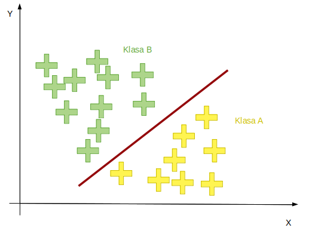{ height=20% } [@schemat] 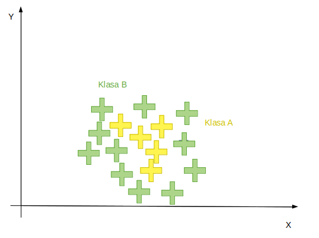{ height=20% } [@schemat]


Taka prosta nazywana jest _prostą marginalną_
i powstaje ona poprzez generowanie i selekcję tych prostych, które rzetelnie szufladkują klasy danych[@3;@32].

Technika ta gwarantuje precyzyjniejsze regulatory niż drzewa decyzyjne, niestety dla dużych zbiorów danych czas trwania
szkolenia znacznie się wydłuża oraz istnieją przypadki, dla których podział jedną prostą jest niewykonalny, taki
przypadek reprezentuje rozkład na drugim schemacie.

Z powyższego schematu widać, że prosta marginalna ma zastosowanie w przypadku dwóch wymiarów, 
dla większej ilości stosowane jest przekształcenie do innego systemu współrzędnych i szukanie hiperpłaszczyzny brzegowej dzielącej tak samo, jak prosta punkty w przestrzeni na dwa zbiory.[@hiper] 
 
#### Wyszukiwanie podziału 

Idea działania maszyny wektorów nośnych opiera się na wyznaczenia minimalnej wartości wektora wag oraz przesunięcia (ang. _bias_), który geometrycznie opisuje współrzędne hiperpłaszczyzny. 

{ height=10% } [@svmW0]

W przypadku prostej wersji podziału poprzez prostą optymalizacja polega na redukcji danych potrzebnych do uzyskania rozbicia. Margines między kategoriami powinien być maksymalny, żeby zminimalizować błąd dla próby testowej. Nawet w przypadku zastosowania
hiperpłaszczyzny punkty dzielone są na 2 klasy dlatego nie stosuje się go do grupowania i klasyfikacji dla większej ilości. W bibliotece sklearn konwencja przyjmuje stosowanie zasady podziału ang. _one-versus-rest_ i oferuje ponad trzy podejścia formułowania estymatora klasyfikacji:
_SVC_, _LinearSVC_, _NuSVC_ itd.

### K najbliższych sąsiadów

**K najbliższych sąsiadów** (ang. _k nearest neighbours_, skr. **_KNN_**) to algorytm uczenia maszynowego nadzorowanego opierający swoje estymacje dla konkretnego przypadku danych na wartościach jego K najbliższych sąsiadów (punktów) liczonych m.in. dla przestrzeni Euklidesowej[@3]. Koncepcja polega na:

0. Wyszukanie k prób do porównania zgodnie z metryką.
1. Analiza podobieństwa dla wybranej próbki.
2. Selekcja najczęściej pojawiającej się odpowiedzi i oznaczenie sklasyfikowanych wartości.[@confiusion]

Do wyznaczenia odległości w metryce Euklidesowej stosowany jest wzór:

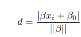{ width=22% } [@manhattan]

popularne są również przestrzenie Manhattan:

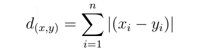{ width=22% } [@manhattan]

oraz Mińkowskiego:

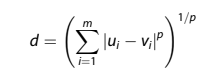{ width=22% } [@minkowski]

Atrybut, który nastraja proces uczenia się modelu i ma na niego największy wpływ określany jest mianem hiperparametru. Dla
KNN jest to liczba sąsiadów i może przyjmować maksymalnie wartości do rozmiaru zbioru cech. Im większa ilość jednostek mających wpływ, tym potęguje się niestety złożoność czasowa algorytmu, znacząco już większa od przedstawionych powyżej innych algorytmów,[@3] oraz tym bardziej wzrasta ryzyko nadmiernego dopasowania do modelu testowanego. 

W celu przewidzenia wartości dla nowych danych należy odnaleźć K najbliższych punktów wyliczając odległości, a
następnie przepisać odpowiedź implikowaną przez większość sąsiadów. Dla wartości K równej jeden, metoda ta nazywana jest
algorytmem najbliższego sąsiada.
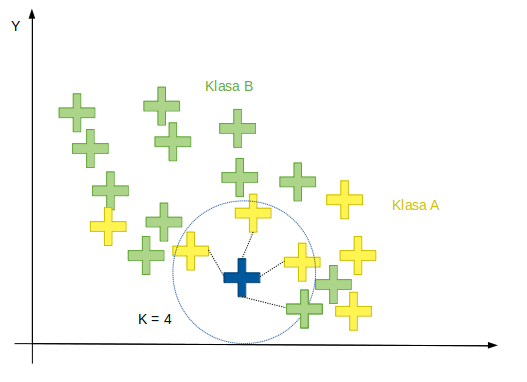{ width=50% } [@schemat]

Dla lekarza wartością dodatnią jest wykrycie zależności, które decydują o uznaniu lub zaprzeczeniu występowania choroby.
Zastosowanie algorytmu KNN może nie tylko zakwalifikować osoby chorujące na serce, ale również ułatwić swoją graficzną
reprezentacją wpływ cech na ostateczny osąd próbki.

# Opis praktycznej części projektu

## Narzędzia i biblioteki zastosowane w pojekcie

Biblioteki w większości posiadają otwarty kod źródłowy, napisany w języku Python[@libpyth].

### Python

Język programowania wysokopoziomowego umożliwiający programowanie zorientowane obiektowo. Pozwala na tworzenie klas, dziedziczenie, polimorfizm odraz hermetyzacje atrybutów w klasie.
Python wykorzystywany jest również do pisania skryptów. Sam interpreter można rozbudowywać o nowe typy danych zaimplementowane w C lub C++.
Na oficjalnej stronie _https://www.python.org/_ można zajrzeć do kodu źródłowego, który jest udostępniony publicznie.
Darmowa biblioteka ułatwia tworzenie szybkich aplikacji oraz integrację z zewnętrznymi projektami[@semi-learning].

### Scikit-learn

Praktyczna część pracy napisana została w języku Python z wykorzystaniem *scikit-learn*, obsługującym wiele algorytmów
maszynowego uczenia się w tym uczenia nadzorowanego i docelowo wybranych algorytmów przedstawionych w teoretycznej
części pracy.

{ height=10% }

Biblioteka rozwijana przez ponad 10 lat opiera się o *Numpy* oraz *Scipy*, daje zestaw narzędzi do obliczeń na macierzach, wektorach oraz umożliwiający metody
numeryczne takie jak całkowanie, różniczkowanie i temu podobne[@scikit]. W rezultacie można za jej pomocą wykonać elementy procesu nauczania algorytmu, takie jak: przetwarzanie wstępne, redukcja wymiarowości, klasyfikacja, regresja.[@libpyth] 
Pomimo cieszenia się dużym zaufaniem, implementacja niekoniecznie musi być najoptymalniejszą. Dodatkowo korzystanie z Numpy zwiększa ryzyko błędów samej bibliotece. Za jej pomocą można wygenerować przykładowa dane, wyliczyć metryki wydajności oraz zinterpretować wyniki klasyfikacji.[@sensor]

*Pandas*
Do przygotowania danych wykorzystano zestaw narzędzi *Pandas*, ułatwiający tworzenie struktur danych i ich analizę. 

*Matplotlib*
W celu wizualizacji wyników w postaci wykresów zastosowano, opartą na *Matplotlib*, bibliotekę *Seaborn* powszechnie stosowaną do rysowania estetycznej grafiki statystycznej.

*Flask*
Część prezentacyjna, czyli możliwość wprowadzenia danych w formularzu na stronie i weryfikacja wyniku dla wyuczonych już modeli wykorzystuje bibliotekę *Flask*. Framework Flask ułatwia pisanie aplikacji internetowych i jest rozwiązaniem, które daje duży zakres dowolności oraz możliwości. Flask sam z siebie nie definiuje warstwy bazy danych czy formularzy, pozwala za to na obsługę rozszerzeń, które ubogacają aplikację o wybraną funkcjonalność. [@flask]

*JsonPickle* i *JobLib*
Przekazywanie obiektów o bardziej skomplikowanej budowie i ich _serializacja_ oraz _deserializacja_ do formatu JSON wykonane są za pomocą biblioteki *jsonpickle*, a zapis
modeli wykonano za pomocą *joblib* która zapewnia obsługę obiektów Pythona i jest zoptymalizowana pod kątem pracy na dużych tablicach Numpy. [@libpyth]

### Środowisko wykonania

Wykonanie programu i analizę danych testowych wykonano na maszynie o parametrach:
```doctest
Procesor	Intel(R) Core(TM) i5-6300U CPU @ 2.40GHz   2.50 GHz
Zainstalowana pamięć RAM	8,00 GB (dostępne: 7,82 GB)
Typ systemu	64-bitowy system operacyjny, procesor x64
```

Wersje bibliotek wykorzystanych w projekcie:

```doctest
setuptools~=49.2.1
Flask~=2.0.1
matplotlib~=3.4.2
numpy~=1.20.3
pandas~=1.2.4
scikit-learn~=0.24.2
pytest~=6.2.5
joblib~=1.0.1
scipy~=1.6.3
seaborn~=0.11.2
jsonpickle~=2.1
```

Interpreter Python w wersji _3.9_.

## Moduły projektu:

- Config-zawiera statyczne zasoby oraz konfigurację logowania projektu
- Data-moduł odpowiada za wczytywanie i obróbkę danych testowych, zawiera definicje obiektów wykorzystywanych przy uczeniu oraz zapisu modelu oraz przekazywaniu wyników prezentowanych na stronie
- Management:

    - PlotGeneration-moduł odpowiedzialny za prezentację wyników w postaci wykresów porównujących algorytmy oraz
      odpowiedzi na zadany problem, oraz przechowuje obiekty, które przy wywoływaniu funkcji od strony www są jedynie formatowane i zwracane
    - Prediction-przygotowanie parametryzacji oraz implepmentacja treningu dla każdego z 3 algorytmów:

        - RF-przygotowanie, trening i zapis modelu sprecyzowany dla klasyfikatora lasów losowych 
        - KNN-przygotowanie, trening i zapis modelu sprecyzowany dla klasyfikatora k-najbliższych sąsiadów 
        - SVM-przygotowanie, trening i zapis modelu sprecyzowany dla maszyny wektorów nośnych
      
- Static-folder z grafikami, plikami stylów, skryptami _javascript_ oraz _jQuerry _
- Templates-folder ze stronami html wykorzystującymi dyrektywy Flask

Projekt posiada dwa tryby pracy:

- tryb nauczania na podstawie danych testowych\
machine learning z wykorzystaniem 3 algorytmów (_Run_Learning_Proces.xml_), musi być wykonany przynajmniej raz przed wykorzystaniem programu jako aplikacja  
- tryb aplikacji web\
wykorzystanie Flask do prezentacji i wykorzystania utworzonych modeli (_Run_Web_Application.xml_), strona prezentuje analizę danych oraz uczenia algorytmów, przy czym głównym zadaniem jest wykonanie predykcji na podstawie danych wpisanych do formularza.

## Trening algorytmu

### Wstęp

Głównym zadaniem trybu nauczania jest utworzenie i wytrenowanie modeli dla 3 algorytmów nauczania nienadzorowanego, w tym celu wykonywany jest preprocessing danych, czyli kolejno:

### Przygotowanie danych

Proces przygotowania danych zastosowany w projekcie składa się z następujących kroków:

1. Załadowanie i konkatenacja datasetu, standardowo również wybranie cech znaczących głównie odbywające się poprzez odrzucenie nadmiarowych parametrów, ale istnieje też możliwość dodania nowych np. utworzenie powierzchni na podstawie wymiarów zawartych w danych testowych. Następnie należy wykonać wyeliminowanie cech niewpływających na odpowiedź i dopiero po dokonaniu selective przystapić do przetwarzania zebranych informacji.

2. Uzupełnienie pustych wartości dla późniejszego porównania w projekcie tworzone są imputery dla 4 różnych form uzupełnienia, 
ale są to najbardziej podstawowe działania typu średnia wartość, najczęściej występująca wartość. Idealnym rozwiązaniem byłoby w przypadku posiadania eksperckiej wiedzy z danej dziedziny uzupełnienia brakujących wartości własnymi propozycjami. Innym sposobem może być wykorzystanie heurystyk specyficznych dla tworzonego modelu[@confiusion].

3. Standaryzacja

4. Konwersja danych dla kategorii

5. Normalizacja z wykorzystaniem MinMaxScaler, zmiana skali w formie przykładu to na przykład przeliczenie temperatury ze
stopni Celcjiusza do Fahrenheita. Wykonuje się ją, by przesunąć wartości skrajne i pozbyć się nierówności w zbiorze[@confiusion].

### Trening algorytmu

*Podział danych* na dane treningowe i testowe wykorzystuje zdefiniowane w bibliotece sklearn predefiniowaną funkcje train_test_split zwracającą cztery obiekty tablic dla x_testowych, y_testowych, x_treningowych oraz y_treningowych[@confiusion]. Tak spreparowany zestaw danych poddawany jest treningowi modelu kolejno dla każdego z algorytmów. 
Do dostrojenia parametrów oraz znalezienia najlepszego modelu wykorzystywany jest:
```Python

GridSearchCV

```
Model trenowany jest na podstawie siatki parametrów i sprawdzana jest każda  kombinacja by uzyskać konfiguracje parametrów dla najlepszego estymatora.


Wykorzystane parametry wykonania GridSearchCv[@scikit]:

- estimator: implementacja interfejsu obiekt estymatora scikit-learn,
- param_grid: słownik parametrów, które są potem testowane w dowolnej sekwencji ustawień,
- refit: dopasowanie best_estimator_, best_index_, best_score_ i best_params_ dla najlepszej sekwencji ustawień parametrów
- cv: parametr k dla KFold walidacji krzyżowej,
- verbose: obszerność logowanych informacji 


*HalvingGridSearchCV*

Sklearn-learn udostępnia również inne implmentacje zastosowania walidacji krzyżowej np. _HalvingGridSearchCV_ lub _HalvingRandomSearchCV_.
HalvingGridSearchCV polega na zmniejszaniu o połowę zbioru parametrów po każdej iteracji algorytmu krzyżowego.
Ta strategia wyszukiwania sukcesywnie zmniejsza ilość wymaganych iteracji dla danego zestawienia, przez co wykonania jest szybsze niż w przypadku zwykłego GridSearchCv.
Na poniższym wykresie przedstawiającym średni wynik dla algorytmu SVC widać, że czas wykonania zmniejszył się ponad 6 krone w stosunku do GridSearch.

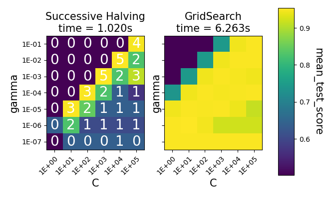[@scikit]{ width=30% }

Umieszczone oznaczenia od 0 do 5 informują o tym, w której iteracji kombinacja parametrów została oznaczona jako najlepsze zestawienie.
Implementacja ta nie została wykorzystana ze względu na nadal pozycjonowanie jej jako eksperymentalnej.

Podczas uczenia i wykonania funkcji _fit_ w rezultacie otrzymujemy zadane wcześniej informację, jakie 
hiperparametry po przejściu sprawdzianu krzyżowego zostały uznane za wystarczająco precyzyjne do utworzenia modelu[@confiusion].

Pierwszym z wymaganych argumentów _GridSearchCV_ są estymatory. W projekcie ich implementacja pochodząca z biblioteki oraz dostępną dla nich parametryzację daje w wyniku następujące zestawienie najlepszych osiągniętych estymatorów:

*KNeighborsClassifier* [@scikit] :
 
- n_neighbors: 6 - liczba sąsiadów, z których wnioskowany jest jednostkowy rezultat.
- weights: 'distance' - wagi, na podstawie których wyliczana jest predykcja, można zastosować wagę 1:1 lub nałożyć wagi zgodnie z dystansem.
- algorithm: auto - algorytm zastosowany do znalezienia najbliższych sąsiadów, w projekcie wykorzystano: brute-force oraz auto
- leaf_size: 1 - rozmiar liścia dla algorytmów BallTree or KDTree
- p:1 - wykorzystanie miar odległości dla manhattan
- metric: 'canberra' -metryka odległości


*RandomForestClassifier*  :

- criterion: poisson - funkcja pomiaru dokładności rozgałęzienia
- min_samples_leaf: 1 -minimalna liczba próbek wymagana na liściu.
- min_weight_fraction_leaf: 0.0 -minimalny ułamek sumy wag wymagany na liściu 
- min_impurity_decrease: 0.0 - większe lub równe zmniejszenie zanieczyszczenia powoduje podział danego węzła\
Zmniejszenie zanieczyszczenia liczone jest zgodnie ze wzorem:\
```
    N_t / N * 
    (impurity -
     N_t_R /N_t * right_impurity  
     - N_t_L / N_t * left_impurity)
```

gdzie N to całkowita liczba próbek, N_t to liczba próbek w bieżącym węźle, N_t_L to liczba próbek w lewym liściu, a N_t_R to liczba próbek w prawym liściu.

- max_features: None - liczba funkcji najlepszego podziału
- random_state: 1 - wykorzystywany przy próbkowaniu cech przy poszukiwaniu najlepszego podziału w węźle
- cpp_aplha: 0.0 - zastosowanie to przycinanie drzewa o największej złożoności mniejszej niż cpp_alpha


*SVC*  :
 
- C: 1 - czyli domyślna wartość dla parametru regularyzacji,
- kernel: poly - jądro wykorzystane w algorytmie,
- degree: 5 - stopień dla funkcji jądra _poly_,
- gamma: scale - współczynnik jądra dla wartości _scale_ parametr jądra ustawiany jest na wartość:\
```text
    1 / (n * X.var())
```
dla wartości auto jest to:
```text
    1 / n
```
gdzie n to liczba cech.

- coef0: 0.3 - niezależny parametr funkcji jądra, wykorzystywany tylko przy jądrach _poly_ i _sigmoid_.
- shrinking: True - heurystyka kurcząca
- cache_size: 500 - cache jądra (w MB)[@scikit].

### Wizualizacja wyników

Po odnalezieniu najlepszego estymatora model jest zapisywany oraz generowane są wykresy dla trybu aplikacji webowej:

- wykresy modeli datasetu wejściowego i rozłożenia cech
- wykresy prezentujące zestawienia danych zebranych na temat algorytmu podczas wykonywania treningu.

Podczas dokonywania finalnej predykcji tworzone są jeszcze wykresy rozmieszczenia danych z zaznaczeniem umiejscowienia nowych danych testowych .

Wykresy dla danych testowych wykonywane są na niepoddanych wstępnej obróbce (normalizacja,standaryzacja,itp.) danych.
Zestawienie zawiera wykres rozłożenia przypadków chorobowych oraz to samo z uwzględnieniem podziału na płcie, wykres zależności danych między sobą oraz rozkład wartości dla każdego parametru.

Interesujące rezulaty widać już z samej analizy danych testowych, poniżej przedstawiono wykres dla cechy _maksymalnego osiągniętego tętna_ widać na nim dużą zależność stwierdzenia choroby układu krążenia.
Na niebiesko zaznaczono przypadki osób zdrowych, na pomarańczowo chorych. Na pierwszy rzut oka widać, że grupa chorych osiąga wyższe wartości dla tego parametru.

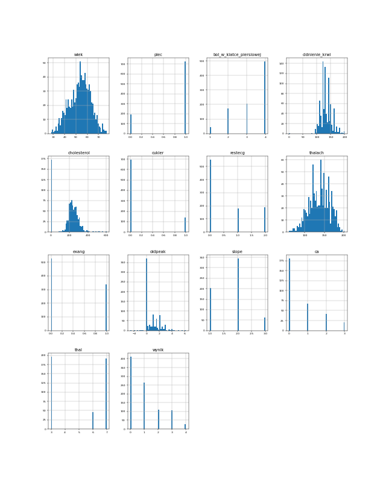{ width=50% } 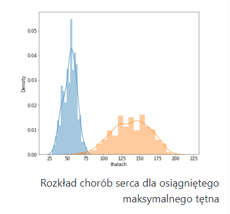{ width=50% }

Analiz algorytmów w postaci wykresów przedstawia osoby wykres dla każdego zdefiniowanego imputera per parametr. Podczas treningu przechodzi jeszcze pętla po metodach ewaluacji wartości:

- precyzja,
- dokładność,
- uśredniona dokładność,
- zrównoważona dokładność,
- recall,
- r2

ale sam model jest zapisywany i analizowany tylko dla wartości scorer = 'accuracy'.

Tworzone są 3 typy wykresów:

- porównanie oparte na danych dla *wyniku*: 'mean_test_score', 'std_test_score', 'rank_test_score', 'split0_test_score'
- porównanie oparte na danych dla *czasu*: 'mean_fit_time', 'std_fit_time', 'mean_score_time', 'std_score_time'                      
- porównanie oparte na *metodach oceny*, które zostały przedstawione powyżej jako metody ewaluacji.


## Opis działania aplikacji webowej

Poniżej przedstawiono architektówe działania:

{ height=70% }

Aplikacja posiada 4 widoki:

- widok główny strony 
- widok prezentacji danych wejściowych 
- widok omówienia treningu algorytmów
- widok formularza pozwalającego na wykonanie predykcji na wyuczonych modelach na podstawie własnych danych wejściowych

Zatwierdzenie formularza wyzwala odczytanie zapisanych modeli, iteracje i wykonanie predykcji na każdym z nich, następnie prezentowane są wyniki dla najlepszych estymatorów oraz wykresy wskazujące na umiejscowienie nowych danych na tle zbioru testowego.

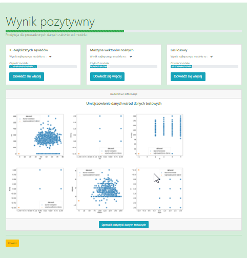{ width=60% }

## Porównanie działania modeli

W tym podrozdziale zamieszczone zostały wyniki oraz wykresy wygenerowane podczas treningu i weryfikacji danych testowych.

### Wskaźniki wydajności

**Dokładność**

Określenie stopnia, w jakim skonstruowany model z powodzeniem realizuje wyznaczone zadanie, należy do wskaźnika wydajności. Przykładem nieprawidłowego wyboru może być próba przewidzenia wystąpienia rzadkiej choroby u pacjenta wykorzystując do oceny pomiar _dokładności_ dla przykładu z rzadkimi wystąpieniami osób chorych. W takim scenariuszu klasyfikacja wszystkich pacjentów jako zdrowych daje
niewiele odbiegającą od perfekcji dokładność, a jednocześnie błędnie osądzać każde wystąpienie choroby. Wynika to z definicji dokładności :
```doctest

         poprawne odpowiedzi
    ----------------------------------
           próby testowe
```
Dla takiego działania przy sporadycznych przypadkach zachorowania uznawianie, że wszystkie przypadki są zdrowe (negatywne) uzyskujemy wysoki współczynnik dokładności, pomimo że zadanie zlokalizowania niezdrowych pacjentów zakończyło się niepowodzeniem.
Informacją, która powinna wynikać z oceny algorytmu to ile pozytywnych (cierpiących na choroby wieńcowe) pzrykładów zlokalizowano poprawnie, taki rodzaj oceny nazywany jest czułością.
 
 - | Dokładność w %       |  |  | | | | | |
------: |-:| -----: | -: | -: | ------: | ---: | -: | -: | -:|
 |Parametryzacja           |    | wyznaczanie parametrow |    |    |  parametry domyślne |    |   |    |
 |Algorytm / Imputer       | średnia | mediana | stała | naj. wartość | średnia | mediana | stała | naj. wartość |
|Losowe lasy decyzyjne    | 83.9% | 81.4% | 81.2% | 81.1% | 81.6% | 81.3% | 81.2% | 81.1% |
 |Maszyna wektorów nośnych | 81.7% | 80.6% | 82.9% | 81.1%| 81.8% | 80.5% | 82.8% | 81.1% |
 |K-najbliższych sąsiadów  | 83.6% | 79.0% | 79.0% | 78.4% | 78.5% | 79.4% | 79.0% | 78.4% |

Parametry domyślne dla zbioru testowego zwracają bardzo wysokie rezultaty jednak zastowowanie dodatkowej paramtryzacji jest widoczne w zwięszeniu wartości dokładności na każdym z algorytmów.
Dla lasów losowych poprawie uległa estymacja dla mediany i średniej, przy maszynie wektorów nośnych poprawa to 0.1% na co drugim imputerze, a dla k-najbliższych sąsiadów wynik dla średniej zwiększył się o ponad 5%.

Utarło się, że wśród problemów machine learningowych dotyczących danych medycznych najbardziej powszechnie stosowanym parametrem oceny jest *czułość* (ang. _true_ _positive_ _rate), czyli ocena ile przypadków pozytywnych zostało tak sklasyfikowanych. 
Do problemu można również podejść z drugiej strony, czyli skupiając się na błędnie sklasyfikowanych przykładach.
Rozróżniamy błąd negatywny (ang. _false_ _negative_) oraz błędnym pozytywnym (ang. _false_ _positive_ ), czyli błędnie sklasyfikowane osoby chore oraz, niepoprawnie uznane za chore przypadki osób zdrowych.

Kolejnym rozpowszechnionym parametrem oceny jest specyficzność inaczej współczynnik poprawnie negatywnych (ang. _true_ _negative_ _rate_), wyznaczającą częstotliwość występowania przypadków negatywnych.[@confiusion]

### Zestawienie efektywności działania algorytmów

Konfrontacja technik ucznia maszynowego zależnie od zestawu danych będzie dawała odmienne wyniki ze względu na ich
predyspozycje do zajmowania się odpowiednimi zbiorami danych.


**Potencjał algorytmów dla niewielkiego kompletu danych zawierającego wartości**

Zaczynając od drzew decyzyjnych, można od razu stwierdzić, że mają niższy potencjał niż pozostałe dwa algorytmy. Istnieje zbyt duże prawdopodobieństwo
dopasowania się do modelu treningowego, gdyż wspomniany zbiór mordancy wejściowych nie jest wystarczająco liczny. Dlatego
w pracy omówione zostały lasy decyzyjne.

Większej dokładności można się spodziewać po metodzie wektorów nośnych, ale jego złożoność czasowa oraz pamięciowa mogą
zaniży jego ogólną klasyfikację.

K-najbliższego sąsiada może być przydatny w przypadku danych nieliniowych oraz łatwo wykorzystany w problemach regresji. Wartość
wyjściowa obiektu jest obliczana przez średnią k wartości najbliższych sąsiadów. Niestety tak samo, jak w przypadku maszyny wektorów nośnych jest wolniejsza i bardziej kosztowna pod względem czasu i
pamięci. Wymaga dużej pamięci do przechowywania całego zestawu danych treningowych do przewidywania oraz nie nadaje się również do dużych danych wymiarowych. 


###  K-najbliższych sąsiadów

Wynik dla danych utworzonych z modelu, który puste wartości zastępuje:

- średnią wartością dla danej kolumny:
    
   - precyzja: 83.56131641845927%,
   - wynik klasyfikacji dokładności: 0.7880434782608695, 
   - zrównoważoną dokładność: 0.7917690417690417, 
   - utrata regresji błędu średniokwadratowego: 0.21195652173913043,

- medianą wartości dla danej kolumny:

    - precyzja: 79.48887663173377%, 
    - wynik klasyfikacji dokładności: 0.7880434782608695, 
    - zrównoważoną dokładność: 0.7873464373464374, 
    - utrata regresji błędu średniokwadratowego: 0.21195652173913043,

- stałą wartością dla danej kolumny:
  - precyzja: 79.08071336642764%,
  - wynik klasyfikacji dokładności: 0.7989130434782609,
  - zrównoważoną dokładność: 0.8030712530712532,
  - utrata regresji błędu średniokwadratowego: 0.20108695652173914,

- najczęstszą wartością dla danej kolumny:
    - precyzja: 78.40319911748483%, 
    - wynik klasyfikacji dokładności: 0.7554347826086957, 
    - zrównoważoną dokładność: 0.749017199017199, 
    - utrata regresji błędu średniokwadratowego: 0.24456521739130435.
  
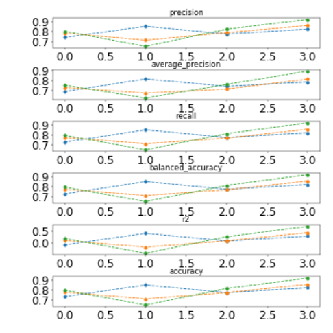{ height=30% }
  
Parametry najwydajniejszego modelu dla danych utworzonych z modelu, który puste wartości zastępuje:

- średnią wartością dla danej kolumny: 
```doctest
'algorithm': 'auto', 'leaf_size': 1, 'metric': 'canberra',
 'n_neighbors': 6, 'p': 1, 'weights': 'distance'
```
- medianą wartości dla danej kolumny
```doctest
'algorithm': 'auto', 'leaf_size': 30, 'metric': 'minkowski', 
'metric_params': None, 'n_jobs': -1, 'n_neighbors': 6,
 'p': 2, 'weights': 'distance'
```
- stałą wartością dla danej kolumny
```doctest
'algorithm': 'auto', 'leaf_size': 30, 'metric': 'minkowski', 
'metric_params': None, 'n_jobs': -1, 'n_neighbors': 6, 
'p': 2, 'weights': 'distance'
```
- najczęstszą wartością dla danej kolumny
```doctest
'algorithm': 'auto', 'leaf_size': 30, 'metric': 'minkowski', 
'metric_params': None, 'n_jobs': -1, 'n_neighbors': 6, 
'p': 2, 'weights': 'distance'
```

Z powyższego zestawienia tylko średnia wyznacza inne parametry, to dla niej uzyskujemy najwyższy wynik zatem do poniższego porównania wykorzystany zostanie model dla uzupełnienia brakujących danych śrenią wartością.
Przyglądając się można zauważyć że uzupełnienie danych dowolną stałą wartością oraz najczęściej występującą wartością dla estymatora generują te same hiperparametry, natomiast wynik dla stałej wartości równej -1 jest wyższy niż dla wartości najczęstszej.
Nie jest to oczywiste i ludzkie postrzeganie mogłoby podpowiadać że wartość specjalnie wybrana i zależna od zbioru będzie dawać lepsze rezultaty niż dowolna wartość. 
Ważnym do przeanalizowania parametrem dla algorytmy k-najbliższych sąsiadów jest N = 6. Maksymalnie N mogłlo równać się liczie zależności czyli 13, najwięskszy procent został osiągnięty w mniej więcej połowie wartości, co ciekawe każdy imputer wybiera tę samą wartość.

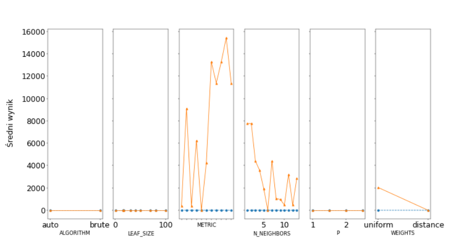{ height=30% }

Zestawienie przedstawione powyżej podpowiada, że do cechą znaczącą jest również metryka, ta cecha jednak jest oczywista ze względu na specyfikę działania algorytmu.
Zastosownie wyszukiwania gridSearch wykazuję,że skupiając się na parametrach: metryki, wagach oraz liczbie sąsiadów jesteśmy w stanie uzyskać optymalne wartości dla modelu algorytmu, pozostałe nie posiadają zyt dużego wpływu przy braku specyficznych danych testowych.


###  Losowe lasy decyzyjne

Wynik dla danych utworzonych z modelu, który puste wartości zastępuje:

 - średnią wartością dla danej kolumny:

   - precyzja: 81.65986394557824% 
   - wynik klasyfikacji dokładności: 0.7934782608695652 
   - zrównoważoną dokładność: 0.7941031941031941 
   - utrata regresji błędu średniokwadratowego: 0.20652173913043478
 - medianą wartości dla danej kolumny:
    
    - precyzja: 81.3904761904762% 
    - wynik klasyfikacji dokładności: 0.8043478260869565 
    - zrównoważoną dokładność: 0.8076167076167076 
    - utrata regresji błędu średniokwadratowego: 0.1956521739130435
   
 - stałą wartością dla danej kolumny:
    
   - precyzja: 81.25170068027212% 
   - wynik klasyfikacji dokładności: 0.8043478260869565 
   - zrównoważoną dokładność: 0.8031941031941032 
   - utrata regresji błędu średniokwadratowego: 0.1956521739130435
 - najczęstszą wartością dla danej kolumny:
    
    - precyzja: 81.1156462585034% 
    - wynik klasyfikacji dokładności: 0.8152173913043478 
    - zrównoważoną dokładność: 0.8122850122850123 
    - utrata regresji błędu średniokwadratowego: 0.18478260869565216
    
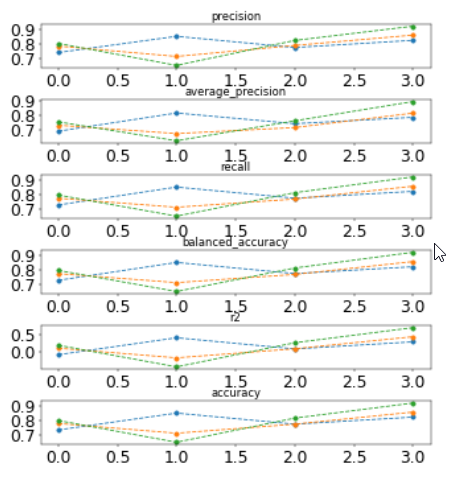{ height=30% }

Tak samo jak w przypadku algorytmu k-najbliższych sąsiadów nalepszy wynik uzyskany dla imputera w postaci średniej. 

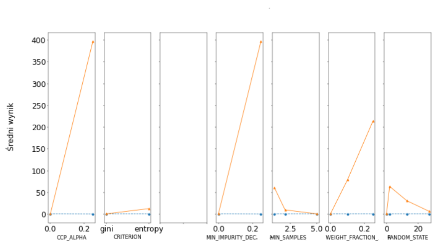{ height=30% }

Każdy parametr ma wpływ na wydajność modelu, ale ccp_alpha oraz min_impurity_decrease mają największy udział w zwiększaniu dokładności.
Algorytm w porównaniu do Knn zwraca mniejszą dokładność, ale wartości taka była spodziewana ze względu na to, iż jest to jeden z najprostszych algorytmów.

###  Maszyna wektorów nośnych

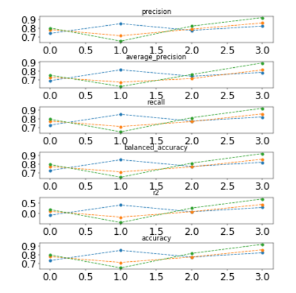{ height=30% }

Algorytm maszyny wektorów nośnych uzyskuje następujące wyniki przy uwzględnieniu, że puste wartości są zastępowanie:

- średnią wartością dla danej kolumny:
    
    - precyzja: 81.79863945578231% 
    - wynik klasyfikacji dokładności: 0.8152173913043478 
    - zrównoważoną dokładność: 0.8122850122850123 
    - utrata regresji błędu średniokwadratowego: 0.18478260869565216
  
- medianą wartości dla danej kolumny:

  - precyzja: 80.57959183673469% 
  - wynik klasyfikacji dokładności: 0.7989130434782609 
  - zrównoważoną dokładność: 0.7986486486486486 
  - utrata regresji błędu średniokwadratowego: 0.20108695652173914
  
- stałą wartością dla danej kolumny:

  - precyzja: 82.88435374149661% 
  - wynik klasyfikacji dokładności: 0.8097826086956522 
  - zrównoważoną dokładność: 0.80995085995086 
  - utrata regresji błędu średniokwadratowego: 0.19021739130434784
  
- najczęstszą wartością dla danej kolumny
  
  - precyzja: 81.11836734693878% 
  - wynik klasyfikacji dokładności: 0.8043478260869565 
  - zrównoważoną dokładność: 0.7987714987714988 
  - utrata regresji błędu średniokwadratowego: 0.1956521739130435
  

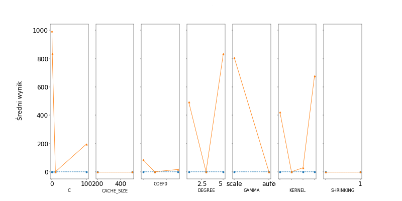{ height=70% }

Dla wykorzystania funkcji SVC wymaganym parametrem jest C, jak już wcześniej wspomniano jest to własność odpowiadająca 
za wyznaczenie złotego środka między obciążeniem a wariancją.


*Wpływ parametrów na model uczący się*

Wykorzystanie parametrów przy tworzeniu modelu uczącego się wpływa negatywnie na czas wykonania, przez zwiększenie ilości wariantów do weryfikacji.
Konfiguracja parametrów im bardziej sprecyzowana, tym większe prawdopodobieństwo wyższej dokładności.
Nie wszystkie parametry wykorzystane powinny być dostrajane jako hiperparametry ze względu na mały wpływ na model, jednak samo ich ustawienie wpływa pozytywnie lub neutralnie na wyniki.


*Porównanie czasu wykonania* 

Czas uczenia w sekundach dla jednego imputera dla domyślnych parametrów prezentuje się następująco: 

- algorytm K najbliższych sąsiadów: 0.2740
- algorytm wektorów nośnych: 0.8999
- algorytm lasów losowych: 7.6909


Czas uczenia w sekundach dla jednego imputera dla listy spreparowanych parametrów to: 

- algorytm K najbliższych sąsiadów: 0.1718
- algorytm wektorów nośnych: 0.6093
- algorytm lasów losowych: 6.302

W obu przypadkach trening danych dla lasów losowych jest dłuższy niż w przypadku algorytmów KNN i SVM. Wszystkie pomiary wykonano na tej samej maszynie dlatego można wykonać porównanie nie biorące pod uwagę szybkości procesora lub wielkości zasobów pamięciowych.

Czas uczenia zależnie od wartości parametru przedstawiono poniżej:

_K- najbliższych sąsiadów_

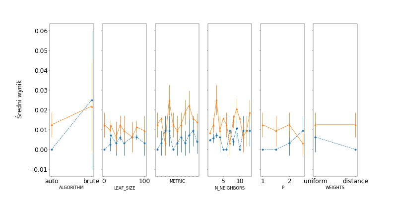{ height=50% }

_Lasy losowe_

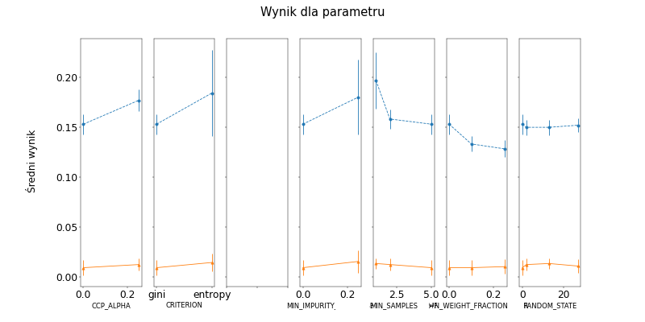{ height=50% }

_Maszyna wektorów nośnych_

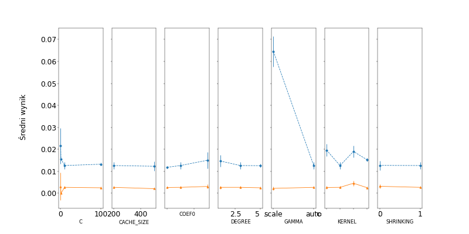{ height=50% }

*Porównanie implementacji*

Implemenatcja każdego z algorytmów z wykorzystaniem biblioteki sklearn jest analogiczna i łatwa w utworzeniu.
Do każdego z modeli można zastosować te same metody oceny dokładności. 

# Podsumowanie

W pracy utworzony został model dla 3 algorytmów maszynowego nadzorowanego, które są w stanie zdiagnozować występowanie choroby serca z dokładnością do ponad 70%.
Projekt nadaje się do rozszerzenia o kolejne algorytmy uczenia maszynowego nadzorowanego tj.: Regresja Logistyczna, Naiwny Bayers. W tym cleu wystarczy zaimplementować i klasę realizująca zadania z TrainingManager.py
W projekcie wykorzystano uczenie maszynowe nadzorowane, ponieważ dane testowe zawierały odpowiedzi dla każdego przypadku testowego, nie było potrzeby wykorzystywać uczenia nienadzorowanego.
Strona realizuje zadanie analityczne i może być wykorzystana w praktyce, a zawarte na niej informację dotyczące wyników działania algorytmów mogą zwiększyć zaufanie do wykorzystywania uczenia maszynowego do zastosowań medycznych.

 **Bibliografia**{.unnumbered}
========


