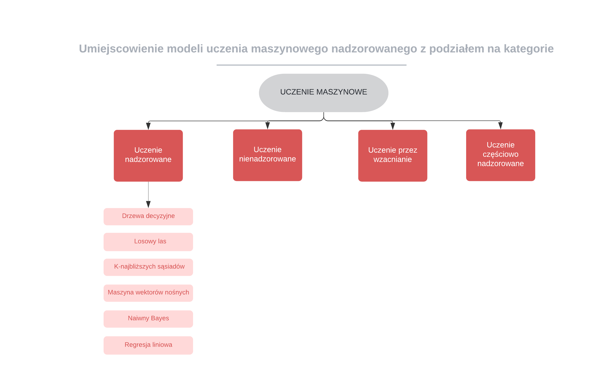
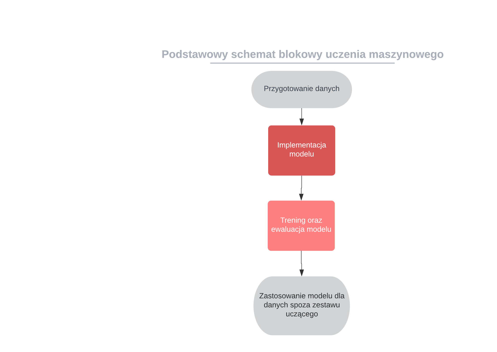

---
title: "Wykrywanie występowanie chorób serca,porównanie algorytów uczenia maszynowego nadzorowanego na podstawie zbioru danych dotyczących chorób układu krążenia z repozytorium  UCI"
author: [Magdalena Szulc]
date: "2022-02-11"
geometry: "left=3cm,right=3cm,top=2cm,bottom=2cm"
output: pdf_document
titlepage: true
titlepage-background: "`titlepage1.pdf`{=latex}"
book: true
titlepage-logo: "`img/umkLogo.png`{=latex}"
logo-width: 30mm
bibliography: true
disable-header-and-footer: true
toc-own-page: true
...

[Abstrakt]

**[[TODO]]**

**Wykrywanie występowanie chorób serca,porównanie algorytów uczenia maszynowego nadzorowanego na podstawie zbioru danych dotyczących chorób układu krążenia z repozytorium  UCI** {.unnumbered}
========

**Wstęp** {.unnumbered}
========

Sztuczna inteligencja wśród szerokiego zakresu swoich zastosowań może zostać wykorzytana do analizy bardziej lub mniej złożonych danych medycznych, w celu przewidzenia wystąpienia choroby u konkretnej osoby, bez udziału procesu myślowego od stony specjalisty.  
 

Do tego przeznaczenia istnieje możliwość zastosowania uczenia nadzorowanego (ang. _supervised learning_) tj. rodzaj uczenia maszynowego zakładający istnienie zbioru danych testowych zawierających odpowiedzi, na ich podstawie wyszukiwane są zależności znaczące oraz budowany jest model do przewidywania wartości.  

W przypadku danych dotyczących chorówb zależności typujące występowanie choroby, bazują na podstawie konkretnych wyników badań zgormadzonych w repozytorium UCI.  

W dzisiejszych czasach choroby sercowo-naczyniowe stanowią najczęstszą  przyczynę zgonów,a liczba osób cierpiących na te dolegliwości stale rośnie. Głównymi przyczynami zachorowalności diagnozowanymi przez specjalistów są niski poziom świadomości i profilaktyki chorób serca. Objawy są tym silniejsze im gorszy jest stan chorobowy pacjenta.   

Dlatego prowadzone  są  intensywne  prace  nad zwiększeniem  dostępności badań,  które  wspomogą  diagnostykę  kardiologiczną na jak najwcześniejszym etapie.  


Powodem szukania dokładniejszych sposobów diagnozowania są również wysokie koszty leczenia generowane przez choroby układu krwionośnego. Według analityków firmy konsultingowej KPMG [^KPMG] w 2011 r. koszty diagnostyki i terapii chorób serca wyniosły ponad 15 miliardów polskich złotych.   


Nadzieją jaka pokładana jest w machine learningu jest szybsza diagnostyka chorób ułatwiająca oraz przyśpieszająca proces ich leczenia. Zastosowanie uczenia maszynowego w medycynie, pozwala również na przetwarzanie dużych zasobów historycznych wyników medycznych, w celu poszerzenia zasobów informacji , głównie zależności przyczynowo skutkowych , które mogą zostać wykorzystane do diagnostyki lub leczenia.  


Słowa kluczowe: uczenie maszynowe, uczenie nadzorowane  

[^KPMG]:  międzynarodowa sieć firm audytorsko-doradczych ze szczególnym uwzględnieniem branży dóbr konsumpcyjnych, usług finansowych, nieruchomości i budownictwa, technologii informacyjnych, mediów i komunikacji (TMT), transportowej (TSL), produkcji przemysłowej, a także sektora publicznego

**Cel i zakres pracy** {.unnumbered}
========

Celem pracy jest porównanie wybranych algorytmów uczenia maszynowego nadzorowanego, przy założeniu że dane wejściowe są wybrakowane, a w rezultacie zbudowanie modelu który na podstawie danych medycznych wystawia diagnozę o występowaniu zaburzeń sercowo-naczyniowych lub ich braku.   

Dane medyczne wyróżniają się tym, że trudno uzyskać do nich dostęp, najczęściej nie są to informacje, które się udostępnia do użytku publicznego, z tego powodu, kluczowym krokiem jest  wybór cech branych pod uwagę przy tworzeniu modelu. Dane pozyskane z repozytorium UCI przeszły już wstepną obróbkę , sam dataset ze względu na swoje niewielkie rozmiary pozwala na sprawdzenie działań algorytmów bez pozbywania się nadmiarowych i mało znaczących cech. 

Zatem odpowiedź na pytanie jak wybrakowanie danych mocno wpływa na rezultat i czy istnieją róznicę między zastosowaniem wybranych algorytmów nauczania nadzorowanego wymaga przedstawienia porówniania łatwości tworzenia modelu, dokładności, złożoności oraz czasu uzyskania odpowiedzi.  


W pracy opisano następujące algorytmu uczenia nadzorowanego: 

- lasy decyzyjne (ang. _decisions-forests_)
- metoda wektorów nośnych (ang. _support vector machines_, SVM)
- k-najbliższych sąsiadów (ang. _k-neares neighbours_, KNN)  

[[TODO]]()słownictwo wykorzystywanego podczas pisania pracy tłumaczenia i wykorzystywane powszechnie w publikacjach naukowaych

## Repozytorium uczenia maszynowego UCI


Sensem wykorzystania uczenia maszynowego jest przewidzenie lub klasyfikacja rzeczywistych wartości które można zastosować w innych dziedzinach.
Im bardziej dokładne i rzeczywisty jest wsad do tworzenia modelu tym bardziej możliwe jest osiągnięcie lepszych efektów na końcu ścieżki uczeniia.
W celu gromadzenia zaufanej bazy dostępnych zbiorów dataset'ów powstało repozytorium uczenia maszynowego UCI. Jak podaje strona informacyjna :

>  [^UCI]... było ono cytowane ponad 1000 razy, co czyni je 
> jednym ze 100 najczęściej cytowanych „artykułów” w całej informatyce ...

[^UCI]: Źródło: https://archive.ics.uci.edu/ml/index.html

**Wprowadzenie  teorertyczne** 
========

**Uczenie maszynowe** (ang._machine learning_, ML)  to dziedzina zajmująca się zestawem algorytmów,  które analizując zbiory dancyh (zazwyczaj baerdzo obszerne) wystawiają predyckję na temat zadanego problemu. Uczenie maszynowe zależnie od sposobu _trenowania_ algorytmu dzieli się na kategorie min. uczenie nadzorowane oraz uczenie bez nadzoru. 

  

Dobór typu uczenia oraz algorytmu uzależniony jest od danych wejściowych oraz oczekiwanego rezultatu. Dane wyjściowe mogą przyjmować format odpowiedzi TAK/NIE , klasyfikacji do danego zbioru czy np procentowej oceny ryzyka.   

**Uczenie maszynowe nadzorowane** (ang. _supervised learning_) to klasa algorytmów uczenia maszynowego, która bazuje na poetykietowanych już danych wejściowych. Ten typ uczenia świetnie nadaje się do rozwiązywania problemów z zakresu klasyfikacji. Nadzór polega na porównaniu rezultatów działania modelu z wynikami które są zawarte w danych wejściowych(_dane oznaczone_). Algorytm po osiągnięciu żądanej efektywnosci jest w stanie dokonać klasyfikacji przykładu dla którego nie posiada odpowiedzi. Sprawdza się to obecnie w rekomendacji produktów oraz diagnozie chorób.  

**Uczenie maszynowe bez nadzoru** (ang. _unsupervised learning_) to klasa algroytmów uczenia maszynowego która głownie rozwiązuje problemy grupowania. Dane dostarczane do modelu nie zawierają _oznaczeń_, zatem nauczanie polega na wyciąganiu konkluzji z poprzednio wykonanych iteracji. Na skuteczność modeli budownych w oparciu o uczenie bez nadzoru wpływ ma rozmiar dostarczonego do nauki zbioru danch, im jest on większy tym bardziej wzrasta effektywność. Takie zbiory można uzyskać rejestrując dane na bierząco dlatego do najczęstrzych zastosowań tej klasy algorytmów, można zaliczyć rozpoznawanie mowy czy obrazu.  

Podział osób na kategorie cierpiące na choroby sercowo-naczyniwe oraz zdrowe, to dylemat klasyfikayjny nadający się do rozwiązania za pomoca algorytmów uczenia maszynowego nadzorowanego i na nich skupia się dalsza część pracy.  

## Ścieżka działania algorytmów uczenia maszynowego nadzorowanego 

  

## Model Danych 

Rozpoczęcie pracy nad budowaniem modelu dla algorytmów uczenia maszynowego w szeroko pojętym znaczeniu zawsze będzie zaczynało się od zebrania danych testowych, jest to czynnik determinujący wybór mmiędzy uczeniem z nadzorcą lub bez.

W przypadku danych testowych z repozytorium UCI , dane pochodziły z róźnych lokalizacji , od tego zależeć mogą jakim badaniom poddani zostali pacjęci a co za tym idzie w jakich kolumnach tabelarycznego przedstawienia będą mieć uzupełnione bądź puste wartości.
Scalenie ze sobą dataset'ów dostarcza większej wariacji. Jeżeli zestaw wejściowy został by ograniczony do jednej lokalizacji to cecha dla której nie uzupełniono wartości zostałaby z autoatu pominięta jako znacząca ze względu na brak danych. Po złączeniu można przeprowadzić szereg działań w celu sztucznego uzupełnienia pustych wartości bazując na wartościach które już istnieją.

Proces przetwarzania danych może skladać sie z wielu róźnych kroków zależenie od typu, w uczeniu nadzorowanym operującym na danych tekstowo-liczbowych poprawnym będzie zastosowanie schematu przedstawionego poniżej:


 
### Obsługa brakujących wartości 
 Możliwości obsługi brakujących wartości są jak już przedstawiono powyżej sa 2 : mniej polecana ze względu na utrate danych, redukcja dataset'u lub uzupełnienie go zgodnie z wybrany przez siebie założeniem.


Biblioteki do nauczania maszynowego dostarczają już gotowe rozwiązania do upuszczenie wierszy lub kolumn zawierających wartości null:
```Python
    dataframe.dropna()
```
Parametryzując: 

- axis — axis=0 jeśli chcemy usunąć wiersze lub axis=1 dla kolumn,
- how — dla how = 'all',  wiersze i kolumny zostaną usunięte tylko wprzypadku, gdy wszystkie wartości kolumny lub wiersza to NaN. Domyślnie how jest ustawione na 'any' i skutkuje to usunięciem wiesza/kolumny z jakimi kolwiek pustymi wartościami.


Uzupełnienie danych inaczej imputacja, rozwiązuje problem w mniej stratny sposób i tak samo jak do redukcji są już gotowe rozwiązania w bibliotece sklearn.

```Python
    imputed_mean = SimpleImputer(strategy="mean", missing_values=numpy.NaN,
     fill_value=-1)

    imputed_median = SimpleImputer(strategy="median", missing_values=numpy.NaN,
     fill_value=-1)

    imputed_most_frequent = SimpleImputer(strategy="most_frequent", 
    missing_values=numpy.NaN, fill_value=-1)

    imputed_most_constant = SimpleImputer(strategy="constant", 
    missing_values=numpy.NaN, fill_value=-1)
    
```    

Powyżej przedstawiono 4 różne strategie uzupełniania wykorzystujące proste matematyczne obliczenia takie jak :

- średnia,
- mediana,
- stała, 
- najczęściej występująca wartość.

Do wyznaczenia wartości uzupełniających można również użyć regresji liniowej.


### Standaryzacja 

Przeksztaucenie danych również bazujące na statystycznych założeniach i również ustandaryzowane w popularnych bibliotekach.
Dąrzymy aby średnia wartoś wynosiła 0, a odchylenie standardowe  1 dla liczbowyh reprezentacji danych. Z matematyczne punktu widzenia wykonujemy działanie 

[TODO] wstawić wzór podejmujemy średnią i dzielimy ją przez odchylenie standardowe.

[TODO]  prezentacja wizualna Z praktycznego umieszczamy dane w zawężonym zakresie na osi.
```Python
    def standarization(x_test, x_train):
        temp_x_train = x_train.loc[:, :].copy()
        temp_x_test = x_test.loc[:, :].copy()
        for iterator in ['age', 'trestbps', 'chol', 'restecg', 'thalach', 'oldpeak',
                         'slope', 'ca', 'thal']:
            scale = StandardScaler().fit(x_train[[iterator]])
            temp_x_train[iterator] = scale.transform(x_train[[iterator]])
            temp_x_test[iterator] = scale.transform(x_test[[iterator]])
    
        return temp_x_test, temp_x_train
```

Powyżej przedstawiono funkcję wykonującą standarycjację poprzez oblizenie średniej oraz odchylenia standardowego wykorzystując funkcję fit a następnie konwertując dane wykorzystując funkcję transform.

### Obsługa zmiennych kategorialnych 

Cechy kategorialne dzielą się na dwie zasadnicze grupy ze względu na mozliwość uprorządkowania , dane takie jak wyksztaucenie , rozmiar 
podlegają mapowaniu , dane typu kolor lub płeć podlegaja kodowaniu. W ten sposób dane kategoryczne staja się wartosciami liczbowymi.

#### Reporezentacja wektorowa

Obsługa danych kategorialnych pozwoliła zmapować/zakodować je w postaci liczbowej ,ale można pójść o krok dalej i te same dane mieć w postaci 0 lub 1 na odpowiedniej kolumnie.
Rozwiązanie reprezentacji wektorowej polega na utworzeniu tylu kolumn ile jest unikalnych wartości dla kategorii i wpisanie 0 lub 1 dla każdego rekordu danych.

[TODO ] wizualizacja

##### Współliniowość cech

Aby znaleść kolrelacje współliniowości należy szukać liniowej zależności pomiędzy danymi, najłatwiej zauważyć to tworząc wykresy z danych testowych dla każdej pary.

[TODO] Wwykresy dla cech

Przy zastosowaniu reprezentacji wektorowej dla cech mocno od siebie uzależnionych zalecane jest zastosowanie :
```Python
    drop_first=True  
```

## Opis praktycznej częsci projektu
Moduły projektu:
 - algorithms:
   - decisionForest - implepmentacja algorytmu
   - KNN  - implepmentacja algorytmu
   - SVM  - implepmentacja algorytmu
 - data - moduł odpowiada za wczytywanie i obróbkę danych testowych, oraz danych dostarczonych finalnie do weryfikacji modelu
 - doc - praca oraz wszytkie dokumenty
 - result - moduł odpowiedzialny za prezentację wyników w postaci wy
kresów porównujących algorytmy oraz odpowiedzi na zadany problem


### Narzędzia i biblioteki zastosowane w pojekcie

Praktyczna część pracy napisana została w języku Python z wykorzystaniem scikit-learn, obsługującym wiele algorytmów maszynowego uczenia się w tym uczenia nadzorowanego i docelowo wybranych algorytmów przedstawionych w teoretycznej części pracy. 
Biblioteka opiera się o Numerical Python, zestaw narzędzi do obliczeń na macierzach, wektorach oraz o pakiet Science python umożliwiający metody numeryczne takie jak całkowanie, różniczkowanie itp. .  
Do przygotowania danych wykorzystano zestaw narzędzi Pandas, ułatwiający tworzenie struktur danych i ich analizę.
W celu wizualizacji wyników w postaci wykresów zastosowano Matplotlib. Część prezentacyjna czyli możliwość wprowadzenia danych w formularzu na stronie i weryfikacja wyniku dla wyuczonych już modeli wykorzystuje bibliotkę Flask.

#### Python
#### Flaks Templates

#### Numpy 
+++++++++++++++++++++++++++++++++++++++++++++++
Numpy to pakiet programistyczny o otwartym kodzie źródłowym przeznaczony do obliczeń naukowych. Udostępniony jest on na licencji BSD. Numpy charakteryzuje się
następującymi właściwościami:
• Posiada wydajne tablice służące do wykonywania dużej ilości złożonych operacji matematycznych i logicznych na zapisanych w nich obiektach.
• Jest kompatybilny i wspierany przez wiele popularnych narzędzi przeznaczonych do obliczeń numerycznych wymagających wysokiej wydajności.
4.4 Podsumowanie 49
• Wykorzystuje statyczne tablice ze zdefiniowanymi rozmiarami. Zmiana ich wielkości lub wymiaru wymusza stworzenie nowej struktury.
• Przechowuje w tablicy jedynie dane tego samego typu
+++++++++++++++++++++++++
#### SkitLearn

+++++++++++++++++++++++++++++++++++++++++++
Scikit-learn to biblioteka programistyczna o otwartym kodzie źródłowym stworzona
w języku programowania Python. Zawiera ona popularne algorytmy uczenia maszynowego. Projekt autorstwa Davida Cournapeau rozpoczął się w 2007 roku w ramach
programu Google Summer of Code. Aktualnie biblioteka wydana jest na licencji
BSD. Scikit-learn charakteryzuje się następującymi właściwościami:
• Wykorzystuje najpopularniejsze biblioteki związane z uczeniem maszynowym,
takie jak NumPy, SciPy, Matplotlib, IPython, Sampy oraz Pandas.
• Jest elastyczna ze względu na kompatybilność z różnymi abstrakcyjnymi obiektami wchodzącymi w skład wykorzystywanych bibliotek. Umożliwia to na przykład dostarczenie danych do modelu zarówno w tablicach z pakietu Numpy,
jak i w ramkach danych pochodzących z biblioteki Pandas
++++++++++++++++++++++++++++++++++++++++++

#### Matplotlib

#### JobLib 

Zapis modelu z joblib
Joblib jest częścią ekosystemu SciPy i zapewnia narzędzia do potokowania zadań Pythona.

Zapewnia narzędzia do zapisywania i ładowania obiektów Pythona, które efektywnie wykorzystują struktury danych NumPy.

Może to być przydatne w przypadku niektórych algorytmów uczenia maszynowego, które wymagają wielu parametrów lub przechowują cały zestaw danych (np. K-Nearest Neighbors).

Poniższy przykład pokazuje, w jaki sposób można wytrenować model regresji logistycznej na podstawie zbioru danych dotyczących początku cukrzycy u Indian Pima, zapisać model do pliku przy użyciu biblioteki zadań i załadować go w celu dokonania prognoz na niewidocznym zbiorze testowym.

// joblib do storage 
Let's Reflect back on Joblib approach :

PROs of Joblib :

1) the Joblib library offers a bit simpler workflow compared to Pickle.

2) While Pickle requires a file object to be passed as an argument, Joblib works with both file objects and string filenames.

3) In case our model contains large arrays of data, each array will be stored in a separate file, but the save and restore procedure will remain the same.

4) Joblib also allows different compression methods, such as 'zlib', 'gzip', 'bz2', and different levels of compression

#### Pandas

++++++++++++++++++++++++++++++++++++
Pandas to pakiet programistyczny zawierający dynamiczne, wydajne i elastyczne
struktury danych. Jest on udostępniony na licencji BSD. Pandas charakteryzuje się
następującymi właściwościami:
48 Wykorzystane narzędzia
• Posiada szybkie i wydajne ramki danych służące do wykonywania operacji
na zapisanych w nich obiektach.
• Oferuje dostęp do narzędzi umożliwiających odczyt, zapis i konwersję danych
w różnych formatach.
• Automatyzuje procesy związane z uzupełnianiem brakujących danych i jest w stanie porządkować je według określonych reguł.
• Wspiera operacje na szeregach czasowych.
• Pozwala na elastyczne przekształcanie i manipulowanie zawartościami struktur
danych.
• Umożliwia dynamiczną zmianę rozmiarów wierszy i kolumn oraz wykonywanie
na nich określonych operacji.
• Etykietuje dane i rozdziela je na określone podzbiory.
• Osiąga wysoką wydajność wykonywanych obliczeń poprzez implementację kluczowych składowych w języku programowania Cython oraz C.
• Udostępnia wydajny mechanizm rozdzielania i łączenia zestawów danych.
• Potrafi operować na danych wielowymiarowych i skalować je do określonych
potrzeb.

++++++++++++++++++++++++++++++++++++


## Trening algorytmu

  

Zgodnie z powyższym schematem po przeprocesowaniu wejściowego dataset'u dane należy podzielić na dane treingowe oraz ewaluacyjne. Powszechnie stosowana K krzyżowa walidacja umożliwia maksymalne wykorzystanie dostarczonego wejśia do dostrajania paraetrów modelu.


Trening modelek  to najfajniejsza część. Masz kilka algorytmów czekających na zastosowanie. Niestety, to tylko 5% twojej praktycznej pracy nad ogólnym przepływem pracy. Jednak z punktu widzenia realizacji jest to zdecydowanie najbardziej czasochłonny krok. Jednym z typowych błędów na tym etapie jest użycie losowego zestawu algorytmów bez żadnego uzasadnienia. Niemniej jednak jest to jak szukanie igły w stogu siana. Aby algorytm był poprawny, powinniśmy najpierw zbadać nasz problem. Wybór funkcji straty, algorytm uczenia się, człon regulujący i całe inne parametry są całkowicie specyficzne dla problemu. Więcej wyjaśnię w kolejnych postach… Szkolenie modelek obejmuje optymalizację hiperparametrów i pierwsze wglądy w dane oraz jakość poprzednich kroków. Załóżmy na przykład, że do wyboru parametrów stosujesz wyszukiwanie według siatki z walidacją krzyżową K-fold i obserwujesz bardzo różne wyniki dla każdego foldu dla każdej innej wartości kandydującej. Jest to wczesny wskaźnik niewystarczających danych uczących lub niewłaściwej reprezentacji cech. Następnie musisz powtórzyć zgodnie z sugestią.

Ocena modelu  mierzy jakość ostatnio wytrenowanego modelu w zestawie walidacyjnym, który nie został dotknięty na żadnym z poprzednich kroków. Najpierw wstępnie przetwarzamy to również za pomocą tej samej metody stosowanej do trenowania danych, a następnie zasilamy nasz model. Ten krok jest definiowany przez wybór miary jakości (ROC, RMNS, F-Score) podobno takiej samej jak miary używanej do szkolenia. Pamiętaj, że różne miary dają różne informacje na temat Twojego modelu.

Nie wyrzucaj wyszkolonych modeli. Załóżmy, że wytrenowałeś 5 różnych sieci NN z małymi różnicami w wydajności, a następnie zestawiłeś  je ze średnim, maksymalnym lub dowolnym innym schematem głosowania. Jeśli spojrzysz na zwycięzców Kaggle, większość z nich to zespoły składające się z NN, SVM lub Random-Forests. Używają nawet biednych modeli w zespole. Dzieje się tak, ponieważ ensemble oznacza lepszą wydajność uogólniania, nieco w zależności od schematu zespołu. Są tu pewne ograniczenia. Rozważ oczekiwania dotyczące czasu wykonywania ostatecznego modelu. Gdy zwiększasz rozmiar swojego zespołu, wzrastają również potrzeby obliczeniowe i pamięciowe. Mówimy tutaj o kompromisie między skalowalnością a dokładnością . Być może najlepszym tego przykładem jest 1 milion dolarów Netflix Challengegdzie Netflix nie zaimplementował algorytmu zwycięzcy z powodu problemów ze skalowalnością.

Teraz jesteśmy na ostatnim etapie. Po tym wyłączysz komputer lub nie. Zmierz wydajność swojego ostatecznego modelu (zestawu modeli) za pomocą trzymanego zestawu. Nie zapomnij o wstępnym przetworzeniu, podobnie jak zestaw walidacji i pociągu. Jest to najważniejszy krok wskazujący rzeczywiste osiągi Twojego ostatecznego modelu. Jeśli Twoje miary różnią się tak bardzo od danych walidacji, oznacza to, że Twój schemat zespołu nie działa i musisz go zmienić. Jednak upewnij się, że wcześniej nie ma nic złego, a wszystkie modele zespołowe są bardzo wygodne ze wszystkich możliwych perspektyw. W przeciwnym razie słaba wydajność na tym etapie stawia cię w bardzo niebezpiecznej sytuacji, z wieloma różnymi kombinacjami wad w zależności od dowolnego modelu w twoim zespole na dowolnym etapie.

Na razie to jest to. Próbowałem wyjaśnić proponowany przeze mnie przepływ pracy w ML niewielką ilością niuansów. Zamierzam szczegółowo wyjaśnić każdy z tych kroków od góry do dołu za pomocą nowych postów, które będą publikowane co tydzień (przynajmniej taki jest plan). Co ważniejsze, zostaw komentarz do tego posta, aby zmienić jego kształt i przedyskutować pomysły . Nie wahaj się uderzyć mnie w twarz błędami.

Kiedy zaczynasz z zupełnie nowym pomysłem na projekt uczenia maszynowego. Przede wszystkim pobierasz zbiór danych. Następnie wykonaj pewne przetwarzanie wstępne — prawdopodobnie wieloetapowe, ponieważ zadanie jest skomplikowane. Następnie tworzysz kilka modeli, niektóre z nich działają lepiej, a inne gorzej.
Oczekuje się, że model uczenia maszynowego zapewni rozwiązanie problemu. Mając na uwadze, że rozwiązanie jest dokładne i wydajne. Musimy zbudować system, który współdziała z prawdziwymi ludźmi. Projekty uczenia maszynowego różnią się w zależności od danego problemu, ale ich ogólna struktura pozostaje taka sama.
Projekt uczenia maszynowego może składać się z następujących procesów:
1) Zdefiniowanie problemu
2) Gromadzenie danych
3) Wstępne przetwarzanie danych
4) Szkolenie modelu
5) Ocena modelu
6) Dokonywanie prognoz
Ocena problemu -:
Zanim zaczniesz myśleć o tym, jak rozwiązać problem z ML, poświęć trochę czasu na przemyślenie problemu, który próbujemy rozwiązać. Czy problem jest dobrze zdefiniowany, najlepsze możliwe rozwiązanie, poziom dokładności wystarczający dla problemu i wiele innych pytań.
Zbieranie danych:
Ten krok jest bardzo ważny, ponieważ jakość i ilość gromadzonych danych bezpośrednio określi, jak dokładny może być nasz model predykcyjny. Istnieje wiele źródeł pozyskiwania danych, takich jak — Kaggle, UCI Machine Learning Repsitory, data.gov.in.
Wstępne przetwarzanie danych:
Polega to na skalowaniu i normalizacji danych. Jeśli w danych występują jakieś brakujące wartości, należy zająć się nimi poprzez obliczenie średniej, mediany lub trybu cechy i zastąpienie jej brakami lub upuszczenie wierszy.
Dane mogą zawierać niepotrzebne kolumny, takie jak numer SSN, który jest unikalny dla każdego użytkownika, więc możemy je usunąć, jeśli nie jest to wymagane w naszej analizie.
Po wstępnym przetworzeniu podziel dane na 2 części - Dane treningowe i Dane testowe. Model będzie szkolony na danych szkoleniowych i oceniany na danych szkoleniowych.
Szkolenie Modelki:
Opracowanie modelu, który radzi sobie lepiej niż punkt odniesienia. Celem treningu jest jak najczęstsze udzielenie odpowiedzi na pytanie lub poprawne prognozowanie. Każda iteracja procesu jest etapem szkolenia.
Ocena modelu:
Po przeszkoleniu modelu nadszedł czas, abyśmy sprawdzili, jak dobry jest. Dane testowe są teraz wprowadzane do modelu w celu dokonania prognoz i obliczenia dokładności. Ma to być reprezentatywne dla tego, jak model może zachowywać się w prawdziwym świecie.
Prognozowanie:
Do testowania modelu wykorzystuje się dane zestawu testowego, które do tego momentu nie były dostępne w modelu; lepsze przybliżenie tego, jak model będzie się zachowywał w świecie rzeczywistym.

Przepływ pracy w ML
Aby opracować i zarządzać modelem gotowym do produkcji, musisz przejść przez następujące etapy:

Pozyskuj i przygotuj swoje dane.

Rozwiń swój model.

Wytrenuj model ML na swoich danych:

Model pociągu
Oceń dokładność modelu
Dostosuj hiperparametry
Wdróż wytrenowany model.

Wysyłaj żądania prognoz do swojego modelu:

Prognozy online
Przewidywanie partii
Monitoruj na bieżąco prognozy.

Zarządzaj swoimi modelami i wersjami modeli.

Te etapy są iteracyjne. Być może będziesz musiał dokonać ponownej oceny i wrócić do poprzedniego kroku w dowolnym momencie procesu.

Pozostała część tej strony szczegółowo omawia poszczególne etapy.

Zanim zaczniesz , oceń problem
Zanim zaczniesz myśleć o tym, jak rozwiązać problem z ML, poświęć trochę czasu na przemyślenie problemu, który próbujesz rozwiązać. Zadaj sobie następujące pytania:

Masz dobrze zdefiniowany problem do rozwiązania?
Przy użyciu ML do rozpoznawania wzorców w danych można zastosować wiele różnych podejść. Ważne jest, aby zdefiniować informacje, które próbujesz wydobyć z modelu i dlaczego potrzebujesz tych informacji.

Czy ML jest najlepszym rozwiązaniem problemu?
Nadzorowana ML (styl ML opisany w tej dokumentacji) jest dobrze dopasowany do pewnych rodzajów problemów.

Powinieneś rozważyć użycie ML dla swojego problemu tylko wtedy, gdy masz dostęp do sporego zestawu danych, z którego możesz trenować swój model. Nie ma absolutnych informacji o tym, ile danych wystarczy. Każda funkcja (atrybut danych), którą włączysz do swojego modelu, zwiększa liczbę wystąpień (rekordów danych), których potrzebujesz, aby prawidłowo wytrenować model. Zapoznaj się ze sprawdzonymi metodami ML, aby uzyskać wskazówki dotyczące inżynierii funkcji.

Należy również uwzględnić podział zestawu danych na trzy podzbiory: jeden do uczenia, jeden do oceny (lub walidacji) i jeden do testowania.

Zbadaj alternatywy, które mogą zapewnić łatwiejszy i bardziej konkretny sposób rozwiązania problemu.

Jak zmierzyć sukces modelki?
Jednym z największych wyzwań związanych z tworzeniem modelu ML jest wiedza, kiedy faza rozwoju modelu jest zakończona. Kuszące jest dalsze udoskonalanie modelu w nieskończoność, wydobywając coraz mniejsze ulepszenia dokładności. Powinieneś wiedzieć, co oznacza sukces, zanim zaczniesz proces. Rozważ poziom dokładności, który jest wystarczający dla Twoich potrzeb. Rozważ konsekwencje odpowiedniego poziomu błędu.

Pozyskaj i przygotuj swoje dane
Musisz mieć dostęp do dużego zestawu danych szkoleniowych, który zawiera atrybut (nazywany funkcją w ML), który chcesz móc wywnioskować (przewidywać) na podstawie innych funkcji.

Załóżmy na przykład, że chcesz, aby Twój model przewidywał cenę sprzedaży domu. Zacznij od dużego zestawu danych opisujących charakterystykę domów na danym terenie, w tym cenę sprzedaży każdego domu.


Zakoduj swój model
Rozwijaj swój model, korzystając z ustalonych technik ML lub definiując nowe operacje i podejścia.

Rozpocznij naukę, korzystając z przewodnika wprowadzającego TensorFlow . Możesz również postępować zgodnie z dokumentacją scikit-learn lub dokumentacją XGBoost, aby utworzyć swój model. Następnie sprawdź kilka przykładów kodu zaprojektowanych do pracy z AI Platform .

Trenuj , oceniaj i dostosowuj swój model
AI Platform zapewnia usługi potrzebne do trenowania i oceny Twojego modelu w chmurze. Ponadto AI Platform oferuje funkcję dostrajania hiperparametrów w celu optymalizacji procesu szkolenia.

Podczas trenowania modelu podajesz mu dane, dla których znasz już wartość docelowego atrybutu danych (funkcji). Uruchamiasz model, aby przewidzieć te wartości docelowe dla danych treningowych, dzięki czemu model może dostosować swoje ustawienia, aby lepiej dopasować dane, a tym samym dokładniej przewidywać wartość docelową.

Podobnie, oceniając wytrenowany model, podajesz mu dane zawierające wartości docelowe. Porównujesz wyniki prognoz modelu z rzeczywistymi wartościami danych oceny i używasz technik statystycznych odpowiednich dla modelu, aby ocenić jego sukces.

Model można również dostroić, zmieniając operacje lub ustawienia używane do kontrolowania procesu uczenia, takie jak liczba kroków uczenia do uruchomienia. Ta technika jest znana jako dostrajanie hiperparametrów .

Ważne: Tworzenie modelu to proces eksperymentowania i stopniowego dostosowywania. Powinieneś spodziewać się dużo czasu na dopracowywanie i modyfikowanie swojego modelu, aby uzyskać najlepsze wyniki. Bardzo ważne jest, aby ustalić próg sukcesu dla swojego modelu przed rozpoczęciem, aby wiedzieć, kiedy przestać udoskonalać model. Zapoznaj się z najlepszymi praktykami ML, aby uzyskać wskazówki dotyczące iteracji modelu.
Testowanie Twojego modelu
Podczas uczenia stosujesz model do znanych danych, aby dostosować ustawienia w celu poprawy wyników. Gdy wyniki są wystarczająco dobre dla potrzeb aplikacji, należy wdrożyć model w dowolnym systemie używanym przez aplikację i przetestować go.

Aby przetestować swój model, przepuszczaj przez niego dane w kontekście jak najbardziej zbliżonym do końcowej aplikacji i infrastruktury produkcyjnej.

Użyj innego zestawu danych niż te używane do szkolenia i oceny. W idealnym przypadku za każdym razem, gdy przeprowadzasz test, powinieneś używać oddzielnego zestawu danych, aby Twój model był testowany z danymi, których nigdy wcześniej nie przetwarzał.

Możesz także chcieć utworzyć różne zestawy danych testowych w zależności od charakteru modelu. Na przykład możesz użyć różnych zestawów danych dla określonych lokalizacji lub punktów w czasie lub możesz podzielić instancje, aby naśladować różne dane demograficzne.

Podczas procesu testowania wprowadzasz korekty parametrów i hiperparametrów modelu na podstawie wyników testów. Możesz odkryć problemy w modelu lub w jego interakcji z resztą aplikacji.


## Wybrane algorytmy uczenia maszynowego nadzorowanego

**Drzewa decyzyjne** (ang. _decisions trees_) są uznawane za najprostyszy i najbliższy ludzkiemu  zrozumieniu algorytm uczenia, który swoją nazwę zawdzięcza graficznej reprezentacji w postaci drzewa. Każdy węzeł oznacza atrybut, na podstawie którego następuję rozróżnienie. W modelu kluczowa jest kolejnośc cech, które wystęują po sobie ponieważ determinuje to otrzymany rezultat.   

  
 
 Prawie każdy algorytm uczenia maszynowego nadzorowanego można podzielić na dwa etapy. W pierwszym opracowywany jest wzorzec, na którym bazuję późniejsza predykcja. Etap nauki dla drzewa decyzyjnego polega na typowaniu atrybutów,którestaja się węzłami decyzyjnymi, dzielącymi rekordy na dwa mniejsze zestawy i tak aż nie ma możliwości dalszego podziału.
  
O metodologie drzew decyzyjnych oparta jest dokładniejsza forma nauczania nadzorowanego:  _losowe lasy decyzyjne._  


**Losowe lasy decyzyjne** (ang. _random decision forests_) to technika polegająca na połączeniu wielu drzew decyzyjnych w celu uniknięcia problemu z _nadmiernym dopasowaniem _ do treningowego zestawu danych na którym został przeszkolony.  Utworzony szablon aby poprawnie działać na danych testowych i służacych weryfikacji, nie może stać się charakterystycznym przypadkiem rozwiązującym przypadek testowy.   
 
W tym celu dla loswoych lasów decyzyjnych najpierw stosuję się **agregację bootstrap'ową**.   

Z treningowego zestawu danch losuję się, co ważne z możliwymi powtorzeniami, wiersze danych dla których trenowany będzie model. Jako rezutat brana jest większość lub średnia wartości uzyskanych wyników dla poszczególnych drzew dezycyjnch. Dodatkowo dla drzew decyzyjnych w lasach losowych, atrybuty odpowiadające za kategoryzację są wybierane z wylosowanego podzbioru.  


Wśrod zalet lasów losowych nalezy wyróżnić iż potrafią one trafnie wykalkulować brakujace wartości cech. Idealnie znajdują zastosowanie dla realnych danych, których zasadniczym problemem jest ich niekompletność.  
 Dane medyczne posiadają szeroką wariację zmiennych z dużym prawdopodobieństwem wybrakownia, zastosowanie do nich lasów decyzyjnych ma potencjał na pozytywne rezulataty.  


**Metoda wektorów nośnych** (ang._support vector machines_, skr. **_SVM_**) to algorytm uczenia maszynowego nadzorowanego, który każdy parametr z dostępnych cech dla danych wejściowych, traktuje jako punkt w przestrzeni. Na podstawie ułożenia punktów  dzieli się je na 2 klasy. Graficznie jest to reprezentowane przez prostą dla której odległość między najbliższymi dwoma punktami dla wektorów jest możliwie największa.Taka prosta nazywana jest  _prostą marginalną_ i powstaje ona poprzez generowanie i selekcję tych prostych które rzetelnie szufladkują klasy danych.   

![Schemat 2 [^schemat_wzorowany]](img/10svm_schemat.png "Schmat SVM")  


Techinka ta gwarantuje precyzyjniejsze rezulatay niż drzewa deczyjne, niestety dla dużych zbiorów danych czas trwania szkolenia znacznie się wydłuża oraz istnieją przypadki dla których podział jedną prostą jest niewykonalny, taki przypadek reprezentuje rozkład na schemacie nr. 2. 

![Schemat 2 [^schemat_wzorowany]](img/9svm_niemozliwy_podzial_schemat.png "Schmat SVM niemożliwy podział")  

Zbór dancyh wykorzytany w pracy nie jest aż tak kolosalny by zaszkodzić wydajności, a małym kosztem można uzyskać celnośc rozwiązania zadanego problemu: wykrwania występowania chorób sercowo-naczyniowych. Istnieje jednak  ryzyko uzyskania rozkładu wartości który wyklucza graficzną frgmentacje zestawu danych na dwie części za pomocą prostej.  


**K najbliższych sąsiadów** (ang. _k nearest neighbours_, skr. **_KNN_**) to algorytm uczenia maszynowego nadzorowanego operający swoje estymacje dla konkretnego przypadku danch na  wartościach jego K najbliższych sąsiadów(punktów) liczonych min. dla przestrzeni Euklidesowej, miasto(in. Manhattan) oraz Mińkowskiego.   

Atrybut który nastraja proces uczenia się modelu i ma na niego największy wpływ określany jest jako hiperparametr. Dla KNN jest to liczba sąsiadów, im większa ilość jednostek mających wpływ, tym wierniejsze będą wyniki. Potęguje się wtedy niestety złożoność czasowa algorytmu, znacząco już większa od przedstawionych powyżej innych algoryrtmów. 

W celu przewidzenia wartości dla nowych danych, należy odnaleść K najbliższych punktów wyliczając odległości, a następnie przpisać odpowiedź implikowaną przez większość sąsiadów. Dla wartości K równej jeden, metoda ta nazywana jest algorytmem najbliższego sąsiada. 

![Schemat 3[^schemat_wzorowany]](img/5knn_schemat.png "Schmat KNN")  


Dla lekarza wartością dodatnią jest wykrycie zależności które decyzują o uznaniu lub zaprzeczeniu występowania choroby. Zastosowanie algorytmu KNN może nie tylko  zakwalifikować osoby chorujące na serce, ale również ułatwić swoją graficzną reprezentacją wpływ cech na ostateczny osąd próbki.  


#########################################część niegotowa ze względu na braki implementacyjne 

### Budowa modelu

Budowanie zbiorów danych

Ta faza obejmuje podział przetworzonych danych na trzy zestawy danych — szkolenie, walidację i testowanie:

Zestaw uczący — służy do wstępnego uczenia algorytmu i uczenia go, jak przetwarzać informacje. Ten zestaw definiuje klasyfikacje modeli za pomocą parametrów. 
Zestaw walidacyjny — używany do oszacowania dokładności modelu. Ten zestaw danych służy do dostrajania parametrów modelu.
Zestaw testowy — służy do oceny dokładności i wydajności modeli. Ten zestaw ma na celu ujawnienie wszelkich problemów lub błędów w modelu. 
Szkolenie i doskonalenie

Gdy masz już zestawy danych, możesz rozpocząć trenowanie modelu. Wiąże się to z wprowadzeniem zestawu treningowego do algorytmu, aby mógł nauczyć się odpowiednich parametrów i cech używanych w klasyfikacji. 

Po zakończeniu szkolenia możesz udoskonalić model, korzystając ze swojego zestawu danych do walidacji. Może to obejmować modyfikację lub odrzucenie zmiennych i obejmuje proces dostrajania ustawień specyficznych dla modelu (hiperparametrów) aż do osiągnięcia akceptowalnego poziomu dokładności. 

Ocena uczenia maszynowego

Wreszcie, po znalezieniu akceptowalnego zestawu hiperparametrów i zoptymalizowaniu dokładności modelu, możesz przetestować swój model. Testowanie wykorzystuje Twój testowy zestaw danych i ma na celu sprawdzenie, czy Twoje modele używają dokładnych funkcji. Na podstawie otrzymanej opinii możesz wrócić do trenowania modelu, aby poprawić dokładność, dostosować ustawienia wyjściowe lub wdrożyć model w razie potrzeby.

Jakie są najlepsze praktyki uczenia maszynowego dla wydajnych przepływów pracy?
Podczas definiowania przepływu pracy dla projektu uczenia maszynowego można zastosować kilka najlepszych praktyk. Poniżej kilka na początek.

Zdefiniuj projekt

Dokładnie zdefiniuj cele projektu przed rozpoczęciem, aby upewnić się, że modele dodają wartość do procesu, a nie redundancję. Definiując swój projekt, weź pod uwagę następujące aspekty:

Jaki jest Twój obecny proces — zazwyczaj modele są zaprojektowane w celu zastąpienia istniejącego procesu. Ważne jest zrozumienie, jak działa istniejący proces, jakie są jego cele, kto go wykonuje i co liczy się jako sukces. Zrozumienie tych aspektów pozwala wiedzieć, jakie role musi pełnić Twój model, jakie ograniczenia mogą istnieć w implementacji oraz jakie kryteria musi spełniać lub przekraczać model. 
Co chcesz przewidzieć — dokładne zdefiniowanie tego, co chcesz przewidzieć, jest kluczem do zrozumienia, jakie dane należy zbierać i jak należy trenować modele. Chcesz być jak najbardziej szczegółowy na tym etapie i upewnić się, że wyniki zostały określone ilościowo. Jeśli twoje cele nie są mierzalne, będziesz miał trudności z zapewnieniem, że każdy z nich zostanie osiągnięty. 
Jakie są Twoje źródła danych — oceń, na jakich danych opiera się Twój bieżący proces, w jaki sposób są gromadzone i w jakiej objętości. Z tych źródeł należy określić, jakie konkretne typy danych i punkty są potrzebne do tworzenia prognoz. 
Znajdź podejście, które działa

Celem wdrożenia przepływów pracy uczenia maszynowego jest poprawa wydajności i/lub dokładności bieżącego procesu. Aby znaleźć podejście, które pozwoli osiągnąć ten cel, musisz:

Badania — przed wdrożeniem podejścia należy poświęcić czas na badanie, w jaki sposób inne zespoły wdrożyły podobne projekty. Możesz być w stanie pożyczyć metody, których używali lub uczyć się na ich błędach, oszczędzając czas i pieniądze.
Eksperyment — niezależnie od tego, czy znalazłeś istniejące podejście, aby zacząć od lub stworzyłeś własne, musisz z nim poeksperymentować. Jest to zasadniczo faza uczenia i testowania Twojego modelu. 
Zbuduj rozwiązanie na pełną skalę

Opracowując swoje podejście, końcowy rezultat jest zazwyczaj dowodem koncepcji. Musisz jednak umieć przełożyć ten dowód na funkcjonalny produkt, aby osiągnąć swój cel końcowy. Aby przejść z rozwiązania testowego do rozwiązania wdrażalnego, potrzebne są: 

Testy A/B — umożliwiają porównanie bieżącego modelu z istniejącym procesem. Może to potwierdzić lub zaprzeczyć, czy Twój model jest skuteczny i może stanowić wartość dodaną dla Twoich zespołów i użytkowników. 
API uczenia maszynowego — tworzenie interfejsu API do implementacji modelu umożliwia komunikację ze źródłami danych i usługami. Ta dostępność jest szczególnie ważna, jeśli planujesz oferować swój model jako usługę uczenia maszynowego.
Dokumentacja przyjazna dla użytkownika — obejmuje dokumentację kodu, metod i sposobu korzystania z modelu. Jeśli chcesz stworzyć produkt rynkowy, musi być jasne dla użytkowników, w jaki sposób mogą wykorzystać model, jak uzyskać dostęp do jego wyników i jakich wyników mogą się spodziewać.
Automatyzacja przepływów pracy uczenia maszynowego
Automatyzacja przepływów pracy uczenia maszynowego umożliwia zespołom wydajniejsze wykonywanie niektórych powtarzalnych zadań związanych z tworzeniem modeli. Istnieje wiele modułów i coraz więcej platform do tego celu, czasami określanych jako autoML. 

Co to jest zautomatyzowane uczenie maszynowe?
AutoML zasadniczo stosuje istniejące algorytmy uczenia maszynowego do opracowywania nowych modeli. Jego celem nie jest automatyzacja całego procesu tworzenia modelu. Zamiast tego ma zmniejszyć liczbę interwencji, które ludzie muszą wykonać, aby zapewnić pomyślny rozwój. 

AutoML pomaga programistom znacznie szybciej rozpocząć i ukończyć projekty. Może również usprawnić procesy uczenia głębokiego i nienadzorowanego uczenia maszynowego, potencjalnie umożliwiając samokorektę w opracowanych modelach. 

Train Test Split
train/test splitting techniques, exploiting three different Python libraries:

Zwykle proces uczenia/podziału testów jest jednym z zadań uczenia maszynowego, które są uznawane za oczywiste . W rzeczywistości naukowcy zajmujący się danymi koncentrują się bardziej na wstępnym przetwarzaniu danych lub inżynierii funkcji, delegując proces dzielenia zestawu danych na wiersz kodu.
W tym krótkim artykule opiszę trzy techniki dzielenia uczenia/testowania, wykorzystujące trzy różne biblioteki Pythona:
nauka-scikit
pandy
NumPy
W tym samouczku zakładam, że cały zestaw danych jest dostępny jako plik CSV, który jest ładowany jako Pandas Dataframe. Rozważam heart.csvzbiór danych, który ma 303 wiersze i 14 kolumn:
importuj pandy jako PD
df = pd.read_csv('źródło/serce.csv')
Ramka danych Pandy
Obraz autora
Kolumna wyjściowa odpowiada kolumnie docelowej, a wszystkie pozostałe odpowiadają cechom wejściowym:
Y_col = „wyjście” 
X_cols = df. loc [:, df.columns != Y_col].columns
1 Nauka scikitu
Scikit-learn udostępnia funkcję o nazwie train_test_split(), która automatycznie dzieli zbiór danych na zbiór uczący i testowy. Jako parametry wejściowe funkcji można przekazać listy lub ramki danych Pandas.
ze sklearn.model_selection importuj train_test_split
X_train, X_test, y_train, y_test = train_test_split (df[X_cols], df[Y_col],test_size=0.2, random_state=42)
Inne parametry wejściowe obejmują:
test_size: część zbioru danych, która ma zostać uwzględniona w zbiorze danych testowych.
random_state: liczba nasion, która ma zostać przekazana do operacji tasowania, dzięki czemu eksperyment będzie powtarzalny.
Oryginalny zbiór danych zawiera 303 rekordy, train_test_split()funkcja test_size=0.20przypisuje 242 rekordy do zestawu uczącego i 61 do zestawu testowego.
2 pandy
Pandas udostępnia funkcję Dataframe o nazwie sample(), która może być używana do dzielenia Dataframe na zestawy pociągowe i testowe. Funkcja otrzymuje jako dane wejściowe fracparametr, który odpowiada proporcji zbioru danych, który ma zostać uwzględniony w wyniku. Podobnie jak scikit-learn train_test_split(), również sample()funkcja dostarcza random_stateparametr wejściowy.
Funkcji sample()można użyć do wyodrębnienia zestawu treningowego:
df_pociąg = df. próbka (frac=0.8, random_state=1)
natomiast zestaw testowy można wyodrębnić, upuszczając zestaw uczący z oryginalnego zestawu danych:
df_test=df.upuszczać(df_train.index)
Zmienne X i Y można wyodrębnić, wybierając odpowiednie kolumny ze zbiorów uczących i testowych:
X_train = df_train[X_cols] 
X_test = df_test[X_cols]
y_train = df_train[Y_col] 
y_test = df_test[Y_col]3 np.random.rand()
Podobnie do train_test_split()funkcji, funkcja sample() z frac=0.8przypisuje 242 rekordy do zbioru uczącego i 61 do zbioru testowego. Oczywiście rekordy zawarte w zbiorach danych tworzonych przez sample()różnią się od tych tworzonych przez train_test_split().
3 Nudny
W pakiecie Numpy możemy wykorzystać tę rand()funkcję do wygenerowania listy losowych elementów od 0 do 1. Dokładniej, możemy wygenerować listę o tej samej długości co Dataframe. Następnie możemy stworzyć maskę o wartościach <0,8, a następnie użyć tej maski do zbudowania zbiorów uczących i testowych:
importuj numer jako np
maska ​​= np.losowy.rand(len(df)) <0,8
df_train = df[maska] 
df_test = df[~maska]
W przeciwieństwie do train_test_split()i sample(), ta strategia nie generuje stałej liczby próbek dla zbiorów uczących i testowych. W tym konkretnym przykładzie liczba próbek w zbiorze uczącym wynosi 256 (w porównaniu z 242 innymi strategiami) i 47 dla zbioru testowego.
Streszczenie
W tym krótkim artykule zilustrowałem trzy strategie dzielenia zbioru danych, dostarczonego jako Ramka danych Pandas, na zbiory pociągowe i testowe.

Feature Scaling
Why Should we Use Feature Scaling?
The first question we need to address – why do we need to scale the variables in our dataset? Some machine learning algorithms are sensitive to feature scaling while others are virtually invariant to it. Let me explain that in more detail.
Training and Predictions
Evaluating the Algorithm
#### Implementacja algorytmu 1: Losowe lasy decyzyjne

+++++++++++++++++++++++++++++++++++++++++++++++++++
Drzewa decyzyjne to metody wykorzystujące szereg zasad decyzyjnych do wytrenowania modelu w oparciu o zbiór uczący w celu generowania przyszłych predykcji
na podstawie zmiennych objaśniających. Poniżej znajduje się schemat przedstawiający przykładową strukturę drzewa decyzyjnego (patrz rysunek 3.6) oraz opis jego
najważniejszych składowych.
Rys. 3.6. Poglądowy schemat przedstawiający przykładową strukturę modelu drzewa decyzyjnego.
32 Metody uczenia maszynowego
• Gałąź - krawędź łącząca pozostałe elementy drzewa
• Węzeł - wierzchołek łączący co najmniej jedną gałąź
• Korzeń - główny węzeł drzewa
• Liść - węzeł z którego nie wychodzi żadna gałąź
Głównym problemem w efektywnym korzystaniu z drzew decyzyjnych jest dobór odpowiedniej struktury dla rozważanego zagadnienia. W tym celu stosuje się algorytmy rekurencyjne umożliwiające maksymalizację zdobywania najistotniejszych
informacji z punktu widzenia rozwiązywanego problemu podczas dokonywania decyzji oraz podziału w każdym węźle. W przypadku przewidywania cen na giełdzie
papierów wartościowych wyznacznikiem dla reguły decyzyjnej mogłaby być wartość
błędu średniokwadratowego postaci:
MSE =
1
n
Xn
i=1
(yi − yˆi)
2
• yi - rzeczywista wartość wyniku
• yˆi - przewidziana wartość
Algorytm rekurencyjny po znalezieniu najskuteczniejszych reguł decyzyjnych
wykrytych na podstawie minimalizacji wartości błędu średniokwadratowego oraz
zmiennych objaśniających mógłby generować przewidywania notowań spółek zamknięcia kolejnego dnia działa giełdy dla nieoznaczonych danych wejściowych. W celu przewidywania jeszcze dokładniejszych wyników mógłby zostać wykorzystany
algorytm lasów losowych. Metoda ta polega na wykorzystaniu wielu drzew decyzyjnych w celu wygenerowania predykcji, a następnie wybrania z nich najczęściej
występującego rezultatu.
+++++++++++++++++++++++++++++++++++++++++++++++++++


#### Implementacja algorytmu 2: Metoda wektorów nośnych


++++++++++++++++++++++++++++++++++++++++++++++++++++++
Maszyna wektorów nośnych jest techniką wykorzystującą wielowymiarową przestrzeń w celu znalezienia maksymalnej hiperpłaszczyzny brzegowej umożliwiającej
najbardziej precyzyjny sposób podziału danych na klasy. Wykres przedstawiający
przykładową predykcję modelu znajduje się na rysunku 3.5.
Nowy obiekt
Y
X
Rys. 3.5. Poglądowy wykres przedstawiający przykładową predykcję modelu maszyny
wektorów nośnych.
Idea działania maszyny wektorów nośnych opiera się na wyszukiwaniu maksymalnych odległości pomiędzy najbliższymi punktami nazywanymi marginesami zgodnie
ze wzorem:
f(x) = β0 +
X
i∈S
αiK(xi
, xi
0)
• β0 - wyraz wolny
• S - zbiór wszystkich obserwacji wektora nośnego
• α - parametry modelu przeznaczone do nauki
• (xi
, xi
0) - pary obserwacji wektora nośnego
• K - funkcja nazywana kernelem porównująca podobieństwo pomiędzy xi
i xi
0
3.7 Drzewa decyzyjne i lasy losowe 31
W przypadku przewidywania notowań spółek na giełdzie papierów wartościowych maszyna wektorów nośnych mogłaby zostać wykorzystana podobnie jak w przypadku regresji logistycznej oraz algorytmu k najbliższych sąsiadów w celu predykcji przyszłych ruchów kursów akcji. Algorytm na podstawie danych wejściowych
oznaczających historyczne wartości spółek przewidywałby ruch wzrostowy, spadkowy lub horyzontalny na zakończenie kolejnego dnia działania giełdy względem
poprzedniego. Oczywiście predykcje odbywałyby się przy wykorzystaniu wytrenowanego wcześniej modelu sekwencyjnie minimalizującego wybraną funkcję błędu
w oparciu o próby uczące
+++++++++++++++++++++++++++++++++++++++++++++++++++++

#### Implementacj algorytmu 3: K najbliższych sąsiadów

Algorytm ten służy do rozwiązywania problemów modelu klasyfikacyjnego. K-najbliższy sąsiad lub algorytm K-NN w zasadzie tworzy wyimaginowaną granicę do klasyfikacji danych. Gdy pojawią się nowe punkty danych, algorytm spróbuje przewidzieć to z dokładnością do najbliższej linii granicznej.

Dlatego większa wartość k oznacza gładsze krzywe separacji, co skutkuje mniej złożonymi modelami. Natomiast mniejsza wartość k powoduje przepełnienie danych i prowadzi do złożonych modeli.

Uwaga:  Bardzo ważne jest, aby podczas analizowania zestawu danych mieć odpowiednią wartość k, aby uniknąć nadmiernego i niedopasowanego zestawu danych.

Używając algorytmu k-najbliższego sąsiada dopasowujemy dane historyczne (lub trenujemy model) i przewidujemy przyszłość. 

+++++++++++++++++++++++++++++++++++++
Algorytm k najbliższych sąsiadów
Algorytm k najbliższych sąsiadów, w odróżnieniu od omówionych powyżej metod,
nie opiera się na trenowaniu modelu w celu generowania predykcji zmiennych objaśnianych. Z tego powodu nazywany jest również często algorytmem leniwym. Idea
jego działania polega na przyporządkowaniu wszystkim danym wejściowym zestawu
cech oraz umieszczeniu ich w wielowymiarowej przestrzeni w oparciu o miarę podobieństwa. W przypadku przekazania do algorytmu próby nieoznaczonej następuje
wyszukanie k najbliższych obiektów przy pomocy określonej metody. Najczęściej
wykorzystywane są do tego celu następujące miary odległości:
• Euklidesowa:
d =
vuutXn
i=1
(xi − yi)
2
3.5 Algorytm k najbliższych sąsiadów 29
• Manhattan:
d =
Xn
i=1
|xi − yi
|
• Minkowskiego:
d =
 Xn
i=1
|xi − yi
|
p
!1
p
– xi
i yi - obserwacje służące do obliczania odległości,
– P - parametr przyjmujący wartość 1 dla odległości Manhattan oraz wartość 2 w przypadku odległości Euklidesowej.
W kolejnym kroku następuje zliczenie wystąpień wszystkich klas z wybranego
zbioru najbliższych sąsiadów i przyporządkowanie etykiety najczęściej występującej grupy do zmiennej objaśnianej. Wykres przedstawiający przykładową predykcję
modelu znajduje się na rysunku 3.4.
Nowy obiekt
Y
X
Rys. 3.4. Poglądowy wykres przedstawiający przykładową predykcję modelu algorytmu
k najbliższych sąsiadów.
W przypadku przewidywania notowań spółek na giełdzie papierów wartościowych algorytm k najbliższych sąsiadów mógłby znaleźć zastosowanie w predykcji
przyszłych ruchów kursów akcji. Na podstawie danych wejściowych oznaczających
historyczne wartości spółek przydzielałby on je do jednej z trzech grup oznaczających ruch cen instrumentów finansowych w kierunku wzrostowym, spadkowym
lub horyzontalnym w czasie kolejnego dnia działania giełdy.
++++++++++++++++++++++++++++++++++


## Wnioski i walidacja rozwiązania

+++++++++++++++++++++++++++++++++++++++++++++++++++++++++++++++
W dalszej części bieżącej sekcji znajdują się wyniki przeprowadzonych eksperymentów. W badaniach zostało wykonanych 25 pełnych iteracji przy wykorzystaniu całego
zbioru treningowego. Zgodnie z przyjętą metodyką ewaluacji opisaną we wcześniejszym fragmencie niniejszego rozdziału wszystkie iteracje zakończone były procesem
weryfikacji skuteczności każdej z architektur na podstawie zbioru testowego. Niższa
uzyskiwana wartość błędu oznaczała wyższą skuteczność generowanych predykcji.
W oparciu o uzyskane wyniki powstały poniższe wykresy odzwierciedlające cały
proces nauki każdej opracowanej na potrzeby przeprowadzenia eksperymentów
+++++++++++++++++++++++++++++++++++++++++++++++++++++++++++++++

### Algorytm 1:Resultaty wnioski: Losowe lasy decyzyjne
### Algorytm 2: Rezultaty wnioski: Metoda wektorów nośnych
### Algorytm 3 : Rezultaty wnioski: K najbliższych sąsiadów

Plusy
Faza uczenia klasyfikacji K-najbliższego sąsiada jest znacznie szybsza w porównaniu z innymi algorytmami klasyfikacji. Nie ma potrzeby uczenia modelu do uogólniania, dlatego KNN jest znany jako prosty algorytm uczenia oparty na instancjach. KNN może być przydatny w przypadku danych nieliniowych. Może być używany z problemem regresji. Wartość wyjściowa obiektu jest obliczana przez średnią k wartości najbliższych sąsiadów.

Cons
Faza testowania klasyfikacji najbliższych sąsiadów K jest wolniejsza i bardziej kosztowna pod względem czasu i pamięci. Wymaga dużej pamięci do przechowywania całego zestawu danych treningowych do przewidywania. KNN wymaga skalowania danych, ponieważ KNN wykorzystuje odległość euklidesową między dwoma punktami danych, aby znaleźć najbliższych sąsiadów. Odległość euklidesowa jest wrażliwa na wielkości. Obiekty o dużych jasnościach będą miały większą wagę niż obiekty o niskich jasnościach. KNN nie nadaje się również do dużych danych wymiarowych.

Jak ulepszyć KNN?
Aby uzyskać lepsze wyniki, zdecydowanie zaleca się normalizację danych w tej samej skali. Ogólnie rzecz biorąc, rozważany zakres normalizacji między 0 a 1. KNN nie jest odpowiedni dla danych wielkowymiarowych. W takich przypadkach wymiar musi się zmniejszyć, aby poprawić wydajność. Również obsługa brakujących wartości pomoże nam poprawić wyniki.

### Porównianie algorytmów : złożoność czasowa , dokładność , złożoność implementacyjna , wpływ danych wykorzytywanych w modelu

### Podsumowanie i opisanie wpływu danych na model

porównanie do dnych statystycznych

 # todo variants of user data preparatrio
            ## preparation all -> all test
            ## preparation best for best 
            ## best from other to best in another  -> result and reasons for data anlayse
            ## fast not best - why is it faster 
            ## 
    # todo prediction
    # todo percentage na true false


**Zestawienie efektywności działania algorytmów** 
========

Konfrontacja technik ucznia maszynowego zaleznie od zestawu danch będzie dawała odmienne wyniki ze względu na ich predyspozycje do zajmowania się odpowiednimi zbiorami danych.  

Potencjał algorytmów dla niewielkiego kompletu danych zawierającego wartości wybrakowane zostanie omówony w późniejszych rozdziałach pracy.  

Zczynając od drzew decyzyjnych, można od razu stwierdzić ich niski potencjał. Istnieje zbyt duże prawdopodobieństwo dopasowania się do modelu treningowego, gdyż wspomniany zbiór dancyh wejściowych  nie jest wystarczająco liczny. Dlatego w dalszej części pracy omówione zostaną lasy decyzyjne.  

Większej dokładności można się spodziewać po metodzie wektorów nośnych, ale jego złożoność czasowa oraz pamięciowa mogą zaniżyc jego ogólną klasyfikację.  

**Wskaźniki wydajności**  

Określenie stopnia, w jakim skonstruowany model z powodzeniem realizuje wyznaczone zadanie należy do wskaźnika wydajności. Przykładem nieprawidłowego wyboru może być próba przewidzenia wystąpienia rzadkiej choroby u pacjenta i określenie głownym miernikiem _dokładność_. W takim scenariuszu klasyfikacja wszystkich pacjentów jako zdrowych , daje niewiele odbiegającą od perfekcji dokładność, a jednocześnie  błędnie osądzać każde wystąpienie choroby.


**K-krotna walidacja krzyżowa** (ang. _Fold Cross-Validation_) to metodyka weryfikacji poprawności modeli nauczania masznowego. Opiera się ona na wyporze wartości swojego hiperparamtru jakim jest K, które może przyjąć dowolną wartość mniejszą lub równą od rozmiaru danych. 

Po wyborze hiperparametru następuje segmentacjia danych na K jendakowej wielkości zestawów. Wykonywanych jest k iteracji, w każdej z nich na k-1 kolekcjach model jest trenowany, a na pozostałej jednej weryfikowany. Procedura efektywnie pomaga ocenić poprawność działania modelu i zastosowanego algorytmu.

[^schemat_wzorowany]:Na podstwie materiałów opublikowanych na [https://www.datacamp.com](http://res.cloudinary.com/dyd911kmh/image/upload/f_auto,q_auto:best/v1526288453/index3_souoaz.png)

## Spis ilustracji
## Spis tabel

## **Bibliografia**

- @article{https://ichi.pro/pl/uczenie-maszynowe-proste-wprowadzenie-96150019624312}
- @article{https://zpjn.wmi.amu.edu.pl/wp-content/uploads/2019/10/praca_magisterska.pdf t}
- @article{https://pdf.helion.pl/alguma/alguma.pdf}
- @article{https://towardsdatascience.com/introduction-to-data-preprocessing-in-machine-learning-a9fa83a5dc9d}
- @article{http://www.mif.pg.gda.pl/homepages/kdz/BIGDATA/AniaPielowska.pdf}
- @article{https://www.analyticsvidhya.com/blog/2017/09/common-machine-learning-algorithms/}
- @article{https://myservername.com/what-is-support-vector-machine-machine-learning}
- @article{https://scikit-learn.org/stable/modules/svm.html}
- @article{https://www.hackerearth.com/practice/machine-learning/machine-learning-algorithms/ml-decision-tree/tutorial/}
- @article{https://scikit-learn.org/stable/modules/neighbors.html}
- @article{file:///C:/Users/User/Downloads/od_pojedynczych_drzew_do_losowego_lasu.pdf}
- @article{https://scikit-learn.org/stable/modules/naive_bayes.html}
- @article{https://scikit-learn.org/stable/modules/tree.html}
- @article{https://scikit-learn.org/stable/modules/feature_selection.html}
- @article{http://pages.cs.wisc.edu/~dpage/kuusisto.thesis.pdf}
- @article{http://www.bme.teiath.gr/medisp/pdfs/PhD_Glotsos_Dimitrios.pdf}
- @article{https://www.springboard.com/blog/how-to-become-a-machine-learning-engineer/}
- @article{http://www.diva-portal.org/smash/get/diva2:920202/FULLTEXT01.pdf}
- @article{https://www.techsparks.co.in/hot-topic-for-project-and-thesis-machine-learning/}
- @article{https://machinelearningmastery.com/k-fold-cross-validation/}
- @article{https://www.writemythesis.org/master-thesis-topics-in-machine-learning/}
- @article{http://mediatum.ub.tum.de/doc/1368117/47614.pdf}
- @article{https://pdfs.semanticscholar.org/0e06/561dbab0581feebe6638dc2671f94c9abf68.pdf}
- @article{https://www.cir.meduniwien.ac.at/assets/Uploads/Masterthesis-SeeboeckPhilipp-Version28-03-2015.pdf}
- @article{https://www.quora.com/Is-there-any-machine-learning-thesis-idea-in-health-care}
- @article{https://digitalcommons.odu.edu/cgi/viewcontent.cgi?referer=- @article{https://www.google.pl/&httpsredir=1&article=1015&context=computerscience_etds}
- @article{https://www.mobt3ath.com/uplode/book/book-60163.pdf}
- @article{https://www.ilovephd.com/thesis-bank-machine-learning-2/}
- @article{https://www.digitalocean.com/community/tutorials/how-to-handle-plain-text-files-in-python-3}
- @article{https://machinelearningmastery.com/naive-bayes-for-machine-learning/}
- @article{https://machinelearningmastery.com/compare-machine-learning-algorithms-python-scikit-learn/}
- @article{https://machinelearningmastery.com/compare-machine-learning-algorithms-python-scikit-learn/}
- @article{https://elitedatascience.com/machine-learning-algorithms}
- @article{https://www.dataschool.io/comparing-supervised-learning-algorithms/}
- @article{https://medium.com/value-stream-design/online-machine-learning-515556ff72c5}
- @article{https://hackernoon.com/choosing-the-right-machine-learning-algorithm-68126944ce1f}
- @article{https://www.kaggle.com/aldemuro/comparing-ml-algorithms-train-accuracy-90}
- @article{https://www.kaggle.com/aldemuro/comparing-ml-algorithms-train-accuracy-90}
- @article{https://machinelearningmastery.com/start-here/}
- @article{https://machinelearningmastery.com/a-tour-of-machine-learning-algorithms/}
- @article{https://blog.statsbot.co/machine-learning-algorithms-183cc73197c}
- @article{https://www.analyticsvidhya.com/blog/2016/01/complete-tutorial-ridge-lasso-regression-python/}
- @article{https://scikit-learn.org/stable/modules/clustering.html}#overview-of-clustering-methods}
- @article{https://towardsdatascience.com/predicting-presence-of-heart-diseases-using-machine-learning-36f00f3edb2c}
- @article{https://towardsdatascience.com/predicting-presence-of-heart-diseases-using-machine-learning-36f00f3edb2c}
- @article{https://www.kaggle.com/cdabakoglu/heart-disease-classifications-machine-learning}
- @article{https://medium.com/@dskswu/machine-learning-with-a-heart-predicting-heart-disease-b2e9f24fee84}
- @article{https://pdfs.semanticscholar.org/d0a5/d4b8e8da3ee2a6bf8ac5d44196fb0365cf1c.pdf}
- @article{file:///home/szulce/Pobrane/Heart_Disease_Detection_by_Using_Machine_Learning_.p}df}
- @article{file:///home/szulce/Pobrane/jcm-08-01050.pdf}
- @article{http://www.cs.put.poznan.pl/alabijak/emd/12_Reprezentacja_wektorowa_slow.pdf}
- @article{https://www.hindawi.com/journals/misy/2018/3860146/}
- @article{https://pub.towardsai.net/3-different-approaches-for-train-test-splitting-of-a-pandas-dataframe-d5e544a5316}
- @article{https://www.run.ai/guides/machine-learning-engineer/machine-learning-workflow/#:~:text=Machine%20learning%20workflows%20define%20which,evaluation%2C%20and%20deployment%20to%20production.}
- @article{https://www.dovepress.com/ensemble-approach-for-developing-a-smart-heart-disease-prediction-syst-peer-reviewed-fulltext-article-RRCC}
- @article{https://machinelearningmastery.com/save-load-machine-learning-models-python-scikit-learn/}
- @article{https://www.datacamp.com/community/tutorials/k-nearest-neighbor-classification-scikit-learn?utm_source=adwords_ppc&utm_medium=cpc&utm_campaignid=1455363063&utm_adgroupid=65083631748&utm_device=c&utm_keyword=&utm_matchtype=&utm_network=g&utm_adpostion=&utm_creative=278443377095&utm_targetid=aud-392016246653:dsa-429603003980&utm_loc_interest_ms=&utm_loc_physical_ms=1011615&gclid=Cj0KCQiA0eOPBhCGARIsAFIwTs40_7xpl5j4oimjYTzVJ_h1AcL5tWAyqktjoXXujTgqCCQLbDOH8BwaAn0hEALw_wcB}
- @article{https://www.geeksforgeeks.org/k-nearest-neighbor-algorithm-in-python/}
- @article{https://m.scirp.org/papers/88650}
- @article{https://link.springer.com/chapter/10.1007/978-3-540-24668-8_21}
- @article{https://erogol.com/machine-learning-work-flow-part-1/}
- @article{https://www.annualreviews.org/doi/pdf/10.1146/annurev-fluid-010719-060214}
- @article{https://towardsdatascience.com/workflow-of-a-machine-learning-project-ec1dba419b94}
- @article{https://cloud.google.com/ai-platform/docs/ml-solutions-overview}
- @article{https://ai.ia.agh.edu.pl/_media/pl:dydaktyka:mbn:uczenie_maszynowe.pdf}
- @article{https://www.researchgate.net/profile/Krzysztof-Krawiec/publication/235352247_Sieci_neuronowe_i_uczenie_maszynowe/links/0a85e5365da2dd5560000000/Sieci-neuronowe-i-uczenie-maszynowe.pdf}
- @article{https://iopscience.iop.org/article/10.1088/1742-6596/1142/1/012012/pdf}
- @article{https://www.statystyczny.pl/co-to-jest-machine-learning/#:~:text=Niekt%C3%B3rzy%20wspominaj%C4%85%20tu%20kolejn%C4%85%20metod%C4%99,tego%20nazwa%20ka%C5%BCdego%20z%20nich.}
- @article{https://www.sciencedirect.com/science/article/pii/S1877050915024928}
- @article{https://machinelearningmastery.com/types-of-classification-in-machine-learning/}
- @article{https://data-flair.training/blogs/types-of-machine-learning-algorithms/}
- @article{https://ichi.pro/pl/co-to-jest-kodowanie-one-hot-i-jak-uzywac-funkcji-pandas-get-dummies-160729382340976}
- @article{https://www.ncbi.nlm.nih.gov/pmc/articles/PMC5640485/}
- @article{https://www.ncbi.nlm.nih.gov/pmc/articles/PMC5863635/}
- @article{https://towardsdatascience.com/heart-disease-prediction-73468d630cfc}
- @article{https://www.sciencedirect.com/science/article/pii/S187705091630638X}
- @article{https://www.ices.on.ca/Publications/Journal-Articles/2014/January/Cardiovascular-Disease-Population-Risk-Tool-predictive-algorithm-for-assessing-CVD-risk}
- @article{https://www.ctvnews.ca/health/test-your-risk-of-heart-disease-with-a-new-online-lifestyle-calculator-1.4030088}
- @article{https://nevonprojects.com/heart-disease-prediction-project/}
- @article{https://scikit-learn.org/stable/modules/neighbors.html}
- @article{https://searchenterpriseai.techtarget.com/definition/machine-learning-ML}
- @article{https://www.forcepoint.com/cyber-edu/machine-learning}
- @article{https://en.wikipedia.org/wiki/Supervised_learning}
- @article{https://www.techopedia.com/definition/8181/machine-learning}
- @article{https://machinelearningmastery.com/supervised-and-unsupervised-machine-learning-algorithms/}
- @article{https://searchenterpriseai.techtarget.com/definition/supervised-learning}
- @article{https://deepai.org/machine-learning-glossary-and-terms/supervised-learning}
- @article{https://towardsdatascience.com/what-are-supervised-and-unsupervised-learning-in-machine-learning-dc76bd67795d}
- @article{https://towardsdatascience.com/what-are-supervised-and-unsupervised-learning-in-machine-learning-dc76bd67795d}
- @article{https://www.geeksforgeeks.org/ml-types-learning-supervised-learning/}
- @article{http://www.cs.ucr.edu/~mwile001/papers/thesis.pdf}
- @article{https://pl.wikipedia.org/wiki/Las_losowy}
- @article{https://python-graph-gallery.com/111-custom-correlogram/}
- @article{https://python-graph-gallery.com/242-area-chart-and-faceting/}
- @article{https://en.wikipedia.org/wiki/Random_forest}
- @article{https://web.stanford.edu/~hastie/Papers/ESLII.pdf}
- @article{https://www.sciencedirect.com/topics/computer-science/random-decision-forest}
- @article{https://flask.palletsprojects.com/en/1.1.x/tutorial/install/}
- @article{https://towardsdatascience.com/introduction-to-data-preprocessing-in-machine-learning-a9fa83a5dc9d}
- @article{https://scikit-learn.org/stable/modules/generated/sklearn.impute.SimpleImputer.html}
- @article{https://stackabuse.com/k-nearest-neighbors-algorithm-in-python-and-scikit-learn/}
- @article{https://dev.to/alod83/3-different-approaches-for-traintest-splitting-of-a-pandas-dataframe-31p0}
- @article{https://pub.towardsai.net/3-different-approaches-for-train-test-splitting-of-a-pandas-dataframe-d5e544a5316}
- @article{https://www.analyticsvidhya.com/blog/2020/04/feature-scaling-machine-learning-normalization-standardization/}
- @article{https://docs.python.org/3/library/itertools.html#itertools.zip_longest}
- @article{https://realpython.com/train-test-split-python-data/}
- @article{https://towardsdatascience.com/flask-and-chart-js-tutorial-i-d33e05fba845}
- @article{https://www.sciencedirect.com/science/article/pii/S2352914820300125 - pobrane jako pdfy}
- @article{https://en.wikipedia.org/wiki/Ejection_fraction}
- @article{https://docs.python.org/3/library/zipfile.html}
- @article{https://flask.palletsprojects.com/en/2.0.x/quickstart/}
- @article{https://machinelearningmastery.com/save-load-machine-learning-models-python-scikit-learn/}
- @article{https://joblib.readthedocs.io/en/latest/}
- @article{https://www.kaggle.com/prmohanty/python-how-to-save-and-load-ml-models}
- @article{https://machinelearningmastery.com/machine-learning-in-python-step-by-step/}
- @article{https://dobrebadania.pl/zmienna-dyskretna-ang-discrete-variable/#:~:text=Zmienna%20dyskretna%20to%20ka%C5%BCda%20cecha,zaw%C3%B3d%2C%20miejsce%20zamieszkania%2C%20wykszta%C5%82cenie.}
- @article{
 Citation Request:

 The authors of the databases have requested that any publications resulting from the use of the Data include the names of the principal investigator responsible for the Data collection at each institution. They would be:
 1. Hungarian Institute of Cardiology. Budapest: Andras Janosi, M.D.
 2. University Hospital, Zurich, Switzerland: William Steinbrunn, M.D.
 3. University Hospital, Basel, Switzerland: Matthias Pfisterer, M.D.
 4. V.A. Medical Center, Long Beach and Cleveland Clinic Foundation:Robert Detrano, M.D., Ph.D.
}
