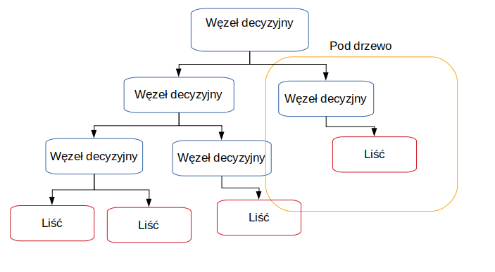

**Wykrywanie występowanie chorób serca, wykorzystanie uczenia maszynowego nadzorowanego** {.unnumbered}
========

**Wstęp** {.unnumbered}
========

Sztuczna inteligencja wśród szerokiego zakresu swoich zastosowań może zostać wykorzytana do analizy bardziej lub mniej złożonych danych medycznych, w celu przewidzenia wystąpienia choroby u konkretnej osoby, bez udziału procesu myślowego od stony specjalisty.  
 

Do tego przeznaczenia idealnie nadaje się uczenie nadzorowane (ang. _supervised learning_) tj. rodzaj uczenia maszynowego zakładający  przykład, dane wejściowe będące wzorcem  na podstawie którego wyszukiwane są zależności.  

Zależności typujące osoby chore, zakwalifikowane na podstawie konkretnych objawów lub wyników badań.  

W dzisiejszych czasach choroby sercowo-naczyniowe stanowią najczęstszą  przyczynę zgonów,a liczba osób cierpiących na te dolegliwości stale rośnie. Głównymi przyczynami zachorowalności diagnozowanymi przez specjalistów są niski poziom świadomości i profilaktyki chorób serca. Objawy są tym silniejsze im gorszy jest stan chorobowy pacjenta.   

Dlatego prowadzone  są  intensywne  prace  nad zwiększeniem  dostępności badań,  które  wspomogą  diagnostykę  kardiologiczną na jak najwcześniejszym etapie.  

Powodem szukania dokładniejszych sposobów diagnozowania są również wysokie koszty leczenia generowane przez choroby układu krwionośnego. Według analityków firmy konsultingowej KPMG [^KPMG] w 2011 r. koszty diagnostyki i terapii chorób serca wyniosły ponad 15 miliardów polskich złotych.   

Nadzieją jaka pokładana jest w machine learningu jest szybsza diagnostyka chorób ułatwiająca oraz przyśpieszająca proces ich leczenia. Zastosowanie uczenia maszynowego w medycynie, pozwala również na przetwarzanie historycznych danych, w celu poszerzenia zasobów informacji które mogą zostać wykorzystane przez lekarza.  

Słowa kluczowe: uczenie maszynowe, uczenie nadzorowane  

[^KPMG]:  międzynarodowa sieć firm audytorsko-doradczych ze szczególnym uwzględnieniem branży dóbr konsumpcyjnych, usług finansowych, nieruchomości i budownictwa, technologii informacyjnych, mediów i komunikacji (TMT), transportowej (TSL), produkcji przemysłowej, a także sektora publicznego

**Cel i zakres pracy** {.unnumbered}
========

Celem pracy jest porównanie wybranych algorytmów uczenia maszynowego nadzorowanego, przy założeniu że dane wejściowe są wybrakowane, a w rezultacie zbudowanie modelu który na podstawie danych medycznych wystawia diagnozę o występowaniu zaburzeń sercowo-naczyniowych lub ich braku.   

Dane medyczne wyróżniają się tym, że trudno uzyskać do nich dostęp, najczęściej nie są to informacje, które się udostępnia do użytku publicznego. Z tego powodu, kluczowym krokiem jest  wybór cech branych pod uwagę przy tworzeniu modelu.  

Zatem odpowiedź na pytanie jak wybrakowanie danych mocno wpływa na rezultat i czy istnieją róznicę między zastosowaniem wybranych algorytmów nauczania nadzorowanego wymaga przedstawienia porówniania łatwości tworzenia modelu, dokładności, złożoności oraz czasu uzyskania odpowiedzi.  

W pracy opisano następujące algorytmu uczenia nadzorowanego: 

- lasy decyzyjne (ang. _decisions-forests_)
- metoda wektorów nośnych (ang. _support vector machines_, SVM)
- k-najbliższych sąsiadów (ang. _k-neares neighbours_, KNN)  

<!-- wybór cech (ang. _feature selection_)
- naiwny klasyfikator Bayers'a(ang. _naive Bayers_)
-->
Praktyczna część pracy napisana została w języku Python z wykorzystaniem scikit-learn, obsługującym wiele algorytmów maszynowego uczenia się w tym uczenia nadzorowanego i docelowo wybranych algorytmów przedstawionych w teoretycznej części pracy.  

Biblioteka opiera się o Numerical Python, zestaw narzędzi do obliczeń na macierzach, wektorach oraz o pakiet Science python umożliwiający metody numeryczne takie jak całkowanie, różniczkowanie itp. .  

Do przygotowania danych wykorzystano zestaw narzędzi Pandas, ułatwiający tworzenie struktur danych i ich analizę.
W celu wizualizacji wyników w postaci wykresów zastosowano Matplotlib.  

 

# Wprowadzenie teoretyczne 

**Uczenie maszynowe** (ang._machine learning_, ML)  to dziedzina zajmująca się zestawem algorytmów,  które analizując duże zbiory dancyh wsyatwiają predyckję na temat zadanego problemu. Uczenie maszynowe zależnie od sposobu _trenowania_ algorytmu wyróżnia min. uczenie nadzorowane oraz uczenie bez nadzoru. Dane oraz wynik który przewidywanie ma osiągnąć uzależniają wybór kategorii.   

  

**Uczenie maszynowe nadzorowane** (ang. _supervised learning_) to klasa algorytmów uczenia maszynowego, która bazuje na poetykietowanych już danych wejściowych. Ten typ uczenia świetnie nadaje się do rozwiązywania problemów z zakresu klasyfikacji. Nadzór polega na porównaniu rezultatów działania modelu z wynikami które są zawarte w danych wejściowych(_dane oznaczone_). Algorytm po osiągnięciu żądanej efektywnosci jest w stanie dokonać klasyfikacji przykładu dla którego nie posiada odpowiedzi. Sprawdza się to obecnie w rekomendacji produktów oraz diagnozie chorób.  

**Uczenie maszynowe bez nadzoru** (ang. _unsupervised learning_) to klasa algroytmów uczenia maszynowego która głownie rozwiązuje problemy grupowania. Dane dostarczane do modelu nie zawierają _oznaczeń_, zatem nauczanie polega na wyciąganiu konkluzji z poprzednio wykonanych iteracji. Na skuteczność modeli budownych w oparciu o uczenie bez nadzoru wpływ ma rozmiar dostarczonego do nauki zbioru danch, im jest on większy tym bardziej wzrasta effektywność. Takie zbiory można uzyskać rejestrując dane na bierząco dlatego do najczęstrzych zastosowań tej klasy algorytmów, można zaliczyć rozpoznawanie mowy czy obrazu.  
  

Podział osób na kategorie cierpiące na choroby sercowo-naczyniwe oraz zdrowe, to dylemat klasyfikayjny nadający się do rozwiązania za pomoca algorytmów uczenia maszynowego nadzorowanego i na nich skupia się dalsza część pracy.  

  

## Wybrane algorytmy uczenia maszynowego nadzorowanego

**Drzewa decyzyjne** (ang. _decisions trees_) są uznawane za najprostyszy i najbliższy ludzkiemu  zrozumieniu algorytm uczenia, który swoją nazwę zawdzięcza graficznej reprezentacji w postaci drzewa. Każdy węzeł oznacza atrybut, na podstawie którego następuję rozróżnienie. W modelu kluczowa jest kolejnośc cech, które wystęują po sobie ponieważ determinuje to otrzymany rezultat.   

  
 
 Prawie każdy algorytm uczenia maszynowego nadzorowanego można podzielić na dwa etapy. W pierwszym opracowywany jest wzorzec, na którym bazuję późniejsza predykcja. Etap nauki dla drzewa decyzyjnego polega na typowaniu atrybutów,którestaja się węzłami decyzyjnymi, dzielącymi rekordy na dwa mniejsze zestawy i tak aż nie ma możliwości dalszego podziału.
  
O metodologie drzew decyzyjnych oparta jest dokładniejsza forma nauczania nadzorowanego:  _losowe lasy decyzyjne._  

**Losowe lasy decyzyjne** (ang. _random decision forests_) to technika polegająca na połączeniu wielu drzew decyzyjnych w celu uniknięcia problemu z _nadmiernym dopasowaniem _ do treningowego zestawu danych na którym został przeszkolony.  Utworzony szablon aby poprawnie działać na danych testowych i służacych weryfikacji, nie może stać się charakterystycznym przypadkiem rozwiązującym przypadek testowy.   
 
W tym celu dla loswoych lasów decyzyjnych najpierw stosuję się **agregację bootstrap'ową**.   

Z treningowego zestawu danch losuję się, co ważne z możliwymi powtorzeniami, wiersze danych dla których trenowany będzie model. Jako rezutat brana jest większość lub średnia wartości uzyskanych wyników dla poszczególnych drzew dezycyjnch. Dodatkowo dla drzew decyzyjnych w lasach losowych, atrybuty odpowiadające za kategoryzację są wybierane z wylosowanego podzbioru.  

Wśrod zalet lasów losowych nalezy wyróżnić iż potrafią one trafnie wykalkulować brakujace wartości cech. Idealnie znajdują zastosowanie dla realnych danych, których zasadniczym problemem jest ich niekompletność.  
 Dane medyczne posiadają szeroką wariację zmiennych z dużym prawdopodobieństwem wybrakownia, zastosowanie do nich lasów decyzyjnych ma potencjał na pozytywne rezulataty.  

**Metoda wektorów nośnych** (ang._support vector machines_, skr. **_SVM_**) to algorytm uczenia maszynowego nadzorowanego, który każdy parametr z dostępnych cech dla danych wejściowych, traktuje jako punkt w przestrzeni. Na podstawie ułożenia punktów  dzieli się je na 2 klasy. Graficznie jest to reprezentowane przez prostą dla której odległość między najbliższymi dwoma punktami dla wektorów jest możliwie największa.Taka prosta nazywana jest  _prostą marginalną_ i powstaje ona poprzez generowanie i selekcję tych prostych które rzetelnie szufladkują klasy danych.   

![Schemat 2 [^schemat_wzorowany]](img/svm_schemat.png "Schmat SVM")  

Techinka ta gwarantuje precyzyjniejsze rezulatay niż drzewa deczyjne, niestety dla dużych zbiorów danych czas trwania szkolenia znacznie się wydłuża oraz istnieją przypadki dla których podział jedną prostą jest niewykonalny, taki przypadek reprezentuje rozkład na schemacie nr. 2. 

![Schemat 2 [^schemat_wzorowany]](img/svm_niemozliwy_podzial_schemat.png "Schmat SVM niemożliwy podział")  

Zbór dancyh wykorzytany w pracy nie jest aż tak kolosalny by zaszkodzić wydajności, a małym kosztem można uzyskać celnośc rozwiązania zadanego problemu: wykrwania występowania chorób sercowo-naczyniowych. Istnieje jednak  ryzyko uzyskania rozkładu wartości który wyklucza graficzną frgmentacje zestawu danych na dwie części za pomocą prostej.  

**K najbliższych sąsiadów** (ang. _k nearest neighbours_, skr. **_KNN_**) to algorytm uczenia maszynowego nadzorowanego operający swoje estymacje dla konkretnego przypadku danch na  wartościach jego K najbliższych sąsiadów(punktów) liczonych min. dla przestrzeni Euklidesowej, miasto(in. Manhattan) oraz Mińkowskiego.   

Atrybut który nastraja proces uczenia się modelu i ma na niego największy wpływ określany jest jako hiperparametr. Dla KNN jest to liczba sąsiadów, im większa ilość jednostek mających wpływ, tym wierniejsze będą wyniki. Potęguje się wtedy niestety złożoność czasowa algorytmu, znacząco już większa od przedstawionych powyżej innych algoryrtmów. 

W celu przewidzenia wartości dla nowych danych, należy odnaleść K najbliższych punktów wyliczając odległości, a następnie przpisać odpowiedź implikowaną przez większość sąsiadów. Dla wartości K równej jeden, metoda ta nazywana jest algorytmem najbliższego sąsiada. 

![Schemat 3[^schemat_wzorowany]](img/knn_schemat.png "Schmat KNN")  

Dla lekarza wartością dodatnią jest wykrycie zależności które decyzują o uznaniu lub zaprzeczeniu występowania choroby. Zastosowanie algorytmu KNN może nie tylko  zakwalifikować osoby chorujące na serce, ale również ułatwić swoją graficzną reprezentacją wpływ cech na ostateczny osąd próbki.  

<!--## Feature Selection
Klasy w module sklearn.feature_selection można wykorzystać do wyboru funkcji / zmniejszenia wymiarów w zestawach próbek, aby poprawić wyniki dokładności estymatorów lub zwiększyć ich wydajność w bardzo wielowymiarowych zestawach danych.

Wybór funkcji jest konieczny dla procesu uczenia maszynowego, ponieważ czasami nieistotne cechy wpływają na wydajność klasyfikacyjną klasyfikatora uczenia maszynowego. Wybór funkcji poprawia dokładność klasyfikacji i skraca czas wykonania modelu. Do wyboru funkcji w naszym systemie wykorzystaliśmy trzy dobrze znane algorytmy FS i algorytmy te wybierają ważne cechy.

(1) Algorytm wyboru funkcji zwolnienia. Relief to algorytm wyboru funkcji [21], który przypisuje wagi do wszystkich funkcji w zbiorze danych, a wagi te mogą być aktualizowane z upływem czasu. Ważne cechy docelowe mają dużą wartość wagową, a pozostałe cechy mają niewielką wagę. Relief wykorzystuje te same techniki co w K-NN, które określają wagi cech (patrz Algorytm 1) [22]
Wybór funkcji
Wybór funkcji ma na celu zmniejszenie liczby funkcji predykcyjnych
zastosowane w modelu podczas poprawy lub bez obniżania wydajności. Duża liczba funkcji powoduje kilka problemów. Pierwszym problemem jest koszt obliczeń.
Gdy liczba funkcji jest wysoka, czas obliczeń i przestrzeń dramatycznie wzrosną. Problem staje się trudny do rozwiązania w przypadku niektórych prostych algorytmów indukcyjnych.
Kolejnym problemem jest uogólnienie wydajności predykcyjnej. Złożoność wzrasta wraz z liczbą funkcji, a wysoka złożoność może powodować nadmierne dopasowanie
ponieważ zbyt wiele funkcji może być zbędnych lub wprowadzających w błąd. Ponadto duży
liczba funkcji wymaga dużej ilości miejsca i może zwiększyć koszt danych
kolekcja.
Przykładem wyboru cech jest obszar selekcji genów. Chcemy wiedzieć
jakie geny odnoszą się do różnych stanów zdrowia. Wyrażenia genowe to zmienne, których rozmiar
może wynosić od 6000 do 60000, zarówno dla zdrowych, jak i chorych pacjentów [47]. Funkcja
wybór może zmniejszyć liczbę zmiennych do kilku tysięcy.
John i in. [59] sklasyfikował techniki wyboru cech jako filtr lub opakowanie
modele. Model filtru jest etapem wstępnego przetwarzania metod indukcyjnych. Funkcja
ranking jest przykładem filtrowania. W rankingu funkcji używamy funkcji niezależnej
metody indukcyjnej do uszeregowania obiektów na podstawie wyników. Na przykład funkcje mogą
być uszeregowane według współczynników korelacji Pearsona, R (i) = √ cov (Xi, Y)
var (Xi) var (Y)
, gdzie X jest
zestaw zmiennych, Y jest etykietą klasy, a i wskazuje zmienną będącą przedmiotem zainteresowania. Możemy
zbuduj także kilka klasyfikatorów z jedną zmienną i klasyfikatory rang (cechy) na podstawie
poziomy błędów.W opakowaniach metoda indukcji jest stosowana w procedurze wyboru funkcji.
Przykładami opakowań są selekcja do przodu i eliminacja do tyłu [59]. Oba są
chciwe metody wyszukiwania w przestrzeni możliwych podzbiorów funkcji. W wybieraniu do przodu
zaczynamy od pustego zestawu dla modelu i dodajemy najbardziej obiecującą funkcję do
12
model w każdej iteracji. W eliminacji wstecznej zaczynamy od modelu pełnego wszystkiego
funkcje i wyeliminuj najmniej obiecującą funkcję w każdej iteracji. Inne przykłady
opakowań obejmuje stosowanie heurystycznych metod wyszukiwania, takich jak algorytmy genetyczne, do
znajdź najbardziej obiecujący podzbiór funkcji [96].
Inna grupa technik wyboru cech wykorzystuje metody osadzone [47]. Podobnie jak w przypadku opakowań, w grę wchodzi model predykcji; nie musimy jednak przekwalifikowywać się
z każdym podzbiorem funkcji, ponieważ cel uczenia się jest zmieniany, aby wyraźnie uwzględniać koszt włączenia funkcji. Przykładem jest analiza wrażliwości. Używamy
wielkość zmiany funkcji kosztu spowodowanej usunięciem funkcji (ustawienie
waga do zera), aby uszeregować cechy.
Bezpośrednia optymalizacja celu należy do rodziny metod osadzonych. Optymalizacja konstrukcji modelu obejmuje bezpośrednio wybór funkcji. Na przykład,
konstrukcja modelu [14, 81] obejmuje optymalizację funkcji straty i regulizatora. Regularizator jest normą 11, która może zmusić podzbiór wagi do zera. The
funkcją celu jest
### Teoria 

### Znane podejścia do danych medycznych
### Zastosowanie do mojego modelu
## Naywe Bayers
Klasyfikatory stosowane w eksperymentach

Naiwny Bayesian

Jest to klasyfikator probabilistyczny oparty na twierdzeniu Baye'a określonym przez wcześniejsze prawdopodobieństwa jego węzłów głównych. Twierdzenie Bayesa podano w równaniu 1, a stałą normalizacyjną podano w równaniu 2. Okazało się, że jest to algorytm optymalny pod względem minimalizacji błędu uogólnionego. Może obsługiwać uczenie maszynowe oparte na statystyce dla wektorów cech  i przypisywać etykietę wektora cech na podstawie maksymalnego prawdopodobieństwa wśród dostępnych klas {X X 1 , X 2 , ..., X M }. Oznacza to, że funkcja „y” należy do klasy X i , gdy prawdopodobieństwo tylne jest maksymalne, tjMax. Problem klasyfikacji bayesowskiej można sformułować na podstawie prawdopodobieństw a-tylnych, które przypisują etykietę klasy ω i do próbki X, która jest maksymalna. Problem klasyfikacji bayesowskiej można sformułować na podstawie prawdopodobieństw a-tylnych, które przypisują etykietę klasy ω i do próbki X , która jest maksymalna.

Stosowanie zasady Bayesa z wzajemną wyłącznością w odniesieniu do chorób i warunkowej niezależności w ustaleniach jest znane jako Naiwne podejście bayesowskie. Jest to klasyfikator probabilistyczny oparty na twierdzeniu Bayesa z silnymi założeniami niezależności między cechami. Naiwny klasyfikator bayesowski pomimo swojej prostoty, zaskakująco dobrze spisuje się i często przewyższa w złożonej klasyfikacji. Simple Naïve Bayesian można wdrożyć, podłączając następującą główną formułę Bayesa:

P ( X 1 , X 2 ,…, X n | Y ) = P ( X 1 | Y ) P ( X 2 | Y )… P ( X n | Y ) (3)

Wspomniana wyżej sieć bayesowska Naïve tworzy model matematyczny, który służy do modelowania skomplikowanych relacji losowych zmiennych atrybutów choroby i wyniku decyzji. Algorytm wykorzystuje wzór do obliczenia prawdopodobieństwa warunkowego w odniesieniu do wartości atrybutów stanu chorobowego i wartości atrybutu decyzyjnego. Na podstawie wcześniejszej wiedzy algorytm klasyfikuje atrybut decyzyjny na przypisane etykiety, a zatem dla każdego atrybutu zmiennej obliczane jest wsparcie warunkowe. 15
### Teoria 
Naiwne metody Bayesa to zbiór nadzorowanych algorytmów uczenia się opartych na zastosowaniu twierdzenia Bayesa z „naiwnym” założeniem warunkowej niezależności między każdą parą cech, biorąc pod uwagę wartość zmiennej klasy. Twierdzenie Bayesa podaje następującą zależność, przy danej zmiennej klasy i zależny wektor cech  przez ,:

Używając naiwnego warunkowego założenia niezależności, załóż, że

dla wszystkich , relacja ta jest uproszczona

Od  jest stały biorąc pod uwagę dane wejściowe, możemy użyć następującej reguły klasyfikacji:

i możemy użyć oszacowania Maximum A Posteriori (MAP) do oszacowania  i ; ten pierwszy to względna częstotliwość klasy w zestawie treningowym.

Różne naiwne klasyfikatory Bayesa różnią się głównie założeniami dotyczącymi dystrybucji .

Pomimo pozornie zbyt uproszczonych założeń, naiwni klasyfikatorzy Bayesa działali całkiem dobrze w wielu rzeczywistych sytuacjach, przy słynnej klasyfikacji dokumentów i filtrowaniu spamu. Wymagają niewielkiej ilości danych treningowych do oszacowania niezbędnych parametrów. (Z teoretycznych powodów, dla których naiwny Bayes działa dobrze i na jakich typach danych działa, zobacz odniesienia poniżej).

Naiwni uczniowie i klasyfikatorzy Bayesa mogą być niezwykle szybcy w porównaniu do bardziej wyrafinowanych metod. Oddzielenie klasowych rozkładów cech warunkowych oznacza, że ​​każdy rozkład można niezależnie oszacować jako rozkład jednowymiarowy. To z kolei pomaga złagodzić problemy wynikające z przekleństwa wymiarowości.

Z drugiej strony, chociaż naiwny Bayes jest znany jako porządny klasyfikator, wiadomo, że jest złym estymatorem, więc wyników prawdopodobieństwa predict_probanie należy brać zbyt poważnie.
### Znane podejścia do danych medycznych
### Zastosowanie do mojego modelu
-->
## Zestawienie efektywności działania algorytmów

Konfrontacja technik ucznia maszynowego zaleznie od zestawu danch będzie dawała odmienne wyniki ze względu na ich predyspozycje do zajmowania się odpowiednimi zbiorami danych.  

Potencjał algorytmów dla niewielkiego kompletu danych zawierającego wartości wybrakowane zostanie omówony w późniejszych rozdziałach pracy.  

Zczynając od drzew decyzyjnych, można od razu stwierdzić ich niski potencjał. Istnieje zbyt duże prawdopodobieństwo dopasowania się do modelu treningowego, gdyż wspomniany zbiór dancyh wejściowych  nie jest wystarczająco liczny. Dlatego w dalszej części pracy omówione zostaną lasy decyzyjne.  

Większej dokładności można się spodziewać po metodzie wektorów nośnych, ale jego złożoność czasowa oraz pamięciowa mogą zaniżyc jego ogólną klasyfikację.  

**Wskaźniki wydajności**  

Określenie stopnia, w jakim skonstruowany model z powodzeniem realizuje wyznaczone zadanie należy do wskaźnika wydajności. Przykładem nieprawidłowego wyboru może być próba przewidzenia wystąpienia rzadkiej choroby u pacjenta i określenie głownym miernikiem _dokładność_. W takim scenariuszu klasyfikacja wszystkich pacjentów jako zdrowych , daje niewiele odbiegającą od perfekcji dokładność, a jednocześnie  błędnie osądzać każde wystąpienie choroby.

**K-krotna walidacja krzyżowa** (ang. _Fold Cross-Validation_) to metodyka weryfikacji poprawności modeli nauczania masznowego. Opiera się ona na wyporze wartości swojego hiperparamtru jakim jest K, które może przyjąć dowolną wartość mniejszą lub równą od rozmiaru danych. 

Po wyborze hiperparametru następuje segmentacjia danych na K jendakowej wielkości zestawów. Wykonywanych jest k iteracji, w każdej z nich na k-1 kolekcjach model jest trenowany, a na pozostałej jednej weryfikowany. Procedura efektywnie pomaga ocenić poprawność działania modelu i zastosowanego algorytmu.

[^schemat_wzorowany]:Schemat wzorowany na http://res.cloudinary.com/dyd911kmh/image/upload/f_auto,q_auto:best/v1526288453/index3_souoaz.png
<!--
Począwszy od klasyfikatora Naive Bayes, trening jest dość łatwy
klasyfikator w małym zestawie danych, jeśli istnieje duża stronniczość i
niska wariancja daje przewagę nad klasyfikatorem
niska stronniczość i duża wariancja, np. KNN, ponieważ później
klasyfikator będzie miał problem z nadmiernym dopasowaniem. Trening trwa
mały zestaw danych wynika z tego powodu, że rozmawia bardzo szybko
potrzebujemy mniej danych treningowych, a także mniej czasu treningowego, ale tak jak my
wszyscy wiedzą, że każda moneta ma dwie strony, jeśli rozpocznie się rozmiar danych
rośnie szansa na błąd asymptotyczny gdzie
Algorytm o niskiej stronniczości i niskiej wariancji jest potężny
wystarczająco, aby uniknąć tego rodzaju problemu
Wadą algorytmu Naïve Bayes jest to, że nie może
nauczyć się interakcji między funkcjami. Z drugiej strony jeśli
rozważając model regresji logistycznej zadbaj o pokrewne
cecha inna niż naiwne Bayes. Regresja logistyczna będzie
zapewniają również pewne matematyczne podejście probabilistyczne, ale jeśli typ danych jest nieliniowy, model regresji logistycznej zawodzi
dostarczyć dowolne wyjście. Dlatego wymaga wielu funkcji
modulacja przed załadowaniem zestawu danych do modelu, który całkiem
dokuczanie. Ale jest całkiem przyjazny dla użytkownika, aby zaktualizować tryb, jeśli
funkcja w zestawie danych typu liniowego, nawet jeśli nowe wiersze i
kolumna przybywa z czasem. tzn. że działa całkiem dobrze
z zestawem danych online i zestawem danych czasowych.-->

## Model Danych 
### Omówienie danych
 <!--
The “Cleveland heart disease dataset 2016” is used by various researchers [13] and can be accessed from online data mining repository of the University of California, Irvine. This dataset was used in this research study for designing machine-learning-based system for heart disease diagnosis. The Cleveland heart disease dataset has a sample size of 303 patients, 76 features, and some missing values. During the analysis, 6 samples were removed due to missing values in feature columns and leftover samples size is 297 with 13 more appropriate independent input features, and target output label was extracted and used for diagnosing the heart disease. The target output label has two classes in order to represent a heart patient or a normal subject. Thus, the extracted dataset is of 29713 features matrix. The complete information and description of 297 instances of 13 features of the dataset is given in Table 1.-->
### Budowa modelu zależna od danych
### Obróbka danych 
<!--
2.2.1. Data Preprocessing
The preprocessing of data is necessary for efficient representation of data and machine learning classifier which should be trained and tested in an effective manner. Preprocessing techniques such as removing of missing values, standard scalar, and MinMax Scalar have been applied to the dataset for effective use in the classifiers. The standard scalar ensures that every feature has the mean 0 and variance 1, bringing all features to the same coefficient. Similarly, in MinMax Scalar shifts the data such that all features are between 0 and 1. The missing values feature row is just deleted from the dataset. All these data preprocessing techniques were used in this research.-->
### Budowa modelu 
#### Metody optymalizacji
#### Implementacja algorytmu 1: Losowe lasy decyzyjne
#### Implementacja algorytmu 2: Metoda wektorów nośnych
#### Implementacj algorytmu 3: K najbliższych sąsiadów
<!--   
#### Implementacj algorytmu 4
#### Implementacj algorytmu 5
 -->

## Wnioski i walidacja rozwiązania
### Algorytm 1:Resultaty wnioski: Losowe lasy decyzyjne
### Algorytm 2: Rezultaty wnioski: Metoda wektorów nośnych
### Algorytm 3 : Rezultaty wnioski: K najbliższych sąsiadów
<!-- 
### Algorytm 4 : Rezultaty wnioski
### Algorytm 5 : Rezultaty wnioski
-->
### Porównianie algorytmów : złożoność czasowa , dokładność , złożoność implementacyjna , wpływ danych wykorzytywanych w modelu

### Podsumowanie i opisanie wpływu danych na model

## Bibliografia
## Spis ilustracji
## Spis tabel
